# BIM und IFC Anforderungen für ASTRA Infrastrukturprojekte

*Erstellt von: NikolayBorissovASTRA | Datum: 2025-08-29 09:10:22 UTC*

## Executive Summary

Diese Spezifikation definiert die Anforderungen an Building Information Modeling (BIM) und Industry Foundation Classes (IFC) für das Bundesamt für Strassen (ASTRA) im Kontext von Schweizer Infrastrukturprojekten. Die Anforderungen orientieren sich an internationalen Standards, schweizerischen Normen und spezifischen ASTRA-Bedürfnissen.

## 1. Strategische BIM-Anforderungen

### 1.1 ASTRA BIM-Vision und Ziele

```mermaid
mindmap
  root((ASTRA BIM Vision))
    Digitale Transformation
      Prozessoptimierung
        Automatisierte Workflows
        Standardisierte Verfahren
        Qualitätssicherung
        Effizienzsteigerung
      Datenintegration
        Einheitliche Datenmodelle
        Interoperabilität
        Zentrale Datenhaltung
        Lebenszyklusmanagement
    Infrastruktur Excellence
      Planungsqualität
        Kollisionsvermeidung
        Koordinationsverbesserung
        Variantenstudien
        Optimierungsalgorithmen
      Bauausführung
        4D Bauablaufplanung
        5D Kostenmanagement
        Qualitätskontrolle
        Fortschrittsverfolgung
    Asset Management
      Betrieb & Wartung
        Facility Management
        Instandhaltungsplanung
        Performance Monitoring
        Predictive Maintenance
      Nachhaltigkeit
        Lebenszyklus-Assessment
        Energiemanagement
        Umweltauswirkungen
        Ressourcenoptimierung
```



### 1.2 Reifegrad-Roadmap


## 2. Fachspezifische BIM-Anforderungen

### 2.1 Infrastruktur-Disziplinen Matrix

```mermaid
flowchart TD
    subgraph "Tiefbau & Infrastruktur"
        T1[Trassierung & Gradiente]
        T2[Strassenkörper & Beläge]
        T3[Entwässerungssysteme]
        T4[Verkehrssicherheit & FZRS]
        T5[Signalisation & Markierung]
        
        T1 --> T2 --> T3 --> T4 --> T5
    end
    
    subgraph "Kunstbauten"
        K1[Brücken & Überführungen]
        K2[Tunnel & Unterführungen]
        K3[Stützmauern & Böschungen]
        K4[Lärmschutzwände]
        K5[Spezialbauten]
        
        K1 --> K2 --> K3 --> K4 --> K5
    end
    
    subgraph "Betriebsanlagen"
        B1[Verkehrsleitsysteme]
        B2[Beleuchtung]
        B3[Energieversorgung]
        B4[Kommunikationstechnik]
        B5[Überwachungsanlagen]
        
        B1 --> B2 --> B3 --> B4 --> B5
    end
    
    subgraph "Umgebung & Landschaft"
        U1[Geländemodell]
        U2[Bepflanzung & Landschaftsbau]
        U3[Gewässer]
        U4[Umweltschutzmaßnahmen]
        U5[Grundwassermanagement]
        
        U1 --> U2 --> U3 --> U4 --> U5
    end
    
    %% Interdisziplinäre Abhängigkeiten
    T3 -.-> U3
    T4 -.-> K2
    B1 -.-> T5
    K1 -.-> T1
    U4 -.-> T3
    
    classDef tiefbau fill:#e3f2fd,stroke:#1976d2,stroke-width:2px
    classDef kunstbau fill:#f3e5f5,stroke:#7b1fa2,stroke-width:2px
    classDef betrieb fill:#e8f5e8,stroke:#388e3c,stroke-width:2px
    classDef umgebung fill:#fff3e0,stroke:#f57c00,stroke-width:2px
    
    class T1,T2,T3,T4,T5 tiefbau
    class K1,K2,K3,K4,K5 kunstbau
    class B1,B2,B3,B4,B5 betrieb
    class U1,U2,U3,U4,U5 umgebung
```



### 2.2 Level of Development (LOD) nach Projektphase

```mermaid
graph TD
    subgraph "Vorstudien"
        V1[LOD 100<br/>Konzeptmodell]
        V2[Machbarkeitsstudien]
        V3[Variantenvergleich]
        
        V1 --> V2 --> V3
    end
    
    subgraph "Vorprojekt"
        VP1[LOD 200<br/>Schemaentwurf]
        VP2[Grundsatzentscheide]
        VP3[Kostenrahmen]
        
        VP1 --> VP2 --> VP3
    end
    
    subgraph "Bauprojekt"
        BP1[LOD 300<br/>Entwurfsplanung]
        BP2[Koordination Fachplaner]
        BP3[Bewilligungsverfahren]
        
        BP1 --> BP2 --> BP3
    end
    
    subgraph "Ausschreibung"
        A1[LOD 350<br/>Ausschreibungsmodell]
        A2[Mengenermittlung]
        A3[Submission]
        
        A1 --> A2 --> A3
    end
    
    subgraph "Ausführung"
        AU1[LOD 400<br/>Ausführungsmodell]
        AU2[Werkplanung]
        AU3[Bauüberwachung]
        
        AU1 --> AU2 --> AU3
    end
    
    subgraph "Betrieb"
        B1[LOD 500<br/>As-Built Modell]
        B2[Facility Management]
        B3[Lebenszyklus]
        
        B1 --> B2 --> B3
    end
    
    V3 --> VP1
    VP3 --> BP1
    BP3 --> A1
    A3 --> AU1
    AU3 --> B1
    
    classDef vorstudien fill:#ffebee,stroke:#d32f2f
    classDef vorprojekt fill:#fff3e0,stroke:#f57c00
    classDef bauprojekt fill:#e8f5e8,stroke:#388e3c
    classDef ausschreibung fill:#e1f5fe,stroke:#0288d1
    classDef ausfuehrung fill:#f3e5f5,stroke:#7b1fa2
    classDef betrieb fill:#fce4ec,stroke:#c2185b
    
    class V1,V2,V3 vorstudien
    class VP1,VP2,VP3 vorprojekt
    class BP1,BP2,BP3 bauprojekt
    class A1,A2,A3 ausschreibung
    class AU1,AU2,AU3 ausfuehrung
    class B1,B2,B3 betrieb
```



## 3. IFC-Anforderungen für ASTRA

### 3.1 IFC Schema und Versionsanforderungen

```mermaid
classDiagram
    direction TB
    
    class IFC_Infrastructure {
        <<IFC 4.3 Infrastructure>>
        +IfcRoad
        +IfcBridge
        +IfcTunnel
        +IfcRailway
        +IfcPort
        +IfcWaterway
    }
    
    class IFC_Road {
        +IfcRoadPart
        +IfcCarriageway
        +IfcShoulder
        +IfcCentralReserve
        +IfcBicycleLane
        +IfcSidewalk
        +IfcPavementMarking
        +IfcTrafficSign
        +IfcVehicleBarrier
    }
    
    class IFC_Bridge {
        +IfcBridgePart
        +IfcDeck
        +IfcSuperstructure
        +IfcSubstructure
        +IfcPylon
        +IfcCable
        +IfcFoundation
        +IfcBearing
    }
    
    class IFC_Tunnel {
        +IfcTunnelPart
        +IfcTunnelSpace
        +IfcLining
        +IfcTunnelInstallation
        +IfcVentilation
        +IfcDrainage
        +IfcSafetySystems
    }
    
    class ASTRA_Extensions {
        <<Custom Schema>>
        +SwissRoadClassification
        +ASTRAAssetID
        +MaintenanceProtocol
        +SafetyStandards
        +EnvironmentalData
    }
    IFC_Infrastructure ||--o{ IFC_Road : "contains"
    IFC_Infrastructure ||--o{ IFC_Bridge : "contains"
    IFC_Infrastructure ||--o{ IFC_Tunnel : "contains"
    IFC_Road ||--|| ASTRA_Extensions : "enhanced by"
    IFC_Bridge ||--|| ASTRA_Extensions : "enhanced by"
    IFC_Tunnel ||--|| ASTRA_Extensions : "enhanced by"
```

### 3.2 ASTRA-spezifische Property Sets

```mermaid
erDiagram
    ASTRA_ROAD ||--o{ ASTRA_ROAD_PROPERTIES : "has"
    ASTRA_BRIDGE ||--o{ ASTRA_BRIDGE_PROPERTIES : "has"
    ASTRA_TUNNEL ||--o{ ASTRA_TUNNEL_PROPERTIES : "has"
    ASTRA_ASSET ||--o{ ASTRA_ASSET_PROPERTIES : "has"
    
    ASTRA_ROAD_PROPERTIES {
        string RoadCategory "Autobahn_Autostrasse_Hauptstrasse"
        string TrafficVolume "AADT_Value"
        string SpeedLimit "Kmh"
        string RoadSurface "Asphalt_Beton_Pflaster"
        string DrainageType "Versickerung_Ableitung"
        date LastMaintenance "ISO_Date"
        string MaintenanceResponsible "ASTRA_Region"
        boolean WinterMaintenance "Salt_Sand_Priority"
    }
    
    ASTRA_BRIDGE_PROPERTIES {
        string BridgeType "Balken_Bogen_Hängebrücke"
        string StructuralMaterial "Beton_Stahl_Verbund"
        decimal LoadCapacity "Tonnen"
        decimal SpanLength "Meter"
        string FoundationType "Flach_Pfahl_Brunnen"
        date LastInspection "ISO_Date"
        string InspectionLevel "Hauptprüfung_Einfache_Prüfung"
        string BridgeCondition "Sehr_gut_Gut_Genügend_Schlecht"
    }
    
    ASTRA_TUNNEL_PROPERTIES {
        string TunnelType "Bergstollen_Schildvortrieb_Deckelbauweise"
        decimal TunnelLength "Meter"
        string VentilationType "Längs_Quer_Halbquer"
        boolean EmergencyExit "Available"
        string FireProtection "Sprinkler_Schaum_Inertgas"
        string EscapeRoute "Primary_Secondary"
        date LastSafetyInspection "ISO_Date"
        string TunnelClass "A_B_C_D"
    }
    
    ASTRA_ASSET_PROPERTIES {
        string AssetID "ASTRA_Unique_ID"
        string ResponsibleRegion "Region_1_2_3_4_5"
        string MaintenanceContract "Contract_Number"
        decimal ReplacementValue "CHF"
        date InstallationDate "ISO_Date"
        date WarrantyExpiry "ISO_Date"
        string Manufacturer "Company_Name"
        string ServiceLife "Years"
    }
```



## 4. Technische Implementation

### 4.1 IFC Export/Import Workflow


### 4.2 ASTRA IFC Quality Assurance Framework

````python name=astra_ifc_validator.py
"""
ASTRA IFC Quality Assurance Framework
Author: NikolayBorissovASTRA
Date: 2025-08-29
Version: 1.0
Purpose: Validates IFC models against ASTRA requirements
"""

import ifcopenshell
import ifcopenshell.validate
import json
import logging
from dataclasses import dataclass, field
from datetime import datetime
from enum import Enum
from pathlib import Path
from typing import Dict, List, Optional, Set, Tuple, Any
import uuid
import re

# Configure logging
logging.basicConfig(level=logging.INFO)
logger = logging.getLogger(__name__)

class ASTRARegion(Enum):
    """ASTRA Regionen"""
    REGION_1 = ("Region 1", "Westschweiz", ["VD", "VS", "GE"])
    REGION_2 = ("Region 2", "Nordwestschweiz", ["BS", "BL", "AG", "SO"])
    REGION_3 = ("Region 3", "Zentralschweiz", ["BE", "FR", "NE", "JU"])
    REGION_4 = ("Region 4", "Zürich", ["ZH", "SH", "TG"])
    REGION_5 = ("Region 5", "Ostschweiz", ["SG", "AR", "AI", "GR"])
    REGION_6 = ("Region 6", "Zentralschweiz Süd", ["LU", "OW", "NW", "UR", "SZ", "ZG"])
    REGION_7 = ("Region 7", "Tessin", ["TI"])

class InfrastructureType(Enum):
    """Infrastruktur-Typen nach ASTRA"""
    AUTOBAHN = ("Autobahn", "A", "Nationalstrassen 1. Klasse")
    AUTOSTRASSE = ("Autostrasse", "H", "Nationalstrassen 2. Klasse")
    HAUPTSTRASSE = ("Hauptstrasse", "N", "Nationalstrassen 3. Klasse")
    ANSCHLUSS = ("Anschluss", "AN", "Anschlussstellen")
    RASTPLATZ = ("Rastplatz", "RP", "Rastplätze und Raststätten")

class ValidationSeverity(Enum):
    """Validierungsschweregrade"""
    INFO = ("INFO", "Informativ", 0)
    WARNING = ("WARNING", "Warnung", 1)
    ERROR = ("ERROR", "Fehler", 2)
    CRITICAL = ("CRITICAL", "Kritisch", 3)

@dataclass
class ValidationIssue:
    """Validierungsproblem"""
    id: str = field(default_factory=lambda: str(uuid.uuid4()))
    severity: ValidationSeverity = ValidationSeverity.INFO
    category: str = ""
    message: str = ""
    element_id: Optional[str] = None
    element_type: Optional[str] = None
    property_name: Optional[str] = None
    expected_value: Optional[str] = None
    actual_value: Optional[str] = None
    line_number: Optional[int] = None
    suggestions: List[str] = field(default_factory=list)
    timestamp: datetime = field(default_factory=datetime.now)
    
    def to_dict(self) -> Dict[str, Any]:
        """Konvertiert zu Dictionary"""
        return {
            'id': self.id,
            'severity': self.severity.value[0],
            'category': self.category,
            'message': self.message,
            'element_id': self.element_id,
            'element_type': self.element_type,
            'property_name': self.property_name,
            'expected_value': self.expected_value,
            'actual_value': self.actual_value,
            'line_number': self.line_number,
            'suggestions': self.suggestions,
            'timestamp': self.timestamp.isoformat()
        }

@dataclass
class ValidationResult:
    """Validierungsergebnis"""
    is_valid: bool = True
    total_issues: int = 0
    critical_issues: int = 0
    error_issues: int = 0
    warning_issues: int = 0
    info_issues: int = 0
    issues: List[ValidationIssue] = field(default_factory=list)
    validation_time: datetime = field(default_factory=datetime.now)
    file_path: Optional[str] = None
    file_size: int = 0
    ifc_version: str = ""
    
    def add_issue(self, issue: ValidationIssue) -> None:
        """Fügt Validierungsproblem hinzu"""
        self.issues.append(issue)
        self.total_issues += 1
        
        if issue.severity == ValidationSeverity.CRITICAL:
            self.critical_issues += 1
            self.is_valid = False
        elif issue.severity == ValidationSeverity.ERROR:
            self.error_issues += 1
            self.is_valid = False
        elif issue.severity == ValidationSeverity.WARNING:
            self.warning_issues += 1
        elif issue.severity == ValidationSeverity.INFO:
            self.info_issues += 1
    
    def get_summary(self) -> Dict[str, Any]:
        """Gibt Zusammenfassung zurück"""
        return {
            'is_valid': self.is_valid,
            'total_issues': self.total_issues,
            'breakdown': {
                'critical': self.critical_issues,
                'error': self.error_issues,
                'warning': self.warning_issues,
                'info': self.info_issues
            },
            'validation_time': self.validation_time.isoformat(),
            'file_info': {
                'path': self.file_path,
                'size_mb': round(self.file_size / (1024*1024), 2),
                'ifc_version': self.ifc_version
            }
        }

class ASTRAPropertySetValidator:
    """Validator für ASTRA-spezifische Property Sets"""
    
    def __init__(self):
        self.required_road_properties = {
            'Pset_ASTRA_Road': {
                'RoadCategory': str,
                'TrafficVolume': int,
                'SpeedLimit': int,
                'RoadSurface': str,
                'MaintenanceResponsible': str,
                'ASTRAAssetID': str
            }
        }
        
        self.required_bridge_properties = {
            'Pset_ASTRA_Bridge': {
                'BridgeType': str,
                'StructuralMaterial': str,
                'LoadCapacity': float,
                'SpanLength': float,
                'LastInspection': str,
                'BridgeCondition': str,
                'ASTRAAssetID': str
            }
        }
        
        self.required_tunnel_properties = {
            'Pset_ASTRA_Tunnel': {
                'TunnelType': str,
                'TunnelLength': float,
                'VentilationType': str,
                'EmergencyExit': bool,
                'FireProtection': str,
                'TunnelClass': str,
                'ASTRAAssetID': str
            }
        }
    
    def validate_road_properties(self, road_element, result: ValidationResult) -> None:
        """Validiert Straßen-Properties"""
        property_sets = road_element.IsDefinedBy or []
        
        found_psets = {}
        for rel in property_sets:
            if rel.is_a('IfcRelDefinesByProperties'):
                pset = rel.RelatingPropertyDefinition
                if pset.is_a('IfcPropertySet'):
                    found_psets[pset.Name] = pset
        
        # Prüfe erforderliche ASTRA Property Sets
        for required_pset_name, required_props in self.required_road_properties.items():
            if required_pset_name not in found_psets:
                issue = ValidationIssue(
                    severity=ValidationSeverity.ERROR,
                    category="Property Sets",
                    message=f"Required property set '{required_pset_name}' missing",
                    element_id=str(road_element.GlobalId),
                    element_type=road_element.is_a(),
                    suggestions=[f"Add {required_pset_name} with required properties"]
                )
                result.add_issue(issue)
                continue
            
            pset = found_psets[required_pset_name]
            pset_props = {prop.Name: prop for prop in pset.HasProperties}
            
            # Prüfe erforderliche Properties
            for prop_name, prop_type in required_props.items():
                if prop_name not in pset_props:
                    issue = ValidationIssue(
                        severity=ValidationSeverity.ERROR,
                        category="Properties",
                        message=f"Required property '{prop_name}' missing in {required_pset_name}",
                        element_id=str(road_element.GlobalId),
                        element_type=road_element.is_a(),
                        property_name=prop_name,
                        suggestions=[f"Add property '{prop_name}' of type {prop_type.__name__}"]
                    )
                    result.add_issue(issue)

class ASTRANamingConventionValidator:
    """Validator für ASTRA Namenskonventionen"""
    
    def __init__(self):
        # ASTRA Namenskonvention: PROJECT_DISCIPLINE_ELEMENT_PHASE_VERSION
        self.naming_pattern = re.compile(
            r'^([A-Z0-9]{3,8})_([A-Z]{2,4})_([A-Z0-9]{3,8})_([A-Z]{2,3})_(\d{2})$'
        )
        
        self.valid_disciplines = {
            'ARC': 'Architektur',
            'STR': 'Tragwerk', 
            'GEO': 'Geotechnik',
            'HYD': 'Wasserbau',
            'TRA': 'Verkehrstechnik',
            'ELE': 'Elektrotechnik',
            'MEP': 'Gebäudetechnik',
            'ENV': 'Umwelt',
            'SUR': 'Vermessung'
        }
        
        self.valid_phases = {
            'VS': 'Vorstudie',
            'VP': 'Vorprojekt', 
            'BP': 'Bauprojekt',
            'AS': 'Ausschreibung',
            'AF': 'Ausführung',
            'AB': 'As-Built'
        }
    
    def validate_file_name(self, file_path: str, result: ValidationResult) -> None:
        """Validiert Dateinamen"""
        file_name = Path(file_path).stem
        
        if not self.naming_pattern.match(file_name):
            issue = ValidationIssue(
                severity=ValidationSeverity.ERROR,
                category="Naming Convention",
                message=f"File name '{file_name}' does not follow ASTRA naming convention",
                actual_value=file_name,
                expected_value="PROJECT_DISCIPLINE_ELEMENT_PHASE_VERSION",
                suggestions=[
                    "Use format: PROJECT_DISCIPLINE_ELEMENT_PHASE_VERSION",
                    "Example: A1_STR_BRIDGE01_BP_01.ifc"
                ]
            )
            result.add_issue(issue)
            return
        
        # Validiere Teile des Dateinamens
        parts = file_name.split('_')
        discipline = parts[1]
        phase = parts[3]
        
        if discipline not in self.valid_disciplines:
            issue = ValidationIssue(
                severity=ValidationSeverity.WARNING,
                category="Naming Convention",
                message=f"Unknown discipline code '{discipline}'",
                actual_value=discipline,
                expected_value=', '.join(self.valid_disciplines.keys()),
                suggestions=[f"Use valid discipline: {', '.join(self.valid_disciplines.keys())}"]
            )
            result.add_issue(issue)
        
        if phase not in self.valid_phases:
            issue = ValidationIssue(
                severity=ValidationSeverity.WARNING,
                category="Naming Convention", 
                message=f"Unknown phase code '{phase}'",
                actual_value=phase,
                expected_value=', '.join(self.valid_phases.keys()),
                suggestions=[f"Use valid phase: {', '.join(self.valid_phases.keys())}"]
            )
            result.add_issue(issue)

class ASTRAGeometryValidator:
    """Validator für geometrische Anforderungen"""
    
    def __init__(self):
        self.coordinate_tolerance = 0.001  # 1mm
        self.swiss_coordinate_bounds = {
            'x_min': 485000,  # Swiss LV95
            'x_max': 834000,
            'y_min': 76000,
            'y_max': 296000,
            'z_min': 200,     # Mindesthöhe
            'z_max': 4500     # Maximalhöhe (Alpen)
        }
    
    def validate_coordinate_system(self, ifc_file, result: ValidationResult) -> None:
        """Validiert Koordinatensystem"""
        # Suche nach Koordinatensystem-Definition
        contexts = ifc_file.by_type('IfcGeometricRepresentationContext')
        
        found_swiss_crs = False
        for context in contexts:
            if hasattr(context, 'CoordinateSpaceDimension'):
                if context.CoordinateSpaceDimension == 3:
                    # Prüfe auf Schweizer Koordinatensystem
                    if hasattr(context, 'TrueNorth'):
                        found_swiss_crs = True
        
        if not found_swiss_crs:
            issue = ValidationIssue(
                severity=ValidationSeverity.WARNING,
                category="Coordinate System",
                message="Swiss coordinate system (LV95) not clearly defined",
                suggestions=[
                    "Define Swiss LV95 coordinate system",
                    "Set proper TrueNorth orientation"
                ]
            )
            result.add_issue(issue)
    
    def validate_geometric_bounds(self, ifc_file, result: ValidationResult) -> None:
        """Validiert geometrische Grenzen"""
        sites = ifc_file.by_type('IfcSite')
        
        for site in sites:
            if hasattr(site, 'RefLongitude') and hasattr(site, 'RefLatitude'):
                # Konvertiere zu Swiss Coordinates (vereinfacht)
                # In der Realität würde hier eine präzise Transformation stattfinden
                pass
            
            # Prüfe Objektpositionen
            elements = ifc_file.by_type('IfcProduct')
            for element in elements[:100]:  # Begrenzte Stichprobe für Performance
                if hasattr(element, 'ObjectPlacement'):
                    placement = element.ObjectPlacement
                    if placement and placement.is_a('IfcLocalPlacement'):
                        # Vereinfachte Geometrieprüfung
                        if hasattr(placement, 'RelativePlacement'):
                            rel_placement = placement.RelativePlacement
                            if rel_placement and hasattr(rel_placement, 'Location'):
                                location = rel_placement.Location
                                if hasattr(location, 'Coordinates'):
                                    coords = location.Coordinates
                                    if len(coords) >= 2:
                                        x, y = coords[0], coords[1]
                                        
                                        # Prüfe Swiss Coordinate Bounds
                                        if not (self.swiss_coordinate_bounds['x_min'] <= x <= self.swiss_coordinate_bounds['x_max']):
                                            issue = ValidationIssue(
                                                severity=ValidationSeverity.WARNING,
                                                category="Geometry",
                                                message=f"X-coordinate {x} outside Swiss bounds",
                                                element_id=str(element.GlobalId),
                                                element_type=element.is_a(),
                                                actual_value=str(x),
                                                expected_value=f"{self.swiss_coordinate_bounds['x_min']}-{self.swiss_coordinate_bounds['x_max']}"
                                            )
                                            result.add_issue(issue)

class ASTRAIFCValidator:
    """Haupt-IFC-Validator für ASTRA"""
    
    def __init__(self):
        self.property_validator = ASTRAPropertySetValidator()
        self.naming_validator = ASTRANamingConventionValidator()
        self.geometry_validator = ASTRAGeometryValidator()
        
        self.supported_ifc_versions = ['IFC4', 'IFC4X3']
        self.required_ifc_elements = [
            'IfcProject',
            'IfcSite', 
            'IfcGeometricRepresentationContext'
        ]
    
    def validate_ifc_file(self, file_path: str) -> ValidationResult:
        """Hauptvalidierungsmethod"""
        result = ValidationResult()
        result.file_path = file_path
        
        try:
            # Datei-Info
            path_obj = Path(file_path)
            result.file_size = path_obj.stat().st_size
            
            # Dateinamen-Validierung
            self.naming_validator.validate_file_name(file_path, result)
            
            # IFC-Datei öffnen
            logger.info(f"Validating IFC file: {file_path}")
            ifc_file = ifcopenshell.open(file_path)
            result.ifc_version = ifc_file.schema
            
            # Schema-Validierung
            self._validate_schema(ifc_file, result)
            
            # Grundstruktur-Validierung
            self._validate_basic_structure(ifc_file, result)
            
            # ASTRA-spezifische Validierungen
            self._validate_astra_requirements(ifc_file, result)
            
            # Geometrie-Validierung
            self.geometry_validator.validate_coordinate_system(ifc_file, result)
            self.geometry_validator.validate_geometric_bounds(ifc_file, result)
            
            logger.info(f"Validation completed. Issues found: {result.total_issues}")
            
        except Exception as e:
            issue = ValidationIssue(
                severity=ValidationSeverity.CRITICAL,
                category="File Access",
                message=f"Cannot open or process IFC file: {str(e)}",
                suggestions=["Check file format and accessibility"]
            )
            result.add_issue(issue)
            logger.error(f"Validation failed: {str(e)}")
        
        return result
    
    def _validate_schema(self, ifc_file, result: ValidationResult) -> None:
        """Validiert IFC-Schema"""
        schema = ifc_file.schema
        
        if schema not in self.supported_ifc_versions:
            issue = ValidationIssue(
                severity=ValidationSeverity.ERROR,
                category="Schema",
                message=f"Unsupported IFC version: {schema}",
                actual_value=schema,
                expected_value=', '.join(self.supported_ifc_versions),
                suggestions=[f"Use supported IFC version: {', '.join(self.supported_ifc_versions)}"]
            )
            result.add_issue(issue)
    
    def _validate_basic_structure(self, ifc_file, result: ValidationResult) -> None:
        """Validiert Grundstruktur"""
        for required_element in self.required_ifc_elements:
            elements = ifc_file.by_type(required_element)
            
            if not elements:
                issue = ValidationIssue(
                    severity=ValidationSeverity.ERROR,
                    category="Structure",
                    message=f"Required element type '{required_element}' not found",
                    expected_value=required_element,
                    suggestions=[f"Add at least one {required_element} element"]
                )
                result.add_issue(issue)
            elif required_element == 'IfcProject' and len(elements) > 1:
                issue = ValidationIssue(
                    severity=ValidationSeverity.WARNING,
                    category="Structure",
                    message=f"Multiple {required_element} elements found",
                    actual_value=str(len(elements)),
                    expected_value="1",
                    suggestions=[f"Use only one {required_element} element"]
                )
                result.add_issue(issue)
    
    def _validate_astra_requirements(self, ifc_file, result: ValidationResult) -> None:
        """Validiert ASTRA-spezifische Anforderungen"""
        # Validiere Straßen-Elemente
        roads = ifc_file.by_type('IfcRoad')
        for road in roads:
            self.property_validator.validate_road_properties(road, result)
        
        # Validiere Brücken-Elemente
        bridges = ifc_file.by_type('IfcBridge')
        for bridge in bridges:
            # Bridge validation would be implemented here
            pass
        
        # Validiere Tunnel-Elemente
        tunnels = ifc_file.by_type('IfcTunnel')
        for tunnel in tunnels:
            # Tunnel validation would be implemented here
            pass
    
    def generate_report(self, result: ValidationResult, output_path: str) -> None:
        """Generiert Validierungsbericht"""
        report = {
            'validation_summary': result.get_summary(),
            'issues': [issue.to_dict() for issue in result.issues],
            'recommendations': self._generate_recommendations(result),
            'astra_compliance': self._assess_astra_compliance(result)
        }
        
        with open(output_path, 'w', encoding='utf-8') as f:
            json.dump(report, f, indent=2, ensure_ascii=False)
        
        logger.info(f"Validation report saved to: {output_path}")
    
    def _generate_recommendations(self, result: ValidationResult) -> List[str]:
        """Generiert Empfehlungen"""
        recommendations = []
        
        if result.critical_issues > 0:
            recommendations.append("Critical issues must be resolved before model can be accepted")
        
        if result.error_issues > 0:
            recommendations.append("Error issues should be resolved for full ASTRA compliance")
        
        if result.warning_issues > 5:
            recommendations.append("Consider reviewing and addressing warning issues for better quality")
        
        # Spezifische Empfehlungen basierend auf Issue-Kategorien
        categories = {}
        for issue in result.issues:
            categories[issue.category] = categories.get(issue.category, 0) + 1
        
        if 'Property Sets' in categories and categories['Property Sets'] > 3:
            recommendations.append("Review ASTRA property set requirements and ensure completeness")
        
        if 'Naming Convention' in categories:
            recommendations.append("Implement consistent ASTRA naming conventions")
        
        return recommendations
    
    def _assess_astra_compliance(self, result: ValidationResult) -> Dict[str, Any]:
        """Bewertet ASTRA-Compliance"""
        total_weight = 100
        deductions = 0
        
        # Gewichtete Bewertung
        deductions += result.critical_issues * 20
        deductions += result.error_issues * 10
        deductions += result.warning_issues * 2
        deductions += result.info_issues * 0.5
        
        compliance_score = max(0, total_weight - deductions)
        
        if compliance_score >= 95:
            compliance_level = "Excellent"
        elif compliance_score >= 85:
            compliance_level = "Good"
        elif compliance_score >= 70:
            compliance_level = "Acceptable"
        elif compliance_score >= 50:
            compliance_level = "Needs Improvement"
        else:
            compliance_level = "Poor"
        
        return {
            'score': compliance_score,
            'level': compliance_level,
            'passed': result.critical_issues == 0 and result.error_issues == 0,
            'requirements_met': {
                'schema_compliance': result.ifc_version in ['IFC4', 'IFC4X3'],
                'naming_convention': 'Naming Convention' not in [i.category for i in result.issues if i.severity in [ValidationSeverity.ERROR, ValidationSeverity.CRITICAL]],
                'property_completeness': 'Property Sets' not in [i.category for i in result.issues if i.severity in [ValidationSeverity.ERROR, ValidationSeverity.CRITICAL]],
                'geometric_validity': 'Geometry' not in [i.category for i in result.issues if i.severity in [ValidationSeverity.ERROR, ValidationSeverity.CRITICAL]]
            }
        }

def demonstrate_astra_ifc_validation():
    """Demonstriert ASTRA IFC-Validierung"""
    print("=== ASTRA IFC Validation Framework Demo ===\n")
    
    # Validator erstellen
    validator = ASTRAIFCValidator()
    
    # Simuliere Validierung (da keine echte IFC-Datei vorhanden)
    print("Simulating IFC validation for ASTRA infrastructure project...")
    
    # Mock-Result für Demonstration
    result = ValidationResult()
    result.file_path = "A1_STR_BRIDGE01_BP_01.ifc"
    result.file_size = 15 * 1024 * 1024  # 15MB
    result.ifc_version = "IFC4X3"
    
    # Simuliere verschiedene Issues
    issues_data = [
        {
            'severity': ValidationSeverity.WARNING,
            'category': 'Property Sets',
            'message': 'ASTRA property Pset_ASTRA_Bridge missing LoadCapacity',
            'element_type': 'IfcBridge',
            'suggestions': ['Add LoadCapacity property with tonnage value']
        },
        {
            'severity': ValidationSeverity.INFO,
            'category': 'Naming Convention',
            'message': 'File name follows ASTRA convention',
            'suggestions': []
        },
        {
            'severity': ValidationSeverity.ERROR,
            'category': 'Structure',
            'message': 'Missing required IfcSite element',
            'suggestions': ['Add IfcSite element to model hierarchy']
        }
    ]
    
    for issue_data in issues_data:
        issue = ValidationIssue(
            severity=issue_data['severity'],
            category=issue_data['category'],
            message=issue_data['message'],
            element_type=issue_data.get('element_type'),
            suggestions=issue_data['suggestions']
        )
        result.add_issue(issue)
    
    # Ergebnisse anzeigen
    summary = result.get_summary()
    print("Validation Summary:")
    print(f"  Valid: {summary['is_valid']}")
    print(f"  Total Issues: {summary['total_issues']}")
    print(f"  Critical: {summary['breakdown']['critical']}")
    print(f"  Errors: {summary['breakdown']['error']}")
    print(f"  Warnings: {summary['breakdown']['warning']}")
    print(f"  Info: {summary['breakdown']['info']}")
    
    print(f"\nFile Information:")
    print(f"  Path: {summary['file_info']['path']}")
    print(f"  Size: {summary['file_info']['size_mb']} MB")
    print(f"  IFC Version: {summary['file_info']['ifc_version']}")
    
    print(f"\nDetailed Issues:")
    for issue in result.issues:
        print(f"  [{issue.severity.value[0]}] {issue.category}: {issue.message}")
        if issue.suggestions:
            print(f"    Suggestions: {', '.join(issue.suggestions)}")
    
    # ASTRA Compliance Assessment
    compliance = validator._assess_astra_compliance(result)
    print(f"\nASTRA Compliance Assessment:")
    print(f"  Score: {compliance['score']}/100")
    print(f"  Level: {compliance['level']}")
    print(f"  Passed: {compliance['passed']}")
    
    print(f"\nRequirements Status:")
    for req, status in compliance['requirements_met'].items():
        status_text = "✓" if status else "✗"
        print(f"  {status_text} {req.replace('_', ' ').title()}")
    
    # Empfehlungen
    recommendations = validator._generate_recommendations(result)
    print(f"\nRecommendations:")
    for rec in recommendations:
        print(f"  • {rec}")
    
    # Report generieren
    report_path = "astra_ifc_validation_report.json"
    validator.generate_report(result, report_path)
    print(f"\nDetailed report saved to: {report_path}")
    
    print("\n=== Demo completed ===")

if __name__ == "__main__":
    demonstrate_astra_ifc_validation()
````

## 5. Datenmanagement und Interoperabilität

### 5.1 ASTRA Common Data Environment (CDE) Architektur


### 5.2 IFC-Datenfluss und -transformation


## 6. Compliance und Standards

### 6.1 ASTRA BIM-Compliance Matrix

| Kategorie | Anforderung | Standard | Validierung | Status |
|-----------|-------------|----------|-------------|--------|
| **IFC Version** | IFC 4.3 Infrastructure | buildingSMART | Schema-Check | ✅ Mandatory |
| **Koordinaten** | Swiss LV95 | swisstopo | Coordinate Bounds | ✅ Mandatory |
| **Namenskonvention** | ASTRA Format | ASTRA-Richtlinie | Regex Pattern | ✅ Mandatory |
| **Property Sets** | ASTRA-spezifisch | ASTRA PropertySets | Attribute Check | ✅ Mandatory |
| **Geometriequalität** | Sub-millimeter | ISO 19650 | Tolerance Check | ✅ Mandatory |
| **Klassifikation** | Uniclass/eBKP | SN 506 500 | Classification Code | 🔶 Recommended |
| **Metadaten** | Dublin Core | ISO 15836 | Metadata Schema | 🔶 Recommended |
| **Sicherheit** | Encryption | ASTRA IT-Security | Access Control | ✅ Mandatory |

### 6.2 Qualitätssicherung-Dashboard


## 7. Implementation Roadmap

### 7.1 Phasenweise Einführung

```mermaid
timeline
    title ASTRA BIM/IFC Implementation Timeline
    
    section Phase 1: Foundation (2024 Q1-Q2)
        Standards Definition     : ASTRA BIM Manual v1.0
                                : IFC 4.3 Infrastructure Schema
                                : Property Set Definitions
        Tool Certification      : Software Validation
                                : Vendor Training
                                : Pilot Project Setup
    
    section Phase 2: Pilot Implementation (2024 Q3-Q4)
        Pilot Projects          : 3 Infrastructure Projects
                                : Validation Framework Testing
                                : Process Optimization
        Training Program        : BIM Manager Certification
                                : User Training Workshops
                                : Support Documentation
    
    section Phase 3: Scaled Deployment (2025 Q1-Q2)
        Regional Rollout        : All ASTRA Regions
                                : CDE Platform Deployment
                                : Quality Assurance Implementation
        Integration Testing     : Legacy System Integration
                                : GIS Data Synchronization
                                : Asset Management Connection
    
    section Phase 4: Full Operation (2025 Q3-Q4)
        Operational Excellence  : Continuous Monitoring
                                : Performance Optimization
                                : Advanced Analytics
        Innovation Integration  : AI-enhanced Validation
                                : Automated Quality Control
                                : Predictive Maintenance
```

### 7.2 Success Metrics und KPIs


## 8. Fazit und Empfehlungen

### 8.1 Kritische Erfolgsfaktoren

1. **Standardisierung vor Technologie**
   - Klare BIM-Standards und -richtlinien
   - Einheitliche IFC-Property-Sets
   - Konsistente Namenskonventionen

2. **Qualitätssicherung als Grundprinzip**
   - Automatisierte Validierung
   - Kontinuierliches Monitoring
   - Proaktive Fehlervermeidung

3. **Schrittweise Implementation**
   - Pilot-Projekte als Lernplattform
   - Iterative Verbesserung
   - Change Management

4. **Kompetenzaufbau**
   - Umfassende Schulungsprogramme
   - Zertifizierung von Fachkräften
   - Wissenstransfer-Mechanismen

### 8.2 Strategische Empfehlungen


Die erfolgreiche Implementierung von BIM und IFC bei ASTRA erfordert eine strategische Herangehensweise, die technische Exzellenz mit organisatorischer Transformation verbindet. Die definierten Anforderungen bilden die Grundlage für eine zukunftsfähige, digitale Infrastrukturplanung und -verwaltung in der Schweiz.
