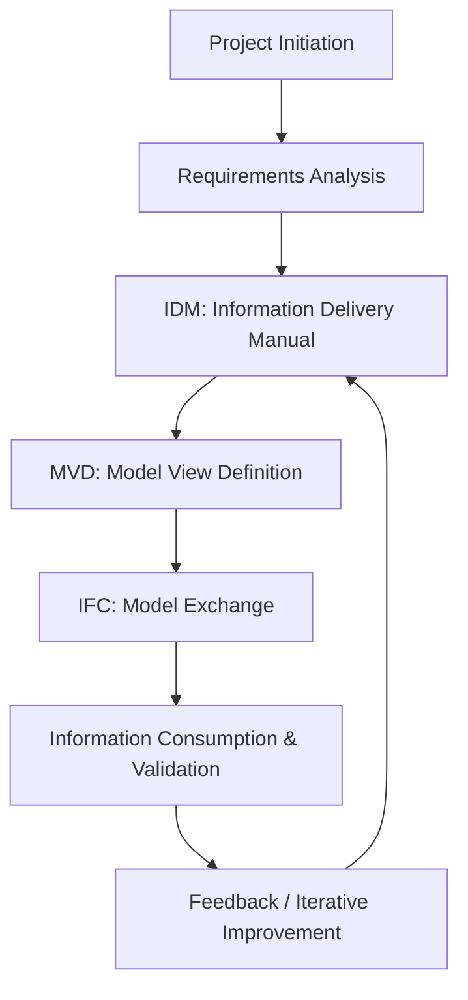
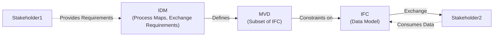
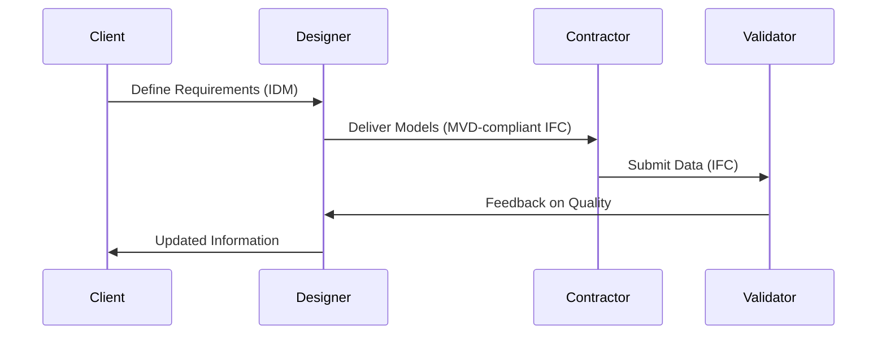

# BIM Information Delivery Visualizations

## Overview

Building Information Modeling (BIM) processes involve the collaborative generation and management of digital representations of physical and functional characteristics of places. To ensure interoperability and seamless information exchanges, clearly visualizing the process, data flows, and quality controls is essential.

---

> **Note:** Diagrams below use Mermaid. To view Mermaid diagrams in GitHub, click "Open in Preview" or use a browser plugin/Markdown viewer that supports Mermaid. If diagrams do not render, verify that your viewer or platform supports Mermaid syntax.

---

## 1. BIM Process Visualization



---

## 2. IDM, MVD, and IFC: Specification Flow

### Description

- **IDM (Information Delivery Manual):** Defines who needs what information, when, and why in the project lifecycle.
- **MVD (Model View Definition):** Specifies subsets of the IFC schema needed to fulfill the IDM requirements for a particular use case.
- **IFC (Industry Foundation Classes):** The open, standardized data model for BIM data exchange.

### Data Flow Diagram



---

## 3. Information Flow Among Stakeholders



---

## 4. Quality Metrics for Information Definitions

### Key Metrics

| Metric                   | Description                                            | Measurement Method                |
|--------------------------|-------------------------------------------------------|-----------------------------------|
| Completeness             | Are all required data fields populated?                | Automated checks; manual review   |
| Consistency              | Is the data logically consistent across the model?     | Schema validation; clash detection|
| Conformance to MVD       | Does the data conform to the MVD specification?        | MVD-based validation tools        |
| Correctness              | Are the values accurate and up-to-date?                | Spot checks; domain expert review |
| Traceability             | Can data changes be traced to responsible stakeholders?| Audit trails; version control     |
| Timeliness               | Was information delivered according to schedule?       | Workflow monitoring               |

---

## 5. Enforcing Quality Checks & Validations

### Iterative Quality Assurance Process

```mermaid
flowchart LR
    A[Information Provision] --> B[Automated Validation (IFC/MVD)]
    B --> C((Passes Validation?))
    C -- Yes --> D[Release for Next Stage]
    C -- No --> E[Feedback to Provider]
    E --> A
    D --> F[Stakeholder Review]
    F --> G((Final Acceptance / Iteration))
    G -- Issues Found --> E
    G -- Accepted --> H[Project Progresses]
```

### Practical Enforcement Strategies

1. **Automated Validation Tools:** Use BIM validation tools (e.g., Solibri, BIMCollab Zoom) to check conformance to MVD and IFC.
2. **Standardized Exchanges:** Mandate that all exchanges are IFC/MVD-compliant.
3. **Quality Gates:** Define checkpoints in the process where data must pass quality checks before progressing.
4. **Stakeholder Feedback Loops:** Use collaborative platforms for issue tracking and resolution.
5. **Documentation & Traceability:** Maintain logs of data changes, validations, and stakeholder responsibilities.
6. **Regular Training:** Ensure all stakeholders understand IDM, MVD, and IFC requirements.

---

## 6. Summary Diagram: Integrated Quality Loop

```mermaid
flowchart TD
    S1[Stakeholder Requirement (IDM)] --> S2[Model Authoring (MVD)]
    S2 --> S3[Data Export (IFC)]
    S3 --> S4[Automated Validation]
    S4 -- Pass --> S5[Stakeholder Review]
    S4 -- Fail --> S2
    S5 -- Approve --> S6[Information Delivery]
    S5 -- Reject --> S2
```

---

## References

- [buildingSMART IDM](https://www.buildingsmart.org/standards/idm/)
- [buildingSMART MVD](https://www.buildingsmart.org/standards/mvd/)
- [IFC Schema Documentation](https://technical.buildingsmart.org/standards/ifc/)
- [Solibri Model Checker](https://www.solibri.com/)
- [BIMCollab Zoom](https://www.bimcollab.com/en/solutions/zoom/)