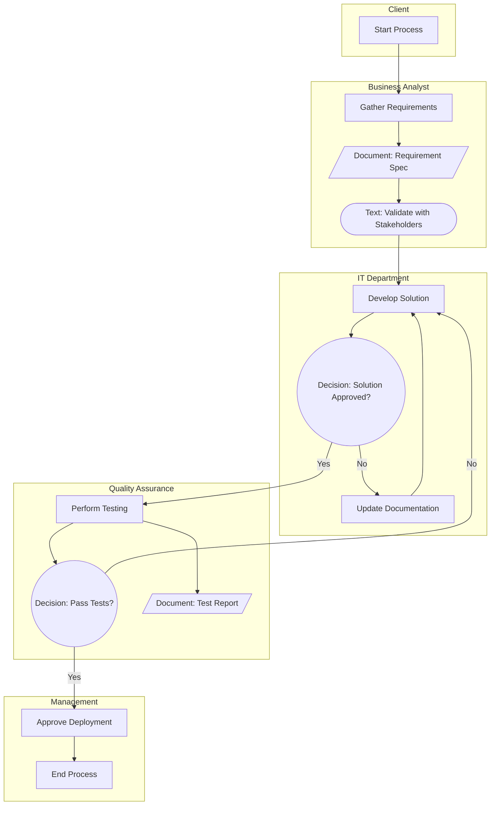
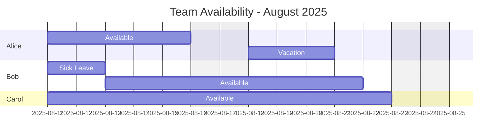

# BPMN
# Example: BPMN-like Business Process with Mermaid

```mermaid
flowchart TD
  %% Roles
  subgraph Client
    C1[Start Process] 
  end

  subgraph "Business Analyst"
    BA1[Gather Requirements]
    BA2[/Document: Requirement Spec/]
    BA3([Text: Validate with Stakeholders])
  end

  subgraph "IT Department"
    IT1[Develop Solution]
    IT2((Decision: Solution Approved?))
    IT3[Update Documentation]
  end

  subgraph "Quality Assurance"
    QA1[Perform Testing]
    QA2((Decision: Pass Tests?))
    QA3[/Document: Test Report/]
  end

  subgraph "Management"
    M1[Approve Deployment]
    M2[End Process]
  end

  %% Flow
  C1 --> BA1
  BA1 --> BA2
  BA2 --> BA3
  BA3 --> IT1
  IT1 --> IT2
  IT2 -- Yes --> QA1
  IT2 -- No --> IT3
  IT3 --> IT1
  QA1 --> QA2
  QA2 -- Yes --> M1
  QA2 -- No --> IT1
  M1 --> M2
  QA1 --> QA3
```

```mermaid
gantt
    dateFormat  YYYY-MM-DD
    title Team Availability - August 2025
    excludes    weekends

    section Alice
    Available       :a1, 2025-08-11, 5d
    Vacation        :a2, 2025-08-18, 3d

    section Bob
    Sick Leave      :b1, 2025-08-11, 2d
    Available       :b2, 2025-08-13, 7d

    section Carol
    Available       :c1, 2025-08-11, 10d
```
