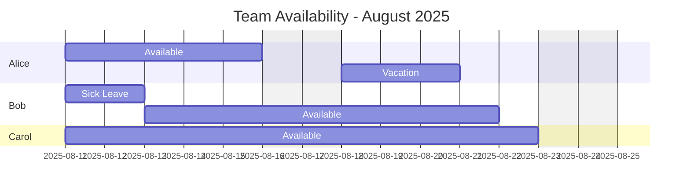

# BPMN

# Techniken

[https://www.linkedin.com/pulse/loops-bpmn-youll-finally-remember-what-iii-mean-filip-stachecki/]

[https://knowhow.visual-paradigm.com/business-process-modeling/bpmn-gateways/]

# Example: BPMN-like Business Process with Mermaid

