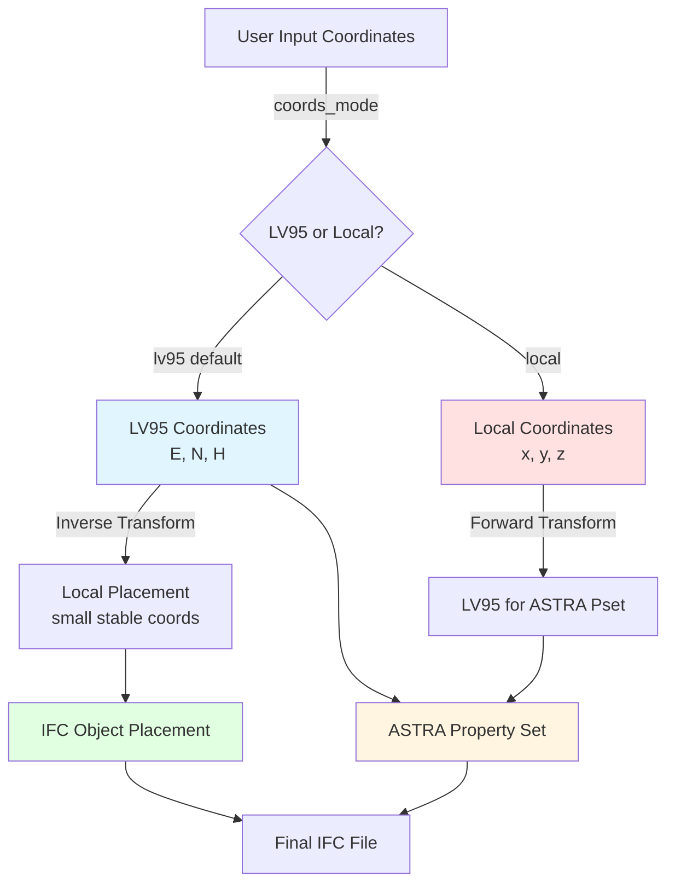
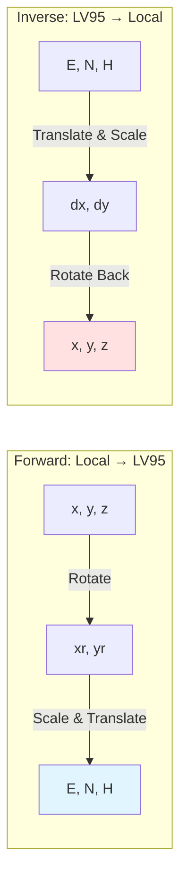
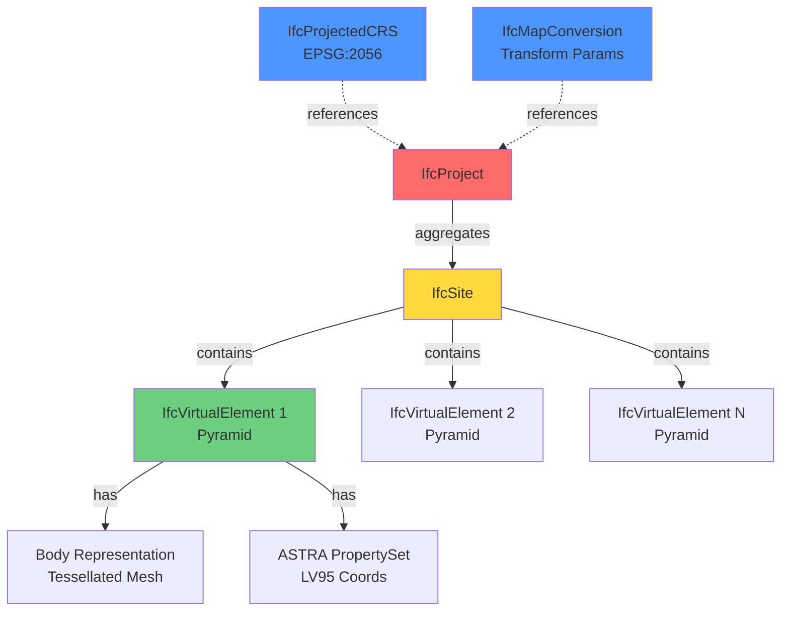
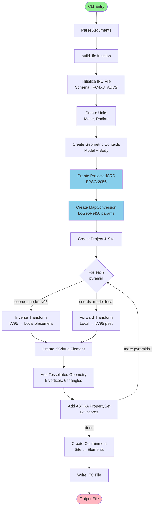

# IFC4X3_ADD2 Maker - Architecture Overview

## System Purpose
Generates georeferenced IFC files containing pyramid geometries using Swiss LV95 coordinate system (EPSG:2056) with LoGeoRef50 mapping.

## Coordinate System Flow



## LoGeoRef50 Transformation (Option A)



## IFC Structure Hierarchy



## Pyramid Geometry (Apex at Z=0)

```
        Z
        ↑
        * (0, 0, 0) ← Apex
       /|\
      / | \
     /  |  \
    /   |   \
   *----*----* ← Base at Z = -height
  /     |     \
 /      |      \
*-------*-------*
        ↓
     Base vertices at Z = -height
     Range: ±base/2 in X,Y
```

## Code Flow



## Key Features

1. **Dual Coordinate Mode**: Supports both LV95-first (default) and local-first workflows
2. **Stable Numerics**: Uses inverse transform to keep local placements small
3. **Standards Compliant**: Follows LoGeoRef50 Option A specification
4. **ASTRA Integration**: Stores exact LV95 coordinates in custom property sets
5. **Closed Tessellation**: Properly oriented triangular faces (GEM001-safe)
