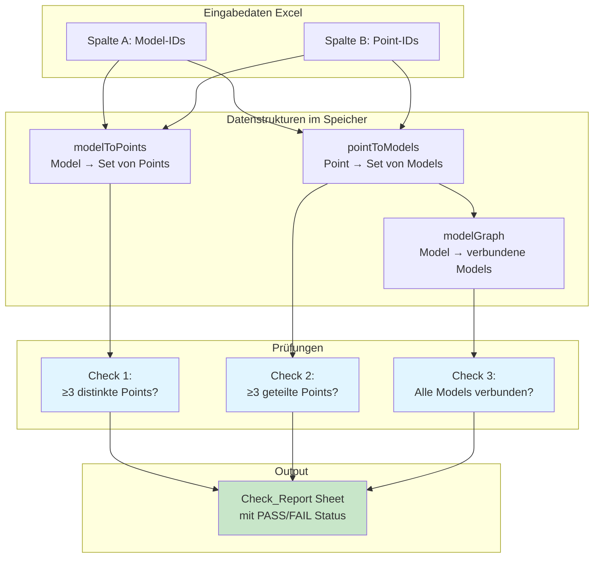
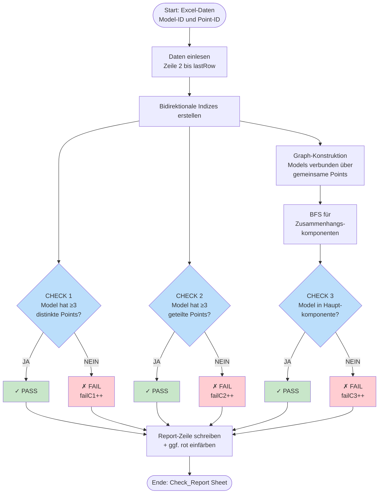

# Code-Erklärung: VBA Model-Point-Validierungsskript

## Zweck
Dieses VBA-Makro validiert die Beziehungen zwischen **Modellen** und **Punkten** (vermutlich BIM-Koordinaten/Referenzpunkte) anhand von drei Prüfkriterien und erstellt einen detaillierten Prüfbericht.

---

## Visualisierung der Datenstruktur



---

## Pseudocode

```pseudocode
PROZEDUR RunModelPointChecks():
    
    // ========================================
    // PHASE 1: DATEN EINLESEN UND INDIZIEREN
    // ========================================
    
    Setze ws = Aktives Arbeitsblatt
    Ermittle lastRow = letzte verwendete Zeile in Spalten A oder B
    
    WENN lastRow < 2 DANN
        Zeige Fehler "Keine Daten gefunden"
        ABBRUCH
    
    Initialisiere Dictionaries:
        modelToPoints = {}     // Model → Set(Point-IDs)
        pointToModels = {}     // Point → Set(Model-IDs)
    
    FÜR JEDE Zeile r VON 2 BIS lastRow:
        modelKey = Trim(Zelle[r, A])
        pointKey = Trim(Zelle[r, B])
        
        WENN beide nicht leer DANN:
            // Bidirektionale Zuordnung aufbauen
            modelToPoints[modelKey].add(pointKey)
            pointToModels[pointKey].add(modelKey)
    
    
    // ========================================
    // PHASE 2: GRAPH-STRUKTUR FÜR CHECK 3
    // ========================================
    
    Initialisiere modelGraph = {}  // Model → Set(verbundene Models)
    
    // Modelle als Knoten hinzufügen
    FÜR JEDES model IN modelToPoints:
        modelGraph[model] = {}
    
    // Kanten erzeugen über gemeinsame Points
    FÜR JEDES point IN pointToModels:
        WENN point von ≥2 Models verwendet DANN:
            FÜR JEDES Paar (model1, model2) dieses Points:
                modelGraph[model1].add(model2)  // Kante hinzufügen
                modelGraph[model2].add(model1)  // ungerichtet
    
    
    // ========================================
    // PHASE 3: ZUSAMMENHANGSKOMPONENTEN (BFS)
    // ========================================
    
    Initialisiere:
        compOfModel = {}       // Model → Komponenten-ID
        compSizes = {}         // Komponenten-ID → Anzahl Models
        compId = 0
        visited = {}
    
    FÜR JEDES model IN modelGraph:
        WENN model NICHT visited DANN:
            compId++
            queue = [model]
            thisSize = 0
            
            // Breadth-First-Search
            SOLANGE queue nicht leer:
                current = queue.dequeue()
                WENN current NICHT visited DANN:
                    visited.add(current)
                    compOfModel[current] = compId
                    thisSize++
                    
                    FÜR JEDES neighbor IN modelGraph[current]:
                        queue.enqueue(neighbor)
            
            compSizes[compId] = thisSize
    
    totalModels = Anzahl aller Models
    allLinked = (compId ≤ 1) ODER (größte Komponente == totalModels)
    
    
    // ========================================
    // PHASE 4: PRÜFUNGEN & BERICHTSERSTELLUNG
    // ========================================
    
    Erstelle neues Sheet "Check_Report"
    Schreibe Header: Model | Distinct Points | Shared Points | 
                     Check1 | Check2 | ... | Check3
    
    Initialisiere failC1 = failC2 = failC3 = 0
    
    FÜR JEDES model IN modelToPoints:
        
        // --- CHECK 1: Mindestens 3 distinkte Points ---
        distinctCount = Anzahl Points für dieses Model
        pass1 = (distinctCount ≥ 3)
        WENN NICHT pass1 DANN failC1++
        
        
        // --- CHECK 2: Mindestens 3 geteilte Points ---
        sharedCount = 0
        sharedList = ""
        
        FÜR JEDES point des Models:
            WENN pointToModels[point].count ≥ 2 DANN:
                sharedCount++
                sharedList += point + ", "
        
        pass2 = (sharedCount ≥ 3)
        WENN NICHT pass2 DANN failC2++
        
        
        // --- CHECK 3: Model ist Teil der Hauptkomponente ---
        thisComp = compOfModel[model]
        thisCompSize = compSizes[thisComp]
        pass3 = (allLinked UND thisCompSize == totalModels)
        WENN NICHT pass3 DANN failC3++
        
        
        // --- Zeile schreiben ---
        Schreibe in Report:
            [model, distinctCount, sharedCount, 
             pass1?"PASS":"FAIL", pass2?"PASS":"FAIL", 
             sharedList, allList, thisComp, thisCompSize, 
             pass3?"PASS":"FAIL"]
        
        WENN pass1 UND pass2 UND pass3 DANN:
            Zeile normal formatieren
        SONST:
            Zeile rot einfärben
    
    
    // ========================================
    // PHASE 5: ZUSAMMENFASSUNG
    // ========================================
    
    Formatiere Report (Borders, AutoFilter)
    
    Zeige MessageBox:
        "Models failing Check 1: " + failC1
        "Models failing Check 2: " + failC2
        "Models failing Check 3: " + failC3
        "Components found: " + compId
        "Largest component: " + MaxCompSize(compSizes)

ENDE PROZEDUR


// ========================================
// PRÜFLOGIK ZUSAMMENGEFASST
// ========================================

CHECK 1 (Distinkte Points):
    ✓ PASS: Model hat ≥3 verschiedene Point-IDs zugeordnet
    ✗ FAIL: Model hat <3 Point-IDs
    → Prüft minimale Punktanzahl pro Model

CHECK 2 (Geteilte Points):
    ✓ PASS: Model hat ≥3 Points, die auch von anderen Models benutzt werden
    ✗ FAIL: Model teilt <3 Points mit anderen Models
    → Prüft Vernetzung zwischen Models

CHECK 3 (Globale Verbindung):
    ✓ PASS: Alle Models sind über geteilte Points verbunden
           (bilden eine zusammenhängende Komponente im Graph)
    ✗ FAIL: Model ist Teil einer isolierten Gruppe
    → Prüft Gesamtkonsistenz des Model-Netzwerks
```

---

## Visualisierung der Prüfungen



---

## Beispiel-Szenario

**Eingabedaten:**
| Model | Point |
|-------|-------|
| M1    | P1    |
| M1    | P2    |
| M1    | P3    |
| M2    | P2    |
| M2    | P3    |
| M2    | P4    |
| M3    | P5    |

**Resultat:**
- **M1**: ✓ Check1 (3 Points), ✓ Check2 (P2, P3 geteilt), ✗ Check3 (nicht mit M3 verbunden)
- **M2**: ✓ Check1 (3 Points), ✓ Check2 (P2, P3 geteilt), ✗ Check3 (nicht mit M3 verbunden)
- **M3**: ✗ Check1 (nur 1 Point), ✗ Check2 (0 geteilte Points), ✗ Check3 (isoliert)

**Graph:**
```
M1 ←→ M2    M3 (isoliert)
```
