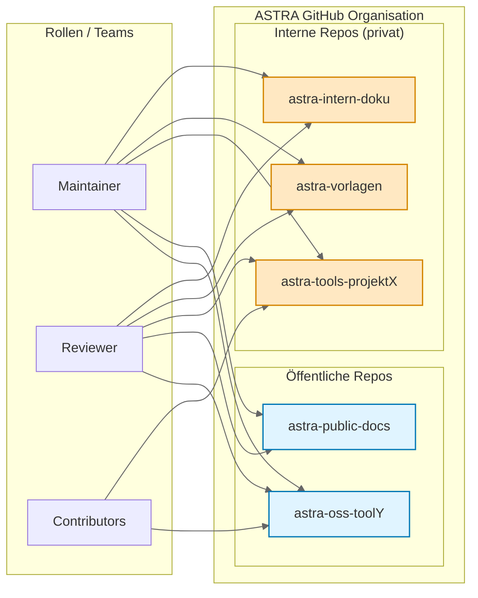
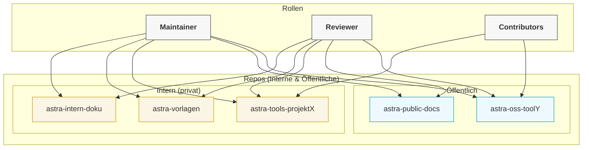
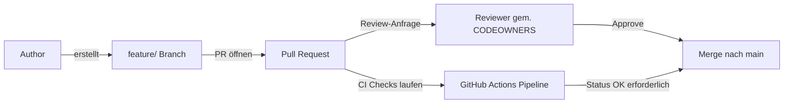

# GitHub Plan-Evaluierung für ASTRA

## 1. Executive Summary

- **Eignung für ASTRA:** Der GitHub Team-Plan erfüllt die aktuellen Anforderungen (private Repositories, Reviews via Pull Requests, Branch-Schutz, wenige CI-Workflows) vollständig – bei sehr niedrigen Lizenzkosten. Der Wechsel zu Enterprise Cloud wird erst relevant, sobald SSO/SCIM, erweiterte Audit-/Compliance-Kontrollen, IP-Allow-List oder Data Residency (EU) gefordert sind.  
- **Kostenrahmen (Listenpreise, exkl. MwSt.):** Team: 4 USD/User/Monat, Enterprise Cloud: 21 USD/User/Monat.  
  - 30 Nutzer: 1 440 USD/Jahr (Team) vs. 7 560 USD/Jahr (Enterprise Cloud)  
  - 70 Nutzer: 3 360 USD/Jahr (Team) vs. 17 640 USD/Jahr (Enterprise Cloud)  
- **CI/CD-Kontingente:** Team enthält 3 000 Actions-Minuten/Monat pro Organisation, Enterprise Cloud 50 000/Monat. Minuten gelten organisationsweit (nicht pro User). Mehrbedarf: zubuchbare Minuten oder Self-Hosted Runner.  
- **Schlüssel-Features:** Verpflichtende Reviews, Branch-Schutz, Code Owners für private Repos sind im Team-Plan enthalten (im Free-Plan fehlen sie). Interne Repositories, Audit-Log-Streaming, IP-Allow-List, SAML/SCIM und EU-Data Residency sind Enterprise Cloud vorbehalten.

---

## 2. Vergleichstabelle (Kernpunkte)

Quelle für Preise, Kontingente und Feature-Zuordnung: GitHub Pricing & Dokumentation (Details siehe Nachweise unter der Tabelle).

| Kriterium | Free (Org) | Team | Enterprise Cloud | Enterprise Server |
|-----------|------------|------|------------------|-------------------|
| Listenpreis | 0 USD | 4 USD/User/Monat | 21 USD/User/Monat | Lizenz/Seat + eigene Infrastruktur |
| Private Repos | Ja (eingeschränkt) | Ja | Ja | Ja |
| Verpflichtende Reviews (private Repos) | Nein | Ja | Ja | Ja |
| Branch-Schutz (private Repos) | Nein | Ja | Ja | Ja |
| Code Owners (private Repos) | Nein | Ja | Ja | Ja |
| GitHub Pages (private Repos) | Nein | Ja | Ja | Ja |
| Actions-Minuten/Monat (Org) | 2 000 | 3 000 | 50 000 | Self-Hosted Runner üblich |
| Packages-Speicher inkl. | 500 MB | 2 GB | 50 GB | Self-Hosted/extern |
| SSO (SAML), SCIM | Nein | Nein | Ja | Ja |
| Audit-Log-Streaming / erweiterte Audit-APIs | Nein | Eingeschränkt | Ja | Ja |
| Interne Repositories (org-weit sichtbar) | Nein | Nein | Ja | Ja |
| IP-Allow-List | Nein | Teilweise (Org-Level) | Ja | Ja |
| Data Residency (EU) | Nein | Nein | Ja (EU-Regionen) | On-Prem nach Richtlinie |
| SLA | Community | Web-Support | 99,9 % monatlich | Eigene SLA/HA erforderlich |

### Nachweise (Auswahl)
- Preise & Kontingente (Actions/Packages), SLA  
- Fehlende Team-Features im Free-Plan (Required Reviewers, Branch-Schutz, Code Owners, Pages, Wikis)  
- Interne Repositories nur Enterprise Cloud  
- IP-Allow-List, Audit-Log, Policies auf Enterprise-Ebene  
- EU Data Residency (Enterprise Cloud)  
- Pages in privaten Repos ab Team  

> Konkrete Links können bei Bedarf ergänzt werden (GitHub Pricing, Enterprise Feature Docs).

---

## 3. Repository-Vorschlag (Definitionen & Beispiele)

### Artefakt-Typen
- Code
- Dokumentation (Markdown, PDF)
- Diagramme (Mermaid)
- Vorlagen (JSON, XML)
- Präsentationen (PPT)
- Prozessbeschreibungen

### Sichtbarkeit
- **Interne Artefakte:** Nur für ASTRA (private Repositories).
- **Öffentliche Artefakte:** Öffentlich (public Repos) oder (bei Enterprise Cloud) org-weit sichtbar als „internal“.

### Empfohlene Repositories (Auszug)
| Repository | Typ | Inhalt | Öffnungsperspektive |
|------------|-----|--------|---------------------|
| `astra-intern-doku` | privat | Richtlinien, Prozesse, Handbücher, Mermaid-Diagramme | intern |
| `astra-vorlagen` | privat | JSON/XML-Schemas, Formular-Templates | intern |
| `astra-tools-<projekt>` | privat (optional später public) | Python/CLI/Actions-Skripte | selektive Öffnung |
| `astra-public-docs` | public | Veröffentlichte Dokumentation, GitHub Pages | öffentlich |
| `astra-oss-<tool>` | public | Open-Source-Projekte | OSS |

---

## 4. Branching- & PR-Regeln (pro Repository)

| Regel | Beschreibung |
|-------|--------------|
| Geschützte `main` | Änderungen nur via Pull Request |
| Reviews | ≥ 1 verpflichtender Review (Required Reviewers) |
| Status Checks | CI-Checks müssen grün sein (Blocking) |
| Admin Enforcement | Admins sind nicht ausgenommen |
| Feature Branch Muster | `feature/<kurzbeschreibung>` |
| Merge-Strategie | Squash-Merge als Standard |
| Verantwortlichkeiten | `CODEOWNERS` je Pfad definieren |
| Governance | Gleichbleibende Policies über alle Repos (Org-Ebene) |

---

## 5. Visualisierung: Organisation & Repo-Zuschnitt

```mermaid
graph LR
  subgraph ASTRA·GitHub·Organisation
    direction TB
    subgraph Interne Repos (privat)
      A1[astra-intern-doku]
      A2[astra-vorlagen]
      A3[astra-tools-projektX]
    end
    subgraph Öffentliche Repos
      B1[astra-public-docs]
      B2[astra-oss-toolY]
    end
  end
  subgraph Rollen/Teams
    T1[Maintainer]
    T2[Reviewer]
    T3[Contributors]
  end
  T1 --> A1
  T1 --> A2
  T1 --> A3
  T1 --> B1
  T1 --> B2
  T2 --> A1
  T2 --> A2
  T2 --> A3
  T2 --> B1
  T2 --> B2
  T3 --> A3
  T3 --> B2
```

Hier ist die korrigierte und verbesserte Mermaid-Visualisierung. Der Fehler kam durch Sonderzeichen (Mittelpunkte ·) und Leerzeichen im Subgraph-Namen. In Mermaid sollten Subgraph-Bezeichner einfache, gültige Identifikatoren sein (keine Sonderzeichen). Der sichtbare Titel kann getrennt vom technischen Identifier stehen.

Korrigierte Basisversion (gleiche Struktur, aber lauffähig):



Alternative mit vertikaler Gesamt-Ausrichtung (Top-Down), falls du die Rollen oben oder unten haben möchtest:



Variante mit Aggregationsknoten für Rechte (reduziert visuelle Wiederholung):

```mermaid
graph LR
  %% Rollen
  T1[Maintainer]
  T2[Reviewer]
  T3[Contributors]

  %% Rechte-Bündel
  subgraph Rechte_Pakete["Zugriffspakete"]
    RP_full[Full Zugriff (Intern + Öffentlich)]
    RP_limited[Begrenzt (nur ausgewählte Projekte)]
  end

  %% Repos
  subgraph Repos["Repos"]
    subgraph Intern_Privat["Intern (privat)"]
      A1[astra-intern-doku]
      A2[astra-vorlagen]
      A3[astra-tools-projektX]
    end
    subgraph Public_Open["Öffentlich"]
      B1[astra-public-docs]
      B2[astra-oss-toolY]
    end
  end

  %% Rollen zu Paketen
  T1 --> RP_full
  T2 --> RP_full
  T3 --> RP_limited

  %% Pakete zu Repos
  RP_full --> A1 & A2 & A3 & B1 & B2
  RP_limited --> A3 & B2

  classDef role fill:#f2f2f2,stroke:#555;
  classDef pkg fill:#ffe4ff,stroke:#b800b8;
  classDef intern fill:#fff6dd,stroke:#c78b00;
  classDef pub fill:#e6f7ff,stroke:#0085b3;

  class T1,T2,T3 role;
  class RP_full,RP_limited pkg;
  class A1,A2,A3 intern;
  class B1,B2 pub;
```

---

## 6. Visualisierung: Pull-Request-Review-Flow (vereinfachter Ablauf)



---

## 7. Kostenübersicht (Listenpreise, Richtwerte)

| Nutzer | Team (4 USD/Monat) | Team/Jahr | Enterprise Cloud (21 USD/Monat) | Enterprise/Jahr |
|--------|--------------------|-----------|----------------------------------|------------------|
| 10 | 40 USD/Monat | 480 USD | 210 USD/Monat | 2 520 USD |
| 30 | 120 USD/Monat | 1 440 USD | 630 USD/Monat | 7 560 USD |
| 70 | 280 USD/Monat | 3 360 USD | 1 470 USD/Monat | 17 640 USD |

> Preise: Listenpreise exkl. MwSt., ohne Add-ons. Mehrverbrauch bei Actions wird separat abgerechnet (Zubuchung oder Self-Hosted Runner).

---

## 8. Empfehlung für ASTRA

| Phase | Empfehlung | Begründung |
|-------|------------|------------|
| Kurzfristig | GitHub Team | Erfüllt Governance-Anforderungen: verpflichtende Reviews, Branch-Schutz, Code Owners. 3 000 Actions-Minuten ausreichend. Geringe Lizenzkosten. |
| Mittelfristige Option | Upgrade zu Enterprise Cloud (Trigger-Kriterien) | Sobald benötigt: SSO/SCIM, IP-Allow-List, Audit-Log-Streaming, interne Repositories, EU Data Residency, höheres CI-Kontingent. |
| Nicht empfohlen | Enterprise Server | Für 10–70 Nutzer ohne harte On-Prem-Vorgabe: zusätzlicher Betriebs- & Wartungsaufwand (Updates, Backup, Runner-Infrastruktur) ohne Funktionsvorteil gegenüber Enterprise Cloud. |

### Upgrade-Trigger (Enterprise Cloud)
- Formalisierte Sicherheits-/Compliance-Anforderungen (SSO, zentrale Provisionierung via SCIM)
- Erhöhte Audit-/Monitoring-Pflichten (Streaming, API-Erweiterungen)
- Netzwerkschutz (IP-Allow-List)
- Interne Repositories zur kontrollierten org-weiten Sichtbarkeit
- Regionale Datenhaltung (EU Residency)
- Skalierung der Automation (50 000 Actions-Minuten + Policies)

---

## 9. Nächste Schritte (Implementierungsfahrplan)

| Schritt | Aktion | Verantwortlich | Zielzeitraum |
|---------|--------|----------------|--------------|
| 1 | Organisation anlegen / Policies definieren | Maintainer | Woche 1 |
| 2 | Repositories initial erstellen | Maintainer | Woche 1–2 |
| 3 | Branch-Schutz + Required Reviews aktivieren | Maintainer / Admin | Woche 2 |
| 4 | CODEOWNERS ausarbeiten (Pfad-Mapping) | Reviewer-Team Leads | Woche 2–3 |
| 5 | CI-Basis (Linting, Tests) | Contributors / DevOps | Woche 3 |
| 6 | Dokumentationsstruktur (intern/public) | Doku-Team | Woche 3–4 |
| 7 | Monitoring: Actions-Minuten & Nutzung | Maintainer | Laufend |
| 8 | Evaluation Upgrade-Kriterien (Quarterly) | Leitung / Security | Quartalsweise |

---

## 10. Governance & Best Practices (Kurzleitfaden)

| Bereich | Empfehlung |
|---------|------------|
| Commit Hygiene | Aussagekräftige Messages, Squash für Feature-Branches |
| Security | Dependabot Alerts aktivieren, Secret Scanning (in Team/Enterprise) |
| Reviews | Fokus auf Architektur, Sicherheit, Wartbarkeit; keine reinen Stil-Diskussionen ohne Regeln |
| CI | Schnelle Feedback-Loops (<10 min) für Standard-Pipeline |
| Dokumentation | Markdown + Mermaid für technische Flüsse; README + CONTRIBUTING in jedem Repo |
| Versionierung | SemVer für öffentliche Artefakte |
| Automatisierung | Reusable Workflows für wiederkehrende CI-Muster |
| Transparenz | Öffentliche Repos: klare LICENSE + SECURITY.md |

---

## 11. Beispiel: CODEOWNERS (Auszug)

```text
# Root-Level: Hauptteam
/ @astra-maintainers

# Docs
/docs/ @astra-docs-team

# Tools – spezifische Verantwortliche
/tools/projektX/ @dev-projektX

# Templates
/templates/ @schema-team
```

> Aktiviert automatisierte Review-Zuordnung und verhindert ungewollte Änderungen ohne Zustimmung der Verantwortlichen.

---

## 12. Beispiel: Basis GitHub Actions Workflow (Skeleton)

```yaml
name: CI

on:
  pull_request:
    branches: [ main ]
  push:
    branches: [ feature/* ]

jobs:
  build-test:
    runs-on: ubuntu-latest
    steps:
      - name: Checkout
        uses: actions/checkout@v4
      - name: Setup Python
        uses: actions/setup-python@v5
        with:
          python-version: '3.12'
      - name: Install deps
        run: pip install -r requirements.txt
      - name: Lint
        run: flake8 src
      - name: Tests
        run: pytest -q --disable-warnings --maxfail=1
```

---

## 13. Risikobetrachtung (Kurz)

| Risiko | Beschreibung | Abmilderung |
|--------|--------------|-------------|
| Ungeplante CI-Kosten | Überschreitung Actions-Minuten | Monitoring + Self-Hosted Runner bei Bedarf |
| Fehlende Verantwortlichkeiten | Unklare Review-Prozesse | Konsequente Nutzung CODEOWNERS |
| Sicherheitslücken | Verzögerte Updates von Dependencies | Dependabot Alerts + monatliche Wartungsfenster |
| Wissensinseln | Nur wenige Maintainer | Pair Reviews + Dokumentation-Standards |
| Upgrade-Verzögerung | Späte Reaktion auf Compliance-Forderungen | Quartalsweise Checkliste Security/Compliance |

---

## 14. Zusammenfassung

Der Team-Plan bietet für den aktuellen Bedarf ein optimales Verhältnis aus Funktionalität und Kosten. Ein späterer, klar definierter Übergang zu Enterprise Cloud wird vorbereitet, indem Trigger-Kriterien transparent dokumentiert und regelmäßig überprüft werden. Enterprise Server ist aufgrund der Skalierung und des zusätzlichen Betriebsaufwands gegenwärtig nicht sinnvoll.

---

## 15. Glossar (Kurz)

| Begriff | Definition |
|--------|------------|
| Protected Branch | Branch mit erzwungenen Regeln (Reviews, Status Checks, keine Direkt-Pushes) |
| CODEOWNERS | Datei zur automatisierten Reviewer-Zuweisung basierend auf Pfaden |
| Actions-Minuten | Zeitbudget für gehostete CI-Ausführungen |
| Internal Repository | Nicht öffentlich, aber org-weit sichtbar (nur Enterprise Cloud) |
| SSO / SCIM | Single Sign-On / System for Cross-domain Identity Management (autom. Provisionierung) |

---

## 16. Optional: KPI-Ideen

| KPI | Beschreibung | Messintervall |
|-----|--------------|---------------|
| Time-to-Review | Zeit von PR-Erstellung bis erstem Review | Wöchentlich |
| Merge Lead Time | Zeit von erstem Commit bis Merge | Wöchentlich |
| Actions-Minuten Verbrauch | Anteil am Monatskontingent | Monatlich |
| Anzahl Sicherheits-Warnungen offen | Dependabot/Secret Scanning | Wöchentlich |
| Dokumentations-Abdeckung | Repos mit aktueller README + CONTRIBUTING | Quartalsweise |

---

_Fassung: 1.0 • Ersteller: ASTRA Evaluierungsteam • Stand: (bitte Datum ergänzen)_  
