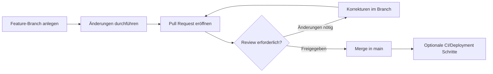

# Vergleich der GitHub-Preismodelle und Empfehlung für ASTRA

## 1. Übersicht der GitHub-Preismodelle

GitHub stellt für Organisationen vorrangig vier relevante Optionen bereit:

- GitHub Free
- GitHub Team
- GitHub Enterprise Cloud
- GitHub Enterprise Server (Self-Hosted)

Die folgenden Abschnitte und Tabellen strukturieren Funktionen, Kosten, Nutzen und Limitierungen, um eine fundierte Entscheidung für das Bundesamt ASTRA zu unterstützen.

> Hinweis: Die im Ausgangstext enthaltenen Platzhalter-Symbole (z.B. „“) wurden entfernt. Wo sie offenbar Quellen oder Hervorhebungen markierten, wurde der Inhalt unverändert übernommen.

### Vergleichstabelle (Kurzüberblick)

| Plan | Kosten (Listenpreis) | Zielgruppe | Schlüssel-Features | Wichtige Limitierungen | Eingeschlossene Actions-Minuten | Packages-Speicher |
|------|----------------------|-----------|--------------------|------------------------|----------------------------------|-------------------|
| Free | $0 / Nutzer | Einzelentwickler, sehr kleine Teams | Unbegrenzte öffentliche Repos, private Repos mit eingeschränkten Funktionen | Keine erweiterten Branch-Regeln, kein Code Owners in privaten Repos, eingeschränkte Governance | 2.000 / Monat | 500 MB |
| Team | ~$4 / Nutzer / Monat (jährliche Abrechnung) | Kleine bis mittelgroße Teams (z.B. 10–70 Nutzer) | Branch Protection, Pflicht-Reviews, mehrere Reviewer, Code Owners, private Wikis, Projekt-Insights | Kein SSO/SAML, eingeschränkte Audit-Logs, keine privaten Pages | 3.000 / Monat | 2 GB |
| Enterprise Cloud | ~$21 / Nutzer / Monat (Rabatte möglich) | Organisationen mit Compliance-/SSO-Bedarf | Alles aus Team + SAML SSO, SCIM, erweiterte Audit-Logs, IP-Allow-Lists, zentrale Repository Rules, EU-Datenresidenz, SLA (99,9%), großes Actions-Kontingent | Höhere Kosten, Setup für SSO/SCIM | 50.000 / Monat | 50 GB |
| Enterprise Server | Lizenz ähnlich Enterprise Cloud + Infrastruktur | Große Organisationen mit zwingender Datenhoheit | Funktionsgleich wie Enterprise Cloud (SSO, Compliance) lokal betrieben | Betriebs-/Update-Aufwand, eigene Runner notwendig | Abhängig von eigener Infrastruktur | Abhängig von eigener Infrastruktur |

---

## 2. Detaillierte Beschreibung der Pläne

### GitHub Free
- Kosten: $0
- Nutzung: Für Open Source und kleine interne Experimente.
- Funktionen:
  - Unbegrenzte öffentliche Repositories (voller Funktionsumfang).
  - Unbegrenzte private Repositories (reduzierter Funktionsumfang).
  - Community-Support.
  - 2.000 CI/CD-Minuten (GitHub Actions) pro Monat.
- Limitierungen:
  - Eingeschränkte Branch-Protektion (keine komplexen Regeln).
  - Keine verpflichtenden mehrstufigen Reviews in privaten Repos.
  - Keine Code Owners (für private Repos).
  - Begrenzte Sicherheits- und Governance-Funktionen.
  - Packages-Speicher: 500 MB.
- Bewertung für ASTRA: Nicht ausreichend für Governance und Qualitätssicherung.

### GitHub Team
- Kosten: ca. $4 / Nutzer / Monat (jährliche Abrechnung).
  - Beispiel: 30 Nutzer ≈ $120 / Monat; 70 Nutzer ≈ $280 / Monat (~$3.360 / Jahr).
- Nutzung: Für Teams mit Bedarf an Review-, Schutz- und Kollaborationsmechanismen.
- Zusatzfunktionen gegenüber Free:
  - Geschützte Branches (Branch Protection Regeln).
  - Pflicht-Pull-Request Reviews (ein oder mehrere Reviewer).
  - Mehrere Reviewer + Teams + Code Owners.
  - Private Wikis und Projekt-Insights.
  - E-Mail-Support.
  - 3.000 CI/CD-Minuten pro Monat (≈ 50 Std. Workflow-Zeit).
  - 2 GB Packages-Speicher.
  - Möglichkeit, optional GitHub Advanced Security zuzubuchen.
- Limitierungen:
  - Kein SAML SSO / SCIM (manuelles Benutzer-Management).
  - Kein erweitertes Audit-Log-Streaming.
  - Keine privaten GitHub Pages.
- Bewertung für ASTRA: Deckt aktuelle Anforderungen weitgehend ab.

### GitHub Enterprise Cloud
- Kosten: Listenpreis ca. $21 / Nutzer / Monat (Rabatte möglich; Non-Profit-Rabatte vermutlich nicht anwendbar).
  - Beispiel: 50 Nutzer ≈ $1.050 / Monat (~$12.600 / Jahr); 70 Nutzer ≈ $1.470 / Monat (~$17.640 / Jahr).
- Nutzung: Für stärkere Compliance-, Sicherheits-, Skalierungs- und Integrationsanforderungen.
- Zusatzfunktionen gegenüber Team:
  - SAML SSO, SCIM (zentrales Identity Management).
  - Erweiterte Audit-Logs + Streaming, IP-Allow-Lists.
  - Repository Rules (organisationsweite Richtlinien).
  - Schutzregeln für Actions-Umgebungen.
  - 50.000 Actions-Minuten / Monat (≈ 833 Std.).
  - 50 GB Packages-Speicher.
  - EU-Datenresidenz (seit Ende 2024).
  - SLA (99,9%) + priorisierter Support (Optional: Premium Support).
  - Enterprise-Account zur Verwaltung mehrerer Organisations-Accounts.
  - Interne (nur Enterprise-weite) Repositories.
  - Optional: Advanced Security (+ ~$19 / Nutzer / Monat), Copilot, Codespaces.
- Limitierungen:
  - Höhere Kosten pro Nutzer.
  - SSO/SCIM-Einführung erfordert Setup (IT-Kooperation).
- Bewertung für ASTRA: Erst notwendig bei gesteigerten Sicherheits-/Compliance-Anforderungen oder größerer Skalierung.

### GitHub Enterprise Server (Self-Hosted)
- Kosten: Lizenz ähnlich Enterprise Cloud + eigene Infrastruktur (Hardware, VMs, Betrieb, Updates).
  - Beispiel: 50 Nutzer ≈ $12.600 / Jahr Lizenz + Betriebskosten.
- Nutzung: Für Organisationen mit strenger Datenhoheit oder regulativer Cloud-Ablehnung.
- Funktionen:
  - Identisch mit Enterprise Cloud auf Feature-Ebene.
  - GitHub Actions nur mit selbstgehosteten Runnern (keine GitHub-gehosteten Runner inklusive).
- Aufwand:
  - Installation, Upgrades, Backups, Verfügbarkeit, Security Hardening durch eigenes Personal.
- Bewertung für ASTRA: Für 10–70 Nutzer überdimensioniert; nur bei zwingender Cloud-Ablehnung sinnvoll.

---

## 3. Annahmen und Anforderungen von ASTRA

### Teamgröße & Skalierung
- Start: 10–30 aktive Nutzer.
- Wachstumsperspektive: Bis ~70 innerhalb eines Jahres.
- Erfordernis: Kostenlinearität und einfache Erweiterbarkeit (gegeben in Team & Enterprise).

### Digitale Artefakte (Repository-Inhalte)
Artefakte umfassen:
- Quellcode
- Dokumentationen (Markdown, PDF)
- Vorlagen (JSON, XML, Office-Dateien)
- Diagramme (Mermaid in Markdown)
- Präsentationen (PPT)
- Prozessbeschreibungen

Unterscheidung:
- Interne Artefakte: Private Repositories (nur ASTRA).
- Öffentliche Artefakte: Open Source / Öffentlichkeitsarbeit (Public Repositories).

### Workflow & Qualitätssicherung
- Feature-Branches + Pull Requests für jede Änderung.
- Review-Zwang (mindestens 1, optional 2 Reviewer).
- Nachvollziehbarkeit durch Commits, PR-Diskussionen und Historie.
- Branch Protection für main.

### CI & Automatisierung
- Geplante Nutzung: „Wenig intensiv“.
- Beispiele:
  - Automatisierte Tests für Code.
  - Linting / Syntaxprüfungen.
  - Dokumentationsbuild (Markdown → PDF).
- Ergebnis: 3.000 Minuten (Team) voraussichtlich ausreichend.
- Optionen bei Überschreitung:
  - Zukauf zusätzlicher Minuten.
  - Self-hosted Runner.
  - Upgrade zu Enterprise erst bei tatsächlichem Bedarf.

### Dateigrößen & Speicher
- Durchschnitt: 3–5 MB pro Datei.
- Größere Dateien (>50–100 MB) extern lagern.
- Vorteil: Keine Notwendigkeit für Git LFS (vorerst).

### Sicherheit & Zugriff
- Branchenschutz (kein Direkt-Push auf main).
- Pflicht-Review.
- 2-Faktor-Authentifizierung für alle Benutzer (Organisation kann das erzwingen).
- Später ggf. SSO (bei Enterprise Cloud).

---

## 4. Empfohlene Repository-Strategie

### Strukturierung interner und öffentlicher Repositories
Richtlinie:
- Standardmäßig private Anlage.
- Öffentliche Schaltung nur nach Freigabe (z.B. Projektleitung).

Beispiele:
- `astra-intern-dokus` (private): Markdown-Dokumente, Prozess-/Ablauf-Mermaid-Diagramme.
- `astra-vorlagen-intern` (private): Vorlagen (JSON/XML/Office).
- `astra-code-projektX` (private): Internes Tool „Projekt X“ (Option zur späteren Öffnung).
- `astra-public-website` (public): Öffentliches Web-/Dokuprojekt (z.B. Pages).
- `astra-open-source-toolY` (public): Open-Source-Tool Y.

### Branching-Modell
- Hauptbranch: `main`
- Feature-Branches: `feat/...`, `fix/...`, `docs/...`
- PR-Beschreibung: Zweck, referenzierte Issue, Reviewer.

### Pull-Request Reviews
- Code Owners (im Team-Plan verfügbar).
- Mindestens 1 Reviewer, bei kritischen Artefakten 2.
- Stale Reviews nach Änderungen erneut erforderlich.

### Merge & Optionale Automatisierung
- Squash-Merge bei Bedarf (saubere Historie).
- Post-Merge-Actions:
  - Build/Test
  - Dokumentationsgeneration
  - Veröffentlichung (Pages / Release Tagging)

### Visualisierung des Workflows



---

## 5. Best Practices für ~10–70 Nutzer

### Teams & Berechtigungen
- Einrichtung von Teams (Admins, Entwickler, Reviewer, Projekt X).
- Minimale Anzahl Organisation-Owner.
- Im Enterprise-Plan: Mappen externer Verzeichnisgruppen via SCIM.

### Branch Protection Rules (Empfohlen)
- Require pull request review before merging.
- Dismiss stale reviews.
- Require status checks to pass.
- Include administrators.
- Optional: Require signed commits.

### GitHub Actions
- Fokus auf wirklichen Mehrwert (Tests, Formatprüfungen, Dokumentationspipeline).
- Nutzung von Self-hosted Runnern bei Engpässen (Team-Plan).
- Monitoring des Minutenverbrauchs.

### Schulung & Konventionen
- Leitfaden für:
  - Branch-Namensschema.
  - Commit-Messages.
  - PR-Beschreibungsvorlagen.
  - Review-Kriterien & Fristen.
- Dokumentation im `docs/` Ordner (PR-reviewbar statt Wiki).

### Issues & Projektmanagement
- Verknüpfung von PRs mit Issues („Closes #123“).
- GitHub Projects (Kanban / Roadmap).
- Klare Zuständigkeiten für Maintainer.

### Dokumentation & Diagramme
- Markdown + Mermaid für Architektur & Prozesse.
- Versionierung von Richtlinien (Review via PR).

### Umgang mit externen Beiträgen (Public Repos)
- `CONTRIBUTING.md`
- `CODE_OF_CONDUCT.md`
- Optional: Discussions für Feedback.

---

## 6. Entscheidungsempfehlung für ASTRA

### Kurzfazit
- GitHub Free: Ungeeignet (fehlende Prüf-/Schutzfunktionen).
- GitHub Team: Deckt aktuelle Anforderungen vollständig und kosteneffizient.
- GitHub Enterprise Cloud: Upgrade sinnvoll bei Bedarf an SSO, erweiterten Audit-/Compliance-Funktionen oder deutlich wachsender Nutzerzahl.
- GitHub Enterprise Server: Nur bei zwingender Cloud-Ablehnung oder besonderen Datenhoheitsauflagen.

### Empfohlener Einstieg
Start mit GitHub Team-Plan – evaluieren nach 12 Monaten.

### Upgrade-Kriterien für Enterprise Cloud
- Zentrale Identity-/Zugriffskontrolle (SAML SSO / SCIM benötigt).
- Erhöhte Compliance-Anforderungen (Audit-Streaming, IP-Restriktionen, EU-Datenresidenz).
- Starker Ausbau der Nutzerbasis (>100) oder geschäftskritische Produktion.
- Bedarf an erweitertem Sicherheitsstack (Advanced Security flächendeckend).

### Kosten-Nutzen (Qualitative Gegenüberstellung)

| Aspekt | Team | Enterprise Cloud |
|--------|------|------------------|
| Kosten (Nutzer <70) | Gering | Hoch |
| Governance (Reviews, Branchschutz) | Voll abgedeckt | Voll + zentral erzwingbar |
| Identity (SSO/SCIM) | Nicht verfügbar | Voll integriert |
| Audit & Compliance | Basis | Erweitert (Streaming, IP-Restriktion) |
| Automatisierungskapazität | Ausreichend (3k Min) | Sehr hoch (50k Min) |
| Skalierbarkeit Verwaltung | Manuell | Zentralisiert |
| Datenresidenz EU | Nein (allgemeine Cloud) | Ja (EU-Region verfügbar) |
| Packages-Speicher | 2 GB | 50 GB |
| Interne globale Repos | Nein | Ja |
| SLA / Support | Kein SLA, regulärer Support | 99,9% SLA, priorisiert |

### Empfohlener Fahrplan
1. Phase 0 (Monate 0–1): Einrichtung Organisation im Team-Plan, Definition Branch-/Review-Richtlinien.
2. Phase 1 (Monate 2–6): Stabilisierung Arbeitsabläufe, Monitoring Nutzung (Actions-Minuten, Repositories, Benutzerverwaltung).
3. Phase 2 (Monate 6–12): Bewertung: Ergeben sich Anforderungen für SSO oder erweitertes Audit?
4. Entscheidungs-Checkpoint: Bei absehbarem SSO-/Compliance-Bedarf → Planung Enterprise-Upgrade (Technisches Onboarding, IdP-Integration).
5. Fortlaufend: Jährliche Neubewertung Preis-/Leistungsverhältnis (Nutzeranzahl, Sicherheitsanforderungen, Automatisierungsgrad).

---

## 7. Fazit

ASTRA sollte mit dem GitHub Team-Plan starten. Er bietet:
- Alle notwendigen Mechanismen für Qualitätssicherung (Pull Requests, Pflicht-Reviews, Branchschutz).
- Ausreichende CI-Ressourcen für „wenig intensive“ Automatisierung.
- Kosteneffizienz bei der aktuellen und geplanten Nutzerzahl (10–70).
- Flexibles Wachstum ohne Vorab-Investitionsdruck.

Ein Wechsel zu GitHub Enterprise Cloud wird dann empfohlen, wenn:
- Zentrale Identitätsverwaltung (SSO/SCIM) organisatorisch priorisiert wird.
- Erhöhte Compliance-/Audit-Anforderungen formell eingeführt werden.
- Das Team signifikant wächst oder geschäftskritische Deployments eine SLA rechtfertigen.

Enterprise Server ist gegenwärtig nicht angezeigt (Overhead > Nutzen), solange Cloud-Nutzung zulässig und EU-Datenresidenz verfügbar ist.

Regelmäßige Überprüfung der Anforderungen stellt sicher, dass das Preismodell nachhaltig optimal bleibt.

---

## 8. Anhang: Beispielhafte Branch Protection Konfiguration (Team-Plan)

```yaml
branch_protection:
  branch: main
  required_reviews: 2          # Mindestanzahl Reviewer
  dismiss_stale_reviews: true  # Neue Änderungen → alte Freigaben ungültig
  require_status_checks: true  # CI muss erfolgreich sein
  status_checks:
    - build
    - lint
    - docs
  signed_commits: false        # Optional aktivierbar
  include_admins: true         # Auch Admins müssen Regeln befolgen
```

## 9. Anhang: Beispielhafte Repository-Namenskonvention

```text
astra-<scope>-<typ>-<projekt>

<scope>: intern | public
<typ>: code | docs | vorlagen | tool
<projekt>: frei vergebener Bezeichner

Beispiel:
astra-intern-docs-prozesse
astra-public-code-toolY
astra-intern-vorlagen-formulare
```

---

## 10. Kurzer Entscheidungsbaum (Textuell)

```mermaid
flowchart TD
    A[Start: Anforderungen analysieren] --> B{Benötigt SSO / SCIM jetzt?}
    B -->|Nein| C{Strenge Compliance sofort?}
    C -->|Nein| D[Empfehlung: GitHub Team starten]
    C -->|Ja| E[Enterprise Cloud erwägen]
    B -->|Ja| E
    D --> F{Wachstum >100 Nutzer oder neue Compliance?}
    F -->|Ja| E
    F -->|Nein| G[Weiter mit Team + jährliche Neubewertung]
    E --> H[Enterprise Cloud Implementierung (SSO, Audit Streaming)]
```

---

## 11. Nächste Schritte (Operativ)

1. GitHub Organisation anlegen (Team-Plan).
2. Rollen & Teams definieren.
3. Branch Protection Rules setzen (main).
4. Schulungsdokument erstellen (Workflow, PR, Reviews).
5. Pilot-Repositories erstellen (intern + 1 öffentliches Testprojekt).
6. Monitoring der Nutzung (Actions-Minuten, Review-Durchlaufzeiten).
7. Nach 6 Monaten Zwischenanalyse (SSO-/Compliance-Bedarf klären).

---

Bei Rückfragen oder für vertiefte Security-/Compliance-Bewertung kann eine gesonderte Analyse erfolgen (z.B. Advanced Security Nutzenabwägung).
