# ASTRA Repository-Organisation Visualisierung

## Gesamt-Organisationsstruktur


## Repository-Kategorisierung nach Sichtbarkeit

```mermaid
pie title Repository-Verteilung nach Sichtbarkeit
    "Öffentlich (10%)" : 10
    "Intern (70%)" : 70
    "Privat (20%)" : 20
```



## Repository-Struktur und Namenskonvention


## Branching-Workflow


## Pull Request Review-Prozess

```mermaid
sequenceDiagram
    participant E as Entwickler
    participant G as GitHub
    participant R1 as Reviewer 1
    participant R2 as Reviewer 2
    participant CO as Code Owner
    participant CI as CI/CD Pipeline
    
    E->>G: Feature Branch erstellen
    E->>E: Code entwickeln
    E->>G: Push Changes
    E->>G: Pull Request öffnen
    
    G->>CI: Trigger Automated Tests
    CI->>CI: Run Tests
    CI->>CI: Security Scan
    CI->>CI: Code Quality Check
    CI->>G: Status Check ✅
    
    G->>R1: Review Request
    G->>R2: Review Request
    G->>CO: Code Owner Review Required
    
    R1->>G: Review + Approve ✅
    R2->>G: Review + Changes Required ⚠️
    
    E->>G: Fix Issues
    E->>G: Push Updates
    
    Note over G: Stale Reviews Dismissed
    
    G->>R2: Re-Review Request
    R2->>G: Approve ✅
    CO->>G: Approve ✅
    
    G->>G: All Checks Passed
    E->>G: Squash and Merge
    G->>G: Delete Feature Branch
```



## Security-Schichten


## Team-Zugriffsmatrix


## Migration Timeline


## CODEOWNERS Beispiel-Struktur

```mermaid
graph TD
    subgraph "CODEOWNERS Hierarchie"
        ROOT["/"]
        ROOT -->|@astra/admins| ALL["* (Alle Dateien)"]
        
        DOCS["/docs/"]
        DOCS -->|@astra/documentation| DOCS_ALL["*.md, *.adoc"]
        
        POLICIES["/policies/"]
        POLICIES -->|@astra/governance @astra/legal| POL_ALL["Alle Policy-Dateien"]
        
        INFRA["/infrastructure/"]
        INFRA -->|@astra/it-ops| INFRA_CODE["*.tf, *.yaml"]
        
        SECURITY["/security/"]
        SECURITY -->|@astra/security-team| SEC_ALL["Sicherheits-relevante Dateien"]
        
        API["/api/"]
        API -->|@astra/backend-team| API_CODE["*.py, *.java"]
    end
    
    style ROOT fill:#f96,stroke:#333,stroke-width:4px
    style SECURITY fill:#f66,stroke:#333,stroke-width:2px
    style POLICIES fill:#66f,stroke:#333,stroke-width:2px
```

## Compliance-Dashboard Konzept

```mermaid
graph TB
    subgraph "Compliance Monitoring"
        D[Dashboard]
        D --> M1[ISO 27001 Status ✅]
        D --> M2[SOC 2 Reports ✅]
        D --> M3[GDPR/DSG Compliance ✅]
        D --> M4[Audit Logs 📊]
        D --> M5[Security Alerts 🔔]
        
        M4 --> A1[User Activities]
        M4 --> A2[Repository Changes]
        M4 --> A3[Permission Changes]
        M4 --> A4[Security Events]
        
        M5 --> S1[Secret Exposures: 0]
        M5 --> S2[Vulnerabilities: 3 Low]
        M5 --> S3[Dependencies: 127 OK]
    end
    
    subgraph "Automated Reports"
        R1[Weekly Security Report]
        R2[Monthly Compliance Report]
        R3[Quarterly Audit Report]
    end
    
    D --> R1
    D --> R2
    D --> R3
    
    style D fill:#69f,stroke:#333,stroke-width:4px
    style M1 fill:#9f9,stroke:#333,stroke-width:2px
    style M2 fill:#9f9,stroke:#333,stroke-width:2px
    style M3 fill:#9f9,stroke:#333,stroke-width:2px
```



## Support-Eskalationspfad


---

*Diese Visualisierungen zeigen die geplante GitHub Enterprise Organisation für ASTRA mit allen wichtigen Strukturen, Prozessen und Abhängigkeiten.*
