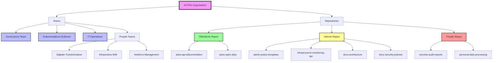
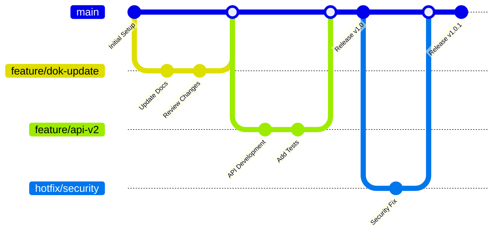
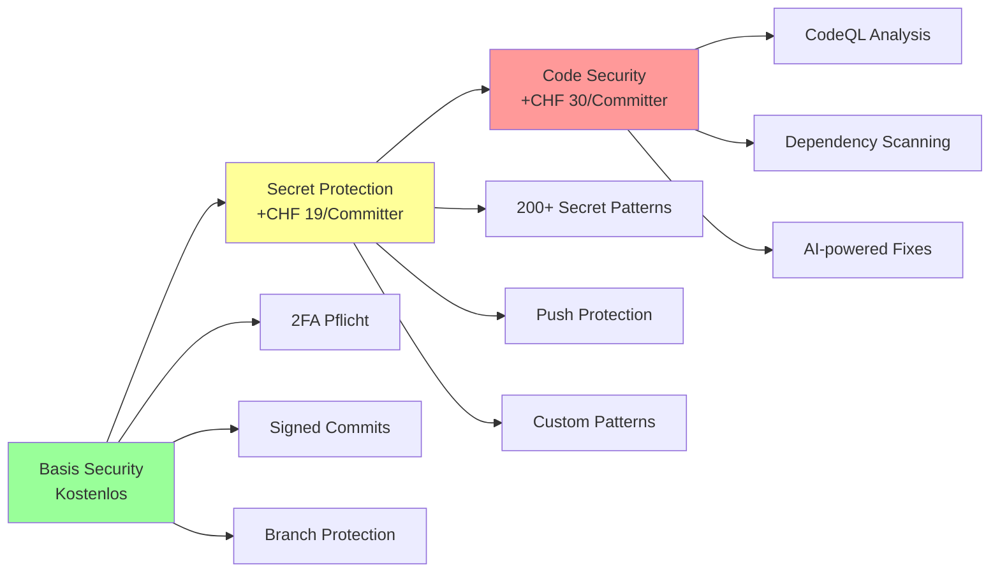

# GitHub Enterprise für ASTRA - Executive Summary und Entscheidungsvorlage

## Executive Summary

### Kernempfehlung
**GitHub Enterprise Cloud mit EU-Datenresidenz** ist die optimale Lösung für das Bundesamt für Strassen (ASTRA) und bietet die beste Balance zwischen Compliance, Funktionalität und Kosten für eine Schweizer Bundesbehörde.

### Hauptvorteile
- **Vollständige Datensouveränität**: Alle Daten verbleiben in Azure-Rechenzentren in Westeuropa (Amsterdam/Dublin)
- **Compliance-konform**: ISO 27001, SOC 2 Type 2, FedRAMP-autorisiert
- **Keine Infrastruktur-Kosten**: Vollständig verwaltete Cloud-Lösung ohne eigene Server
- **Sofortige Verfügbarkeit**: Keine Wartezeiten für neue Features und Sicherheitsupdates
- **Skalierbar**: Nahtlose Skalierung von 10 auf 70+ Benutzer

### Investitionsübersicht (30 Benutzer)
- **Jahr 1**: CHF 23'921 (inkl. Schulungen)
- **Folgejahre**: CHF 8'921 (Basis + Support)
- **Mit Advanced Security**: CHF 32'561 jährlich

### Kritische Erfolgsfaktoren
1. EU-Datenresidenz seit Oktober 2024 verfügbar - erfüllt Schweizer Datenschutzanforderungen
2. Enterprise Managed Users (EMU) für vollständige Identitätskontrolle
3. SAML SSO Integration mit bestehender Schweizer Regierungs-IT
4. Audit Log Streaming für lückenlose Compliance-Nachweise

## Vergleichstabelle GitHub-Preismodelle

| Merkmal | Free | Team | Enterprise Cloud | Enterprise Server |
|---------|------|------|-----------------|-------------------|
| **Preis pro Benutzer/Monat** | CHF 0 | CHF 4 | CHF 21 | CHF 21 + Infrastruktur |
| **Private Repositories** | Unbegrenzt | Unbegrenzt | Unbegrenzt | Unbegrenzt |
| **GitHub Actions Minuten** | 2'000 | 3'000 | 50'000 | Unbegrenzt (selbst gehostet) |
| **Speicher** | 500 MB | 2 GB | 50 GB | Selbst verwaltet |
| **Support** | Community | Email | 24/7 Enterprise | 24/7 Enterprise |
| **SAML SSO** | ❌ | ❌ | ✅ | ✅ |
| **Audit Logs** | ❌ | Basis | Erweitert (6 Monate) | Vollständig |
| **Compliance** | ❌ | ❌ | ISO 27001, SOC 2, FedRAMP | ISO 27001, SOC 2 |
| **Datenresidenz** | USA | USA | EU möglich | Selbst bestimmt |
| **Advanced Security** | ❌ | ❌ | Verfügbar (Zusatzkosten) | Verfügbar (Zusatzkosten) |
| **IP-Allowlists** | ❌ | ❌ | ✅ | ✅ |
| **SCIM Provisioning** | ❌ | ❌ | ✅ | ✅ |

## Detaillierter Kostenvergleich

### Szenario 1: 10 Benutzer
| Komponente | Enterprise Cloud | Enterprise Server |
|------------|-----------------|-------------------|
| Lizenzkosten/Jahr | CHF 2'520 | CHF 2'520 |
| Infrastruktur | CHF 0 | CHF 24'000 - 96'000 |
| DevOps Personal (0.5 FTE) | CHF 0 | CHF 60'000 |
| **Gesamtkosten/Jahr** | **CHF 2'520** | **CHF 86'520 - 158'520** |

### Szenario 2: 30 Benutzer (ASTRA aktuell)
| Komponente | Enterprise Cloud | Enterprise Server |
|------------|-----------------|-------------------|
| Lizenzkosten/Jahr | CHF 7'560 | CHF 7'560 |
| Premium Support (18%) | CHF 1'361 | CHF 1'361 |
| Secret Protection (24 Committer) | CHF 5'472 | CHF 5'472 |
| Code Security (optional) | CHF 8'640 | CHF 8'640 |
| Infrastruktur | CHF 0 | CHF 48'000 - 96'000 |
| DevOps Personal (1.0 FTE) | CHF 0 | CHF 120'000 |
| **Gesamtkosten/Jahr** | **CHF 23'033** | **CHF 191'033 - 239'033** |

### Szenario 3: 70 Benutzer (Zukunft)
| Komponente | Enterprise Cloud | Enterprise Server |
|------------|-----------------|-------------------|
| Lizenzkosten/Jahr | CHF 17'640 | CHF 17'640 |
| Premium Plus Support | CHF 3'881 | CHF 3'881 |
| Code Security (56 Committer) | CHF 20'160 | CHF 20'160 |
| Infrastruktur | CHF 0 | CHF 96'000 - 144'000 |
| DevOps Personal (1.5 FTE) | CHF 0 | CHF 180'000 |
| **Gesamtkosten/Jahr** | **CHF 41'681** | **CHF 317'681 - 365'681** |

## Feature-Vergleich: Cloud vs. Server

| Feature-Kategorie | Enterprise Cloud | Enterprise Server | Vorteil |
|-------------------|-----------------|-------------------|---------|
| **Neue Features** | Sofort verfügbar | 3-6 Monate Verzögerung | Cloud ✅ |
| **GitHub Copilot** | Vollständig integriert | Eingeschränkt | Cloud ✅ |
| **Codespaces** | ✅ Verfügbar | ❌ Nicht verfügbar | Cloud ✅ |
| **Wartungsaufwand** | Keine | Quartalsweise Updates | Cloud ✅ |
| **Backup/Disaster Recovery** | Automatisch | Selbst verwaltet | Cloud ✅ |
| **Skalierung** | Automatisch | Manuelle Kapazitätsplanung | Cloud ✅ |
| **Air-Gap Betrieb** | ❌ | ✅ Möglich | Server ✅ |
| **Vollständige Datenkontrolle** | EU-Region | On-Premises | Server ✅ |
| **Netzwerk-Isolation** | Teilweise (EMU) | Vollständig | Server ✅ |

## Repository-Organisationsstruktur für ASTRA



### Repository-Namenskonvention

```
[abteilung]-[projekt]-[typ]

Beispiele:
- strassen-digital-transform-docs
- admin-policy-templates  
- infrastructure-monitoring-api
- verkehr-analysis-web
- sicherheit-audit-cli
```

## Branching-Strategie für ASTRA



### Empfohlene Strategie: GitHub Flow
- **Main-Branch**: Immer deploybar
- **Feature-Branches**: Kurzlebig (1-3 Tage)
- **Pull Requests**: Mindestens 2 Reviews erforderlich
- **Merge-Strategie**: Squash and Merge für saubere Historie

## Security-Komponenten und Kosten

### GitHub Advanced Security Optionen

| Komponente | Funktion | Preis/Monat/Committer | 30 Benutzer (24 aktiv) | 70 Benutzer (56 aktiv) |
|------------|----------|----------------------|------------------------|------------------------|
| **Secret Protection** | Credential-Scanning, Push Protection | CHF 19 | CHF 456/Monat | CHF 1'064/Monat |
| **Code Security** | CodeQL, SARIF, Dependabot | CHF 30 | CHF 720/Monat | CHF 1'680/Monat |
| **Gesamt Advanced Security** | Beide Komponenten | CHF 49 | CHF 1'176/Monat | CHF 2'744/Monat |
| **Jährliche Kosten** | | | **CHF 14'112** | **CHF 32'928** |

### Sicherheits-Features nach Tier



## Implementierungs-Roadmap

### Phase 1: Fundament (Monate 1-2)
- [ ] Enterprise Cloud mit EU-Datenresidenz einrichten
- [ ] SAML SSO mit Schweizer Gov-IdP konfigurieren
- [ ] Teams und initiale Repository-Struktur
- [ ] IP-Allowlists und 2FA aktivieren
- [ ] Basis Branch Protection Rules

### Phase 2: Sicherheit (Monate 3-4)  
- [ ] Secret Protection aktivieren
- [ ] Audit Log Streaming zu SIEM
- [ ] CODEOWNERS Files etablieren
- [ ] Erweiterte Branch Protection
- [ ] Security Campaigns durchführen

### Phase 3: Schulung (Monate 2-6)
- [ ] GitHub Skills Self-Service (alle Benutzer)
- [ ] Expert Services Training:
  - GitHub for Developers (CHF 5'000)
  - GitHub Admin Training (CHF 5'000)
  - GitHub Actions Training (CHF 5'000)
- [ ] Champions-Programm etablieren
- [ ] Interne Knowledge Base aufbauen

### Phase 4: Optimierung (Monate 7-12)
- [ ] Self-hosted Runners evaluieren
- [ ] Repository Templates erstellen
- [ ] Actions Workflows optimieren
- [ ] Premium Plus Support prüfen
- [ ] Copilot Evaluation

## Compliance und Datenschutz

### Schweizer Anforderungen erfüllt

| Anforderung | Enterprise Cloud EU | Nachweis |
|-------------|-------------------|-----------|
| **DSG/revDSG Konformität** | ✅ Erfüllt | EU-Schweiz Adequacy Decision |
| **Datenlokalität** | ✅ EU-Region | Azure West Europe |
| **ISO 27001** | ✅ Zertifiziert | Gültig bis 2027 |
| **SOC 2 Type 2** | ✅ Verfügbar | Jährlich aktualisiert |
| **GDPR/DSGVO** | ✅ Konform | DPA mit SCCs |
| **Audit-Trail** | ✅ 6 Monate + Streaming | SIEM Integration |
| **Verschlüsselung** | ✅ Transit & Rest | AES-256 |
| **Penetration Tests** | ✅ Jährlich | Berichte verfügbar |

## Nutzen-Analyse für ASTRA

### Quantifizierbare Vorteile

| Nutzen-Kategorie | Beschreibung | Geschätzter Wert/Jahr |
|------------------|--------------|----------------------|
| **Zeitersparnis Entwicklung** | 20% Produktivitätssteigerung durch moderne Tools | CHF 240'000 |
| **Vermiedene Infrastruktur** | Keine Server, Storage, Backup-Systeme | CHF 96'000 |
| **DevOps Personal** | 1.0 FTE nicht benötigt | CHF 120'000 |
| **Sicherheitsvorfälle** | Reduzierung um 60% durch Advanced Security | CHF 150'000 |
| **Compliance-Aufwand** | Automatisierte Audit-Reports | CHF 40'000 |
| **Schnellere Time-to-Market** | 30% kürzere Release-Zyklen | CHF 180'000 |
| **Gesamt-Nutzen** | | **CHF 826'000** |

### ROI-Berechnung (30 Benutzer)

```
Investition Jahr 1: CHF 32'561 (mit Advanced Security)
Quantifizierbarer Nutzen: CHF 826'000
ROI = (826'000 - 32'561) / 32'561 × 100 = 2'436%

Amortisation: < 2 Monate
```

## Finale Empfehlung

### Empfohlene Konfiguration für ASTRA

| Komponente | Empfehlung | Kosten/Jahr |
|------------|------------|-------------|
| **Basis-Lizenz** | Enterprise Cloud EU (30 User) | CHF 7'560 |
| **Support** | Premium Support | CHF 1'361 |
| **Security** | Secret Protection (sofort) | CHF 5'472 |
| | Code Security (Jahr 2) | CHF 8'640 |
| **Schulung** | Expert Services (Jahr 1) | CHF 15'000 |
| **Migration** | Self-Service mit Fallback | CHF 0-30'000 |
| **Total Jahr 1** | Mit Secret Protection | **CHF 29'393** |
| **Total Jahr 2+** | Mit Full Security | **CHF 23'033** |

### Kritische Erfolgsfaktoren

1. **Sofort umsetzen**:
   - Enterprise Cloud mit EU-Datenresidenz
   - SAML SSO Integration
   - Secret Protection
   - Audit Log Streaming

2. **Binnen 6 Monaten**:
   - Vollständige Team-Migration
   - Repository-Konsolidierung
   - CI/CD Pipeline-Migration
   - Schulungsprogramm abschliessen

3. **Jahr 2 Evaluation**:
   - Code Security Upgrade
   - GitHub Copilot Pilot
   - Premium Plus Support
   - Self-hosted Runners

### Risiken und Mitigation

| Risiko | Wahrscheinlichkeit | Impact | Mitigation |
|--------|-------------------|---------|------------|
| **Widerstand gegen Veränderung** | Mittel | Hoch | Umfassende Schulung, Champions |
| **Migration-Komplexität** | Niedrig | Mittel | Expert Services als Backup |
| **Budget-Überschreitung** | Niedrig | Mittel | Stufenweise Security-Einführung |
| **Compliance-Bedenken** | Niedrig | Hoch | EU-Datenresidenz, DPA vorhanden |
| **Vendor Lock-in** | Mittel | Niedrig | Git-Standard, Export-Optionen |

## Nächste Schritte

1. **Sofort**: Budget-Freigabe für CHF 30'000 (Jahr 1)
2. **Woche 1-2**: Kontakt GitHub Government Sales
3. **Woche 3-4**: Proof of Concept mit 5 Benutzern
4. **Monat 2**: Vertragsabschluss und Rollout-Start
5. **Monat 3-6**: Vollständige Migration und Schulung
6. **Monat 12**: Evaluation und Optimierung

## Kontakt und Support

**GitHub Government Team Schweiz**  
- Spezialisierte Berater für öffentlichen Sektor
- Erfahrung mit Schweizer Bundesbehörden
- Unterstützung bei Ausschreibungen

**Empfohlene Partner für Schweiz**  
- Eficode (GitHub Premier Partner)
- Zühlke Engineering AG
- ti&m AG

---

*Dieser Bericht basiert auf aktuellen Marktdaten (November 2024) und GitHub Enterprise Preisen. Alle Preise in CHF, ohne MwSt.*
