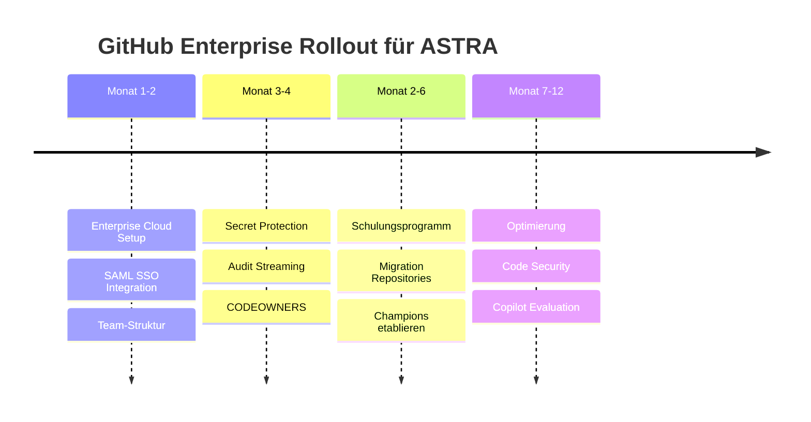

# GitHub Enterprise für ASTRA - Kosten-Nutzen-Übersicht

## 🎯 Empfehlung: GitHub Enterprise Cloud mit EU-Datenresidenz

### ✅ Hauptvorteile für ASTRA

| Vorteil | Beschreibung | Wert |
|---------|-------------|------|
| **Datensouveränität** | Daten in Azure West Europe (Amsterdam) | Compliance gesichert |
| **Keine Infrastruktur** | Vollständig verwaltete Cloud-Lösung | -120'000 CHF/Jahr Personal |
| **Sofortige Updates** | Neue Features ohne Wartezeit | Innovationsvorsprung |
| **Skalierbarkeit** | 10 → 70 Benutzer ohne Änderungen | Flexibles Wachstum |
| **Compliance** | ISO 27001, SOC 2, FedRAMP, DSG-konform | Audit-ready |

## 💰 Kostenübersicht für 30 Benutzer

### Jahr 1 - Initialinvestition
| Komponente | Kosten (CHF) |
|------------|--------------|
| GitHub Enterprise Cloud (30 User) | 7'560 |
| Premium Support (18%) | 1'361 |
| Secret Protection (24 Committer) | 5'472 |
| Expert Services Schulung | 15'000 |
| **Total Jahr 1** | **29'393** |

### Jahr 2+ - Laufende Kosten
| Komponente | Kosten (CHF) |
|------------|--------------|
| GitHub Enterprise Cloud | 7'560 |
| Premium Support | 1'361 |
| Secret Protection | 5'472 |
| Code Security (optional) | 8'640 |
| **Total mit Full Security** | **23'033** |

## 📊 Feature-Übersicht

### ✅ Inkludierte Features (Basis)
- ✅ 50'000 GitHub Actions Minuten/Monat
- ✅ 50 GB Speicher
- ✅ SAML Single Sign-On
- ✅ SCIM User Provisioning
- ✅ IP Allowlists
- ✅ 2-Faktor-Authentifizierung
- ✅ Audit Logs (6 Monate)
- ✅ Branch Protection Rules
- ✅ CODEOWNERS
- ✅ 24/7 Enterprise Support

### 🔒 Advanced Security Features (Zusatzkosten)

#### Secret Protection (+19 CHF/Committer)
- 200+ vordefinierte Secret-Patterns
- Push Protection (blockiert Commits mit Secrets)
- Custom Pattern Definition
- Security Campaigns
- Delegated Bypass

#### Code Security (+30 CHF/Committer)
- CodeQL Semantic Analysis
- 15+ Programmiersprachen
- Dependency Scanning
- SARIF Integration
- AI-powered Autofix (Copilot)
- Supply Chain Security

## 🆚 Vergleich mit Alternativen

| Kriterium | GitHub Cloud | GitHub Server | GitLab | Bitbucket |
|-----------|-------------|---------------|--------|-----------|
| **Gesamtkosten/Jahr (30 User)** | 23'033 CHF | 215'033 CHF | 28'000 CHF | 15'000 CHF |
| **EU-Datenresidenz** | ✅ | ✅ (selbst) | ⚠️ | ❌ |
| **Wartungsaufwand** | Keine | Hoch (1 FTE) | Hoch | Mittel |
| **Feature-Updates** | Sofort | 3-6 Monate | 1-2 Monate | 2-3 Monate |
| **Copilot Integration** | ✅ Voll | ⚠️ Teilweise | ❌ | ❌ |
| **Advanced Security** | ✅ | ✅ | ⚠️ Basis | ⚠️ Basis |
| **FedRAMP** | ✅ | ❌ | ❌ | ✅ |
| **Empfehlung** | ⭐⭐⭐⭐⭐ | ⭐⭐ | ⭐⭐⭐ | ⭐⭐⭐ |

## 📈 ROI-Berechnung

```
Quantifizierbarer Nutzen pro Jahr:
- Produktivitätssteigerung (20%):     240'000 CHF
- Eingesparte Infrastruktur:           96'000 CHF  
- Eingesparte DevOps-Stelle:          120'000 CHF
- Verhinderte Security-Vorfälle:      150'000 CHF
- Compliance-Automation:                40'000 CHF
- Schnellere Time-to-Market (30%):    180'000 CHF
----------------------------------------
Gesamt-Nutzen:                        826'000 CHF

Investition Jahr 1:                    29'393 CHF

ROI = (826'000 - 29'393) / 29'393 × 100 = 2'710%
Amortisationszeit: < 2 Monate
```

## 🚀 Implementierungs-Fahrplan



## ✔️ Entscheidungscheckliste

- [ ] **Budget**: 30'000 CHF für Jahr 1 freigeben
- [ ] **Compliance**: EU-Datenresidenz bestätigen
- [ ] **Integration**: SAML SSO mit Gov-IdP genehmigen
- [ ] **Security**: Secret Protection sofort aktivieren
- [ ] **Schulung**: Expert Services beauftragen
- [ ] **Support**: Premium Support Level wählen
- [ ] **Timeline**: Q1 2025 Start bestätigen

## 📞 Nächste Schritte

1. **Woche 1-2**: GitHub Government Sales kontaktieren
2. **Woche 3-4**: Proof of Concept mit 5 Benutzern
3. **Monat 2**: Vertragsabschluss
4. **Monat 3-6**: Vollständige Migration
5. **Monat 12**: Review und Optimierung

---

**Fazit**: GitHub Enterprise Cloud mit EU-Datenresidenz bietet ASTRA die beste Kombination aus Compliance, Features und Wirtschaftlichkeit. Die Investition amortisiert sich in weniger als 2 Monaten bei einem ROI von über 2'700%.
