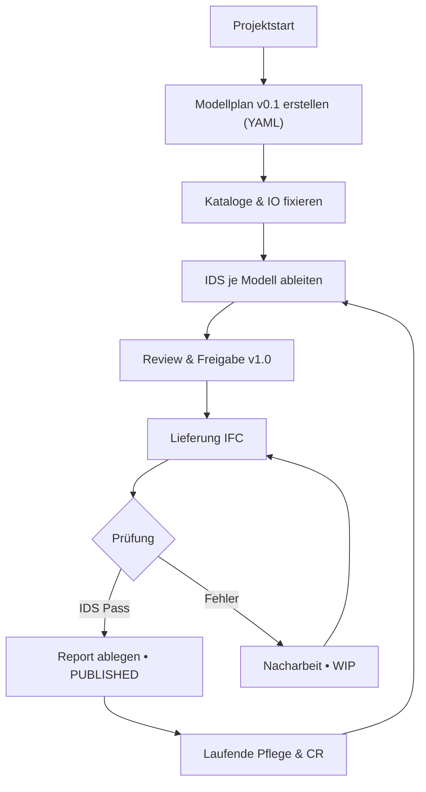

Schritt 1: Rahmen setzen
• Zielbild definieren: Zweck des Modellplans, Abnahme-kriterien, verwendete Normen (IFC 4.3, ISO 19650-Zustände), IDS-Einsatz.
• Geltungsbereich festlegen: Bauwerke, Disziplinen, Phasen, Datenquellen.
• Governance festlegen: Rollen (PL, Bauherrenunterstützung, BIM-Koordination, Datenarchitekt, Disziplinleiter, QS) und RACI je Artefakt.

Schritt 2: CDE-Struktur und Versionierung fixieren
• Ordner und Zustände: 01_WIP, 02_Shared, 03_Published, 04_Archived.
• Speicherorte: /Modellplaene, /IDS, /Reports, /Changelog.
• Namensschema für Dateien und Artefakte; semantische Versionierung (vMAJOR.MINOR.PATCH).

Schritt 3: Datenmodell für den Modellplan definieren
• Pflichtfelder pro Modell:
– Modell-ID, Bezeichnung, Modelltyp {Projekt|Kontext}, Gruppe, IO-Nummer, Fachmodell.
– Phase, LOD/LOG, CRS, LoGeoRef, Verantwortlich, Status, Revision.
– Erwartete IFC-Klassen, Property-/Quantity-Sets, Muss-Eigenschaften inkl. Einheit/Wertebereich.
– Dateiname-Muster, Liefermeilensteine, IDS-Pfad, Prüfregeln.
• Optionale Felder: Segmentierungsschema, Modellsegment-Liste, Abhängigkeiten, Referenzen.
• Maschinenlesbares Format: YAML als Master, IDS pro Modell als Ableitung.

Schritt 4: Kataloge einsammeln und fixieren
• IO-Nummern aus Bauherrenunterstützung.
• Gruppen- und Fachmodell-Vokabular konsolidieren.
• Kontrollierte Wertebereiche (CRS, LoGeoRef, Phasen, LOD) als Listen definieren.

Schritt 5: Initialen Modellplan v0.1 erstellen
• YAML-Skelett erzeugen und in CDE/01_WIP/Modellplaene ablegen.
• Minimale Inhalte für jedes geplante Projekt- und Kontext-Modell befüllen.
• Prüflisten je Disziplin ergänzen (Muss-Eigenschaften).

Schritt 6: Segmentierungsregeln festlegen
• Kriterien: >1000 m Kantenlänge oder fachlich sinnvoll.
• Schema definieren: z. B. km-Abschnitte, Bauwerks-Teile (Widerlager O/W, Fahrbahn N/S).
• Benennung: Modellsegment = {Schema}:{Wert} (z. B. km:1+000–1+250).
• Auswirkungen auf Dateinamen und IDS festhalten.

Schritt 7: IDS aus dem Modellplan ableiten
• Pro Modell eine IDS mit erwarteten IFC-Klassen, Psets/Props, Pflicht/Optional, Einheit, zulässige Werte.
• IDS an Pfaden im YAML referenzieren.
• Beispieleinträge mit echten Werten validieren.

Schritt 8: Prüfprozess definieren
• Automatisch: IDS-Validierung bei Lieferung, Bericht im CDE/Reports je Lieferung ablegen.
• Manuell: Stichproben-Abgleich effektive Eigenschaften ↔ Modellplan.
• Befundklassen: Pass, Warnung, Fehler; Rückspielung an Verursacher mit Frist.

Schritt 9: Änderungsmanagement und Changelog
• Änderungen am Modellplan nur per Change-Request.
• Review durch BIM-Koordination und Datenarchitekt, Freigabe durch PL.
• Changelog pflegen (was, warum, gültig ab, betroffene Modelle/IDS).

Schritt 10: Freigabe und Verteilung
• Modellplan v1.0 in 03_Published veröffentlichen, Hash/Signatur sichern.
• Verlinkung in BEP/Vertragsanhängen.
• IDS-Paket synchron in 03_Published/IDS bereitstellen.

Schritt 11: Laufende Pflege
• Regelmässige Reviews je Meilenstein oder bei Norm-/Vokabular-Änderungen.
• Veraltete Einträge ausphasen, „gültig_bis“ setzen, Nachfolger referenzieren.
• KPIs: Abdeckungsgrad Muss-Eigenschaften, IDS-Pass-Quote, Nacharbeitszeit.

Schritt 12: Abnahme und Übergabe
• Abnahmekriterien je Disziplin prüfen, Restmängel dokumentieren.
• Abschlussversion des Modellplans und IDS archivieren, Abschlussbericht im CDE.

Minimal-Artefakte

YAML-Skelett (Modellplan)

```yaml
modellplan:
  version: "1.0.0"
  gueltig_ab: "2025-10-09"
  projekt:
    io_nummer: "IO-12345"
    name: "Projekt A"
  kontrollierte_werte:
    modelltyp: ["Projekt","Kontext"]
    phase: ["GP/EK","AP/MK","DP/MP","AUS","BETR"]
    crs: ["LV95"]
    logeoref: ["LoGeoRef30","LoGeoRef40"]
  modelle:
    - id: "OBJ-BRG-001"
      bezeichnung: "Brücke X – Tragwerk"
      modelltyp: "Projekt"
      gruppe: "Bauwerk"
      io_nummer: "IO-12345"
      fachmodell: "Tragwerk_Beton"
      phase: "AP/MK"
      lod: "300-350"
      crs: "LV95"
      logeoref: "LoGeoRef30"
      verantwortung:
        rolle: "FU"
        organisation: "Unternehmen Y"
      segmentierung:
        schema: "km"
        segmente: ["km:1+000–1+250","km:1+250–1+500"]
      ifc:
        klassen: ["IfcBridge","IfcSlab","IfcBeam"]
        psets:
          - name: "Pset_BridgeCommon"
            props:
              - {name: "ConstructionPhase", required: true, type: "Text"}
              - {name: "LoadClass", required: false, type: "Text"}
        qsets:
          - name: "Qto_BeamBaseQuantities"
            props:
              - {name: "Length", required: true, unit: "m"}
      ids: "ids/OBJ-BRG-001.ids"
      dateiname_muster: "IO-12345_OBJ-BRG-001_{segment}_{phase}_{rev}.ifc"
      pruefungen:
        - {typ: "IDS", pfad: "ids/OBJ-BRG-001.ids"}
        - {typ: "manuell", checkliste: "docs/check_BRÜCKE_tragwerk.md"}
```

IDS-Minimalbeispiel (Auszug)

```xml
<ids:ids xmlns:ids="http://buildingSMART.org/IDS" version="1.0">
  <ids:specifications>
    <ids:specification name="OBJ-BRG-001">
      <ids:applicability>
        <ids:entity name="IfcBeam"/>
      </ids:applicability>
      <ids:requirements>
        <ids:property>
          <ids:propertySet>Pset_BridgeCommon</ids:propertySet>
          <ids:name>ConstructionPhase</ids:name>
          <ids:cardinality>required</ids:cardinality>
        </ids:property>
        <ids:quantity>
          <ids:quantitySet>Qto_BeamBaseQuantities</ids:quantitySet>
          <ids:name>Length</ids:name>
          <ids:cardinality>required</ids:cardinality>
          <ids:measure>m</ids:measure>
        </ids:quantity>
      </ids:requirements>
    </ids:specification>
  </ids:specifications>
</ids:ids>
```

Benennung und Muster
• Datei: {IO}-{ModellID}-{Segment}-{Phase}-{Rev}.ifc
• Segment: {Schema}:{Wert}
• IDS: {ModellID}.ids, ein Pfad je Modell.

Prozess-Flow (Mermaid)



Kontrollen je Lieferung
• Formale Prüfung: Dateiname, IO, Segment, Phase, Revision.
• Inhalt: IDS-Ergebnis, Muss-Eigenschaften erfüllt, Einheiten korrekt, Referenzen vorhanden.
• Vollständigkeit: alle geplanten Modelle geliefert, alle Segmente abgedeckt.
