# Analyse, Verbesserung und Lösungskonzept: BIM-Modellplanung

Ich werde Ihre Modellplanungs-Dokumentation analysieren, verbessern und umfassende Konzepte mit Visualisierungen erstellen.

## 📊 Konsistenzprüfung & Verbesserungsvorschläge

### Identifizierte Inkonsistenzen und Verbesserungspotenziale:

```yaml
findings:
  inkonsistenzen:
    - bereich: "Terminologie"
      problem: "Wechsel zwischen 'Projekt-Modell' und 'Projektmodell' (mit/ohne Bindestrich)"
      empfehlung: "Einheitliche Schreibweise: 'Projektmodell'"
    
    - bereich: "Prozessbeschreibung"
      problem: "Prüfprozesse erwähnt aber nicht detailliert beschrieben"
      empfehlung: "Detaillierte Prozessbeschreibung mit Verantwortlichkeiten und Frequenzen"
    
    - bereich: "Datenstruktur"
      problem: "YAML-Format erwähnt aber keine konkrete Struktur definiert"
      empfehlung: "YAML-Schema und Beispiele bereitstellen"
    
    - bereich: "Schwellenwerte"
      problem: "Räumliche Grenze (1000m x 1000m x 1000m) nicht begründet"
      empfehlung: "Technische Begründung und projektspezifische Anpassungsmöglichkeiten dokumentieren"

  verbesserungen:
    - kategorie: "Strukturierung"
      massnahme: "Klare Trennung zwischen Konzept, Prozess und technischer Umsetzung"
    
    - kategorie: "Qualitätssicherung"
      massnahme: "Validierungsregeln und Prüfkriterien definieren"
    
    - kategorie: "Automatisierung"
      massnahme: "IDS-basierte automatische Validierung priorisieren"
    
    - kategorie: "Governance"
      massnahme: "Change-Management-Prozess für Modellplan-Aktualisierungen etablieren"
```

## ✅ Tasks für die Umsetzung

```list type="issue"
data:
- title: "[Setup] Projekt-Governance und Rollenkonzept für Modellplanung etablieren"
  labels: ["setup", "high-priority", "governance"]
  number: 1
  description: |
    Definition der Rollen, Verantwortlichkeiten und Genehmigungsprozesse
    - BIM-Manager, Fachplaner, Koordinatoren
    - RACI-Matrix erstellen
    - Eskalationspfade definieren

- title: "[Konzept] YAML-Schema für Modellplan entwickeln und dokumentieren"
  labels: ["konzept", "high-priority", "technical"]
  number: 2
  description: |
    Entwicklung eines standardisierten YAML-Schemas inkl.:
    - Pflicht- und optionale Felder
    - Validierungsregeln
    - Versionierung
    - Beispieldateien

- title: "[Konzept] Fachmodell-Katalog und Namenskonventionen definieren"
  labels: ["konzept", "medium-priority", "standards"]
  number: 3
  description: |
    Vollständige Liste der Fachmodelle mit:
    - Standardbezeichnungen
    - Beschreibungen und Anwendungsfälle
    - Mappings zu IFC-Entitäten
    - Abhängigkeiten zwischen Modellen

- title: "[Prozess] Modellplan-Prüfprozess (manuell + IDS) konzipieren"
  labels: ["prozess", "high-priority", "quality"]
  number: 4
  description: |
    Detaillierte Prozessbeschreibung für:
    - Initiale Prüfung bei Modelleingang
    - Periodische Validierung
    - IDS-Regelwerk aufsetzen
    - Reporting und Abweichungsmanagement

- title: "[Prozess] Change-Management für Modellplan-Aktualisierungen etablieren"
  labels: ["prozess", "medium-priority", "governance"]
  number: 5
  description: |
    Prozess für Änderungen am Modellplan:
    - Änderungsantrag und Bewertung
    - Genehmigungsworkflow
    - Versionskontrolle
    - Kommunikation an Stakeholder

- title: "[Technisch] CDE-Integration und Speicherstruktur konzipieren"
  labels: ["technical", "high-priority", "infrastructure"]
  number: 6
  description: |
    CDE-Implementierung planen:
    - Ordnerstruktur definieren
    - Zugriffsrechte konzipieren
    - Versionierung implementieren
    - API-Schnittstellen für Automatisierung

- title: "[Technisch] IDS-Regelwerk für automatische Validierung erstellen"
  labels: ["technical", "high-priority", "automation"]
  number: 7
  description: |
    IDS-Spezifikationen entwickeln für:
    - Modelltyp-Validierung
    - Eigenschaftsprüfung
    - Geometrische Constraints
    - Namenskonventionen

- title: "[Technisch] Räumliche Segmentierungslogik und Tooling entwickeln"
  labels: ["technical", "medium-priority", "tooling"]
  number: 8
  description: |
    Werkzeuge für Modellsegmentierung:
    - Automatische Größenprüfung
    - Segmentierungsvorschläge
    - Namensgebungsautomatik
    - Visualisierung der Segmente

- title: "[Applikation] Requirements für Modellplan-Generator definieren"
  labels: ["application", "high-priority", "requirements"]
  number: 9
  description: |
    Anforderungskatalog erstellen:
    - Funktionale Anforderungen
    - UI/UX-Konzept
    - Datenquellen und Integrationen
    - Reporting-Funktionen

- title: "[Applikation] Modellplan-Generator MVP entwickeln"
  labels: ["application", "high-priority", "development"]
  number: 10
  description: |
    Entwicklung Minimum Viable Product:
    - Core-Funktionen implementieren
    - YAML-Export/Import
    - Basis-Validierung
    - CDE-Anbindung

- title: "[Qualität] Testkonzept und Validierungskriterien erstellen"
  labels: ["quality", "medium-priority", "testing"]
  number: 11
  description: |
    Qualitätssicherung definieren:
    - Testfälle für Modellvalidierung
    - Akzeptanzkriterien
    - Performance-Benchmarks
    - Pilotprojekt-Kriterien

- title: "[Dokumentation] Benutzerhandbuch und Schulungsunterlagen erstellen"
  labels: ["documentation", "medium-priority", "training"]
  number: 12
  description: |
    Umfassende Dokumentation:
    - Step-by-Step Guides
    - Best Practices
    - FAQ und Troubleshooting
    - Video-Tutorials
```

## 🏗️ Verbesserter Inhalt - Strukturierte Dokumentation


# BIM-Modellplanung: Konzept und Richtlinien

## 1. Zweck und Geltungsbereich

### 1.1 Zielsetzung
Die Modellplanung bildet die Grundlage für die strukturierte Erstellung, Verwaltung und Qualitätssicherung aller BIM-Fachmodelle im Projekt. Sie definiert die erforderlichen Modelle, deren Eigenschaften und Beziehungen zueinander.

### 1.2 Geltungsbereich
- Alle Projektmodelle gemäß Projektumfang
- Kontextmodelle zur räumlichen Einordnung
- Gesamter Projektlebenszyklus (Planung bis Betrieb)

### 1.3 Referenzen
- ISO 19650-2: BIM-Prozesse in der Planungsphase
- SIA 2051: Building Information Modelling (BIM)
- Projektspezifische BIM-Execution-Plan (BEP)

---

## 2. Grundprinzipien der Modellplanung

### 2.1 Proaktive Planung
- **Frühzeitige Definition**: Modellplan wird zu Projektbeginn erstellt
- **Stakeholder-Einbindung**: Alle Fachplaner wirken bei der Erstellung mit
- **Iterative Verfeinerung**: Regelmäßige Überprüfung und Anpassung

### 2.2 Strukturierte Dokumentation
- **Maschinenlesbarkeit**: YAML-Format als primäres Dokumentationsformat
- **Versionskontrolle**: Lückenlose Nachverfolgbarkeit aller Änderungen
- **Zentrale Ablage**: CDE als Single Source of Truth

### 2.3 Qualitätsorientierung
- **Prüfbarkeit**: Alle Definitionen müssen validierbar sein
- **Automatisierung**: IDS-basierte Regelprüfung wo möglich
- **Kontinuierliche Verbesserung**: Lessons Learned fließen in Updates ein

---

## 3. Modellklassifizierung

### 3.1 Modelltypen

#### 3.1.1 Projektmodelle
**Definition**: Modelle von Bauwerken und natürlichen Elementen, die Teil des Projektumfangs sind.

**Beispiele**:
- Brückenbauwerke
- Straßenkörper und Ingenieurbauwerke
- Entwässerungsanlagen
- Böschungen und Geländemodellierungen
- Lärmschutzwände

**Eigenschaft**: `modell_typ: projekt`

#### 3.1.2 Kontextmodelle
**Definition**: Modelle zur räumlichen und fachlichen Einordnung, die nicht zum Projektumfang gehören.

**Beispiele**:
- Parzellengrenzen und Katasterdaten
- Bestandsgebäude außerhalb des Projektumfangs
- Geologisches Untergrundmodell
- Leitungsbestand Dritter
- Digitales Geländemodell (DGM)

**Eigenschaft**: `modell_typ: kontext`

### 3.2 Gruppenzuweisung

**Zweck**: Organisatorische und fachliche Zuordnung der Projektmodelle

**Definierte Gruppen**:
- `gruppe_bauwerk`: Hochbauten und Brücken
- `gruppe_ingenieurbau`: Verkehrsanlagen, Tunnel
- `gruppe_landschaft`: Grünflächen, Gewässer
- `gruppe_infrastruktur`: Ver- und Entsorgung
- `gruppe_geotechnik`: Untergrund und Gründungen

### 3.3 IO-Nummern (Inventarobjekte)

**Zweck**: Eindeutige Zuordnung zu Projektbestandteilen gemäß Bauherrenvorgaben

**Struktur**: `IO-[Projekt]-[Kategorie]-[Laufnummer]`

**Beispiel**: `IO-N04-BW-001` (Brückenbauwerk 001 im Projekt N04)

**Prozess**:
1. IO-Nummern bei Bauherrenunterstützung anfragen
2. Zuordnung im Modellplan dokumentieren
3. In allen Modellen als Eigenschaft hinterlegen

---

## 4. Fachmodelle

### 4.1 Standardkatalog

| Fachmodell-Code | Bezeichnung | Beschreibung | Typische Elemente |
|-----------------|-------------|--------------|-------------------|
| FM-ARC | Architektur | Hochbauliche Elemente | Wände, Decken, Räume |
| FM-STR | Tragwerk | Tragende Konstruktion | Stützen, Träger, Fundamente |
| FM-GEO | Geotechnik | Untergrund und Gründung | Bodenschichten, Pfähle |
| FM-HYD | Hydraulik | Wasserbauliche Anlagen | Rohre, Schächte, Becken |
| FM-BRI | Brückenbau | Brückenbauwerke | Überbau, Unterbau, Lager |
| FM-ROA | Straßenbau | Verkehrsflächen | Fahrbahn, Gehwege, Markierungen |
| FM-TUN | Tunnelbau | Untertägige Bauwerke | Tunnelröhre, Portale, Technik |
| FM-LSW | Lärmschutz | Schallschutzanlagen | Lärmschutzwände, -wälle |
| FM-VEG | Vegetation | Grünplanung | Bäume, Sträucher, Rasen |
| FM-ELT | Elektrotechnik | Elektrische Anlagen | Kabel, Leuchten, Schaltanlagen |
| FM-TOP | Topografie | Geländeoberfläche | DGM, Böschungen |

**Erweiterung**: Projektspezifische Fachmodelle sind mit der Projektleitung abzustimmen und im Katalog zu dokumentieren.

### 4.2 Namenskonventionen

**Schema**: `[Projekt]_[IO-Nummer]_[Fachmodell]_[Segment]_[Version]`

**Beispiel**: `N04_IO-N04-BW-001_FM-BRI_Nord_v2.3`

**Regeln**:
- Keine Sonderzeichen außer Unterstrich und Bindestrich
- Keine Leerzeichen
- Versionsnummer gemäß Semantic Versioning (Major.Minor)

---

## 5. Räumliche Segmentierung

### 5.1 Segmentierungskriterien

**Geometrische Grenzen**:
- **Maximale Ausdehnung**: 1.000m × 1.000m × 1.000m
- **Begründung**: Performance-Optimierung in BIM-Software, Dateigrößen-Management

**Fachliche Grenzen**:
- Bauabschnitte und -phasen
- Funktionale Einheiten (z.B. Brückenfelder)
- Zuständigkeitsbereiche verschiedener Planer

### 5.2 Segmentierungslogik

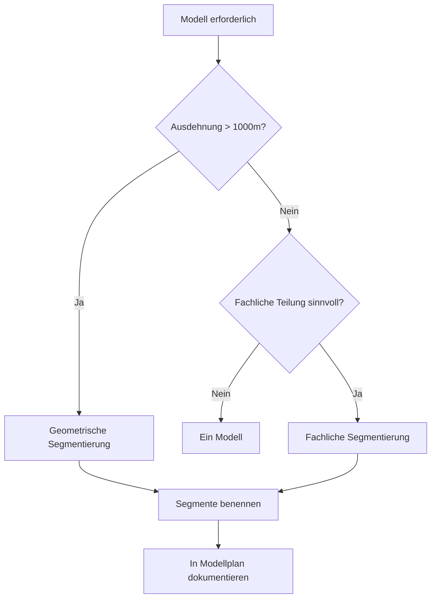

### 5.3 Namensgebung für Segmente

**Prinzipien**:
- Sprechende, selbsterklärende Bezeichnungen
- Konsistent innerhalb des Projekts
- Berücksichtigung der räumlichen Anordnung

**Beispiele**:
- Geometrisch: `Abschnitt_km_12.0-13.0`, `Segment_Ost`, `Feld_1-3`
- Funktional: `Rampe_Sued`, `Bauphase_2`, `Strecke_A`
- Kombiniert: `Bruecke_km_15.3_Feld_2`

---

## 6. Modellplan-Dokumentation

### 6.1 YAML-Struktur

```yaml
# Beispiel Modellplan-Struktur
modellplan:
  projekt:
    name: "Nationalstraße N04 - Abschnitt Ost"
    code: "N04"
    version: "2.1"
    datum: "2025-10-09"
    verantwortlich: "Max Mustermann, BIM-Manager"
  
  modelle:
    - id: "MOD-001"
      name: "N04_IO-N04-BW-001_FM-BRI_Nord_v2.0"
      modell_typ: "projekt"
      gruppe: "gruppe_bauwerk"
      io_nummer: "IO-N04-BW-001"
      io_bezeichnung: "Talbrücke Mustertal"
      fachmodell: "FM-BRI"
      segment: "Nord"
      verantwortlich: "Ingenieurbüro Brückenbau GmbH"
      
      eigenschaften:
        ersteller: "J. Schmidt"
        software: "Autodesk Revit 2024"
        koordinatensystem: "CH1903+ LV95"
        lod: "300"
        
      raum:
        bbox_min: [2683000, 1247000, 420]
        bbox_max: [2683500, 1247800, 485]
        segmentierungsgrund: "Länge > 1000m - Aufteilung in Nord/Süd"
      
      abhaengigkeiten:
        - modell_id: "MOD-003"
          typ: "referenziert"
          beschreibung: "Gründung aus Geotechnikmodell"
      
      validierung:
        letzter_check: "2025-10-05"
        status: "bestanden"
        pruefmethode: "IDS-Regelwerk v1.2"
    
    - id: "MOD-002"
      name: "N04_IO-N04-BW-001_FM-BRI_Sued_v2.0"
      modell_typ: "projekt"
      gruppe: "gruppe_bauwerk"
      io_nummer: "IO-N04-BW-001"
      io_bezeichnung: "Talbrücke Mustertal"
      fachmodell: "FM-BRI"
      segment: "Sued"
      # ... weitere Eigenschaften
    
    - id: "MOD-999"
      name: "N04_Kontext_Parzellen"
      modell_typ: "kontext"
      gruppe: null
      io_nummer: null
      fachmodell: "FM-TOP"
      segment: null
      beschreibung: "Katasterdaten Gemeinde Musterstadt"
      datenquelle: "Vermessungsamt Kanton"
```

### 6.2 Tabellarische Übersicht

**Minimale Spalten für Modellplan-Tabelle**:

| Spalte | Datentyp | Pflicht | Beschreibung |
|--------|----------|---------|--------------|
| Modell-ID | Text | Ja | Eindeutige ID |
| Modellname | Text | Ja | Vollständiger Name gemäß Konvention |
| Modelltyp | Enum | Ja | `projekt` oder `kontext` |
| Gruppe | Enum | Bei Projektmodell | Gruppenzuordnung |
| IO-Nummer | Text | Bei Projektmodell | Inventarobjekt-Nummer |
| Fachmodell | Code | Ja | Aus Fachmodellkatalog |
| Segment | Text | Optional | Bei räumlicher Teilung |
| Verantwortlich | Text | Ja | Organisation/Person |
| LOD | Text | Ja | Level of Development |
| Status | Enum | Ja | `geplant`, `in_arbeit`, `freigegeben` |

---

## 7. Prozesse

### 7.1 Erstellung des Modellplans

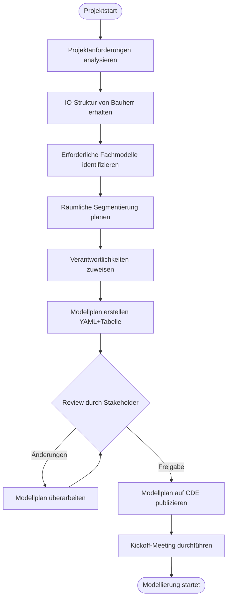

### 7.2 Modellvalidierung

#### 7.2.1 Manuelle Prüfung

**Frequenz**: Bei jedem Modell-Update im CDE

**Schritte**:
1. Modell aus CDE herunterladen
2. Eigenschaftsexport erstellen (z.B. IFC-Analyse-Tool)
3. Abgleich mit Modellplan-Vorgaben
4. Abweichungen dokumentieren
5. Feedback an Fachplaner

**Verantwortlich**: BIM-Koordinator

#### 7.2.2 Automatisierte IDS-Prüfung

**Frequenz**: Automatisch bei CDE-Upload

**Prozess**:
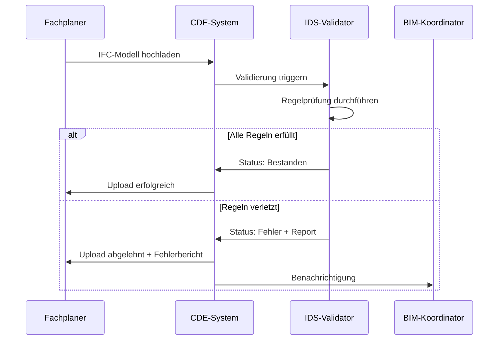

**IDS-Regelkategorien**:
- Modellnamen und Datei-Metadaten
- Erforderliche Eigenschaften (IO-Nummer, Fachmodell, etc.)
- Geometrische Constraints (Bounding Box)
- IFC-Schema-Konformität
- Projektspezifische Business Rules

### 7.3 Aktualisierung des Modellplans

**Trigger für Updates**:
- Projektumfangsänderungen
- Neue IO-Nummern
- Zusätzliche Fachmodelle erforderlich
- Änderung der Segmentierung
- Verantwortlichkeitswechsel

**Change-Management-Prozess**:

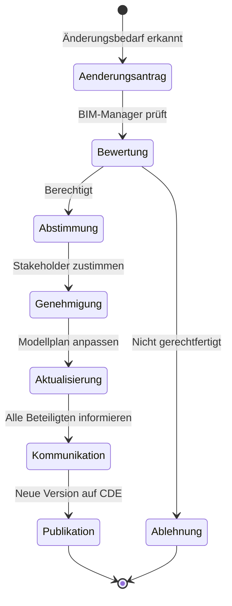

**Versionskontrolle**:
- **Major-Version** (x.0): Strukturelle Änderungen, neue Modelle
- **Minor-Version** (x.y): Eigenschaftsanpassungen, Korrekturen
- **Changelog**: Dokumentation aller Änderungen

---

## 8. CDE-Integration

### 8.1 Ordnerstruktur

```
/Projekt_N04
  /01_Modellplan
    /01_Aktuell
      - Modellplan_v2.1.yaml
      - Modellplan_v2.1.xlsx
    /02_Archiv
      - Modellplan_v2.0.yaml
      - Modellplan_v1.5.yaml
    /03_IDS_Regeln
      - IDS_Regelwerk_v1.2.xml
  /02_Modelle
    /01_Projektmodelle
      /IO-N04-BW-001_Talbruecke
        /FM-BRI_Brueckenbau
          - N04_IO-N04-BW-001_FM-BRI_Nord_v2.0.ifc
          - N04_IO-N04-BW-001_FM-BRI_Sued_v2.0.ifc
        /FM-STR_Tragwerk
          - ...
    /02_Kontextmodelle
      - N04_Kontext_Parzellen.ifc
      - N04_Kontext_DGM.ifc
  /03_Validierung
    /01_Reports
      - Validierungsbericht_2025-10-09.pdf
```

### 8.2 Zugriffsrechte

| Rolle | Modellplan | Projektmodelle | Kontextmodelle | Validierung |
|-------|------------|----------------|----------------|-------------|
| BIM-Manager | Lesen/Schreiben | Lesen/Schreiben | Lesen/Schreiben | Lesen/Schreiben |
| Fachplaner | Lesen | Lesen/Schreiben (eigene) | Lesen | Lesen (eigene) |
| Projektleitung | Lesen | Lesen | Lesen | Lesen |
| Auftraggeber | Lesen | Lesen | Lesen | Lesen |

---

## 9. Tooling und Automatisierung

### 9.1 Modellplan-Generator (in Entwicklung)

**Funktionsumfang**:
- Import von Projektdaten (IO-Liste, Bauwerksverzeichnis)
- Wizard-basierte Modellplan-Erstellung
- Automatische Namensgebung gemäß Konventionen
- YAML- und Excel-Export
- IDS-Regelwerk-Generierung
- Integration mit CDE-API

**Technologie-Stack**:
- Backend: Python (FastAPI)
- Frontend: React/TypeScript
- Datenbank: PostgreSQL
- IFC-Handling: IfcOpenShell

### 9.2 Validierungs-Pipeline

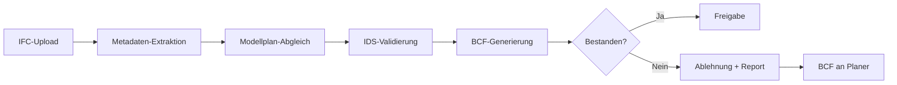

---

## 10. Qualitätskriterien

### 10.1 Modellplan-Qualität

- ✅ Vollständigkeit: Alle erforderlichen Modelle erfasst
- ✅ Konsistenz: Einheitliche Namensgebung und Struktur
- ✅ Aktualität: Änderungen innerhalb 48h nachgepflegt
- ✅ Prüfbarkeit: Alle Kriterien sind validierbar
- ✅ Nachvollziehbarkeit: Änderungshistorie lückenlos

### 10.2 Modell-Qualität

- ✅ Konformität: Übereinstimmung mit Modellplan-Vorgaben
- ✅ Koordination: Clash-freie Integration mit anderen Modellen
- ✅ Geometrie: Innerhalb definierter Bounding Box
- ✅ Semantik: Korrekte IFC-Klassifizierung
- ✅ Eigenschaften: Alle Pflichtattribute vorhanden

---

## 11. Verantwortlichkeiten (RACI)

| Aktivität | BIM-Manager | Fachplaner | Projektleitung | Bauherr |
|-----------|-------------|------------|----------------|---------|
| Modellplan erstellen | R/A | C | C | I |
| Modellplan genehmigen | R | I | A | C |
| Modelle erstellen | C | R/A | I | I |
| Modelle validieren | R/A | C | I | I |
| Modellplan aktualisieren | R/A | C | C | I |
| IDS-Regeln pflegen | R/A | C | I | I |

**Legende**: R = Responsible, A = Accountable, C = Consulted, I = Informed

---

## Anhang A: Checkliste Projektvorbereitung

- [ ] IO-Nummern und Objektbezeichnungen vom Bauherrn erhalten
- [ ] Projektspezifische Fachmodelle identifiziert
- [ ] Räumliche Segmentierung geplant
- [ ] Verantwortliche Fachplaner benannt
- [ ] Modellplan-YAML erstellt
- [ ] Modellplan-Tabelle erstellt
- [ ] IDS-Regelwerk aufgesetzt
- [ ] CDE-Struktur eingerichtet
- [ ] Zugriffsrechte konfiguriert
- [ ] Kickoff-Meeting durchgeführt
- [ ] Schulungen organisiert

## Anhang B: FAQ

**F: Was passiert bei nachträglichen IO-Änderungen?**
A: Change-Request gemäß Abschnitt 7.3, Modellplan-Update, Kommunikation an alle Fachplaner, ggf. Modell-Umbenennung.

**F: Können Segmentierungsgrenzen nachträglich angepasst werden?**
A: Ja, durch formellen Change-Request. Bereits erstellte Modelle müssen ggf. neu segmentiert werden.

**F: Wer definiert projektspezifische Fachmodelle?**
A: BIM-Manager in Abstimmung mit Projektleitung und relevanten Fachplanern.


## 🎯 Konzepte aus diversen Sichten

### 1. Prozesssicht - BPMN-Diagramm

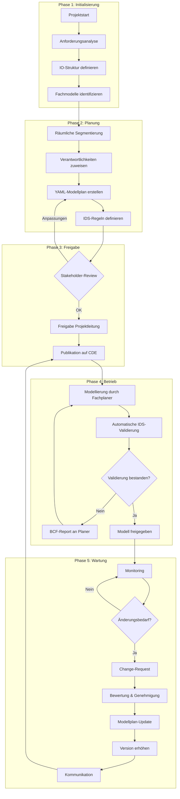

### 2. Datensicht - Informationsmodell

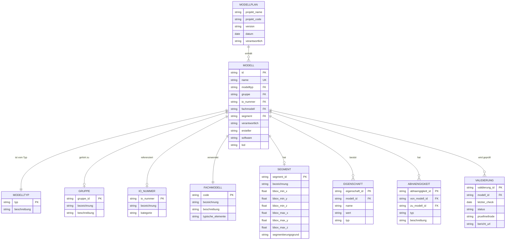

### 3. Systemsicht - Architektur

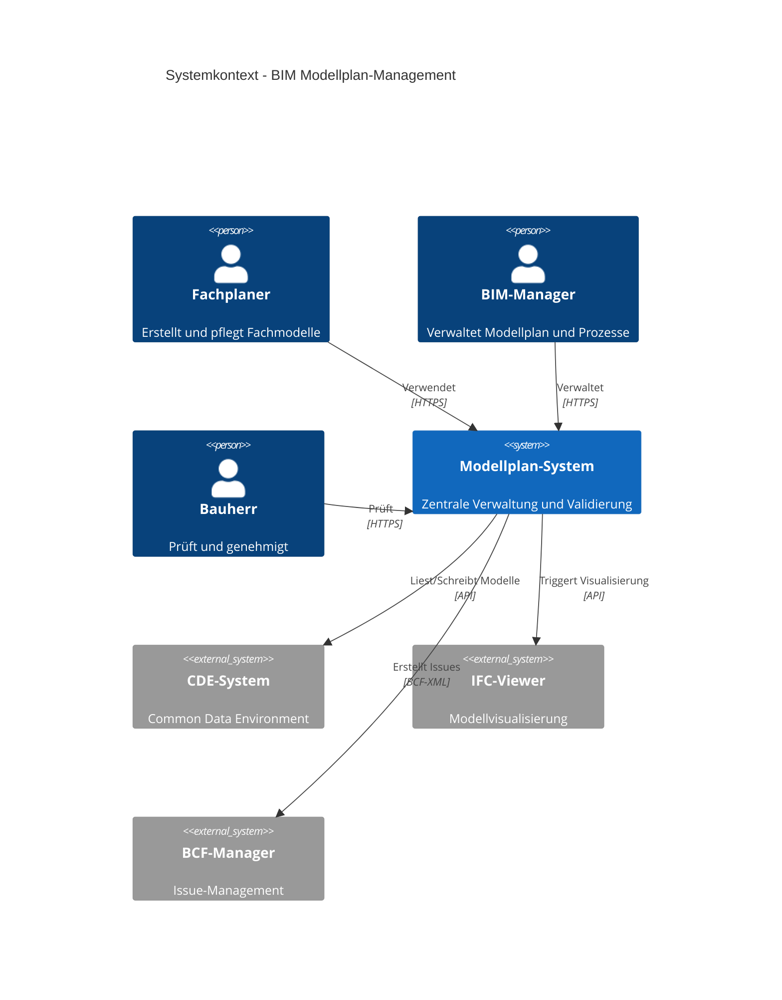

### 4. Komponentensicht - Modellplan-Generator

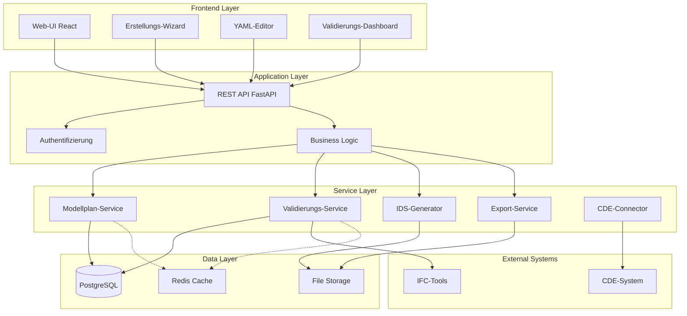

### 5. Deployment-Sicht

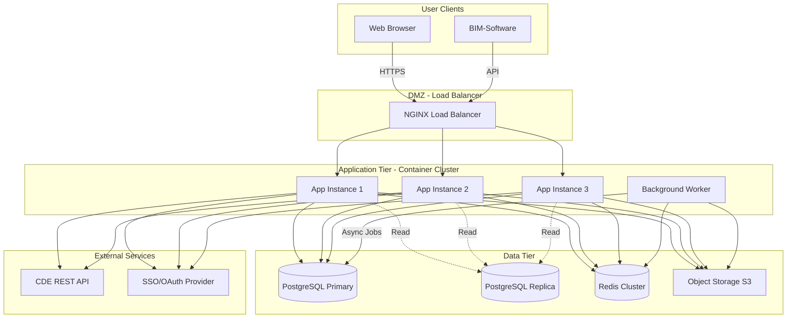

### 6. Sicherheitssicht

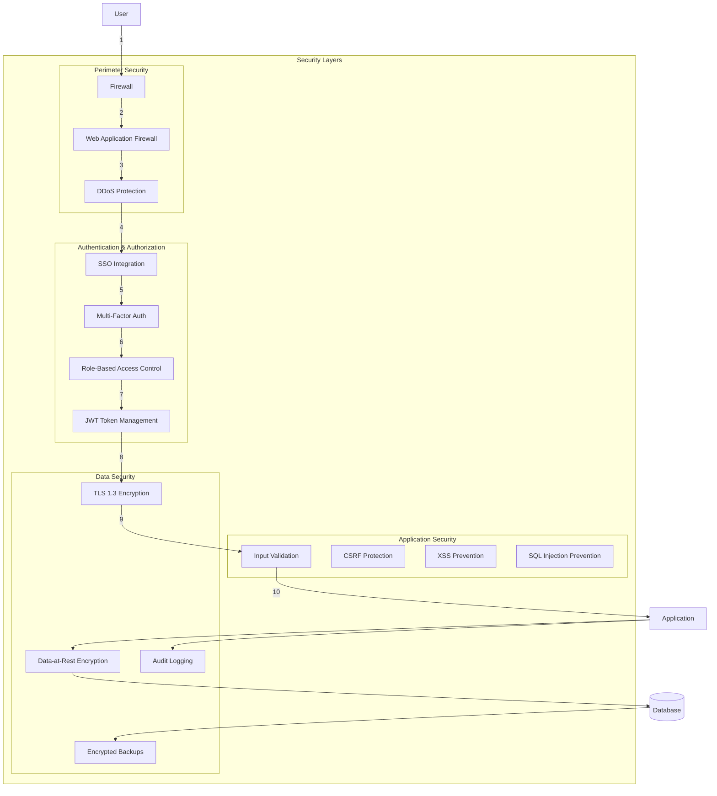

### 7. Validierungs-Workflow

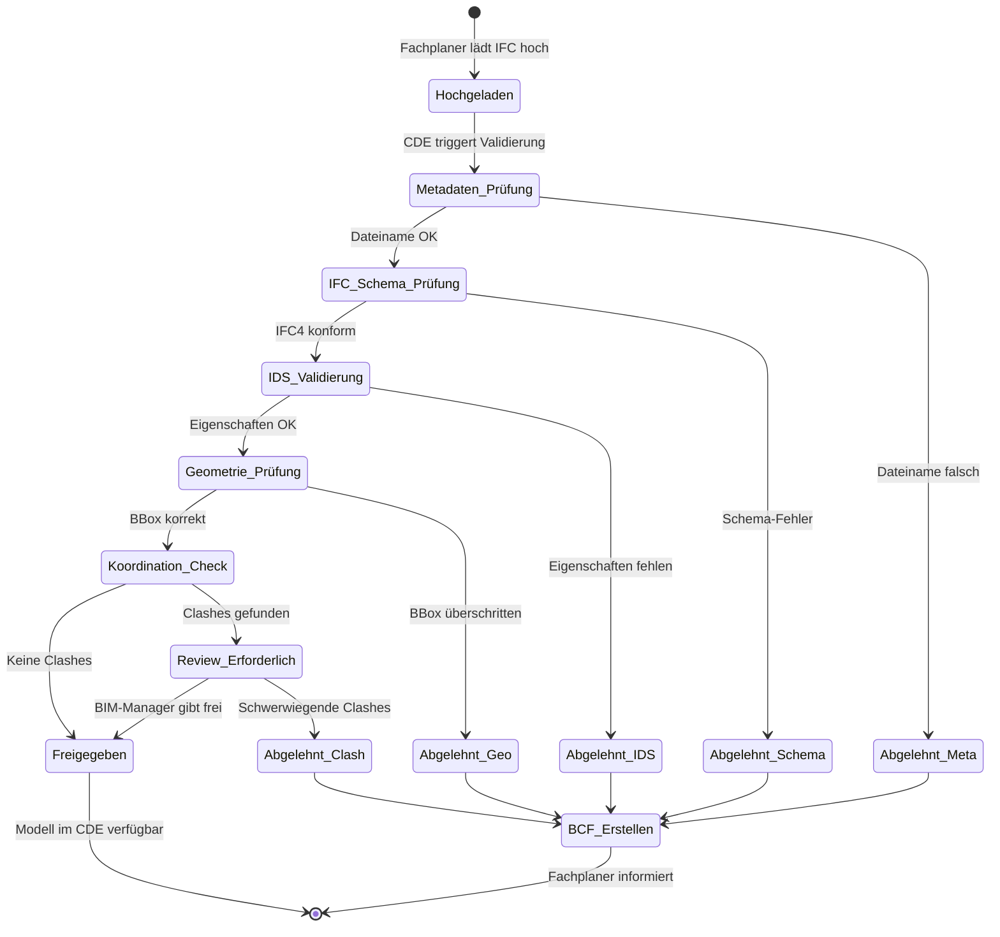

### 8. Interaktionssicht - Sequenzdiagramm

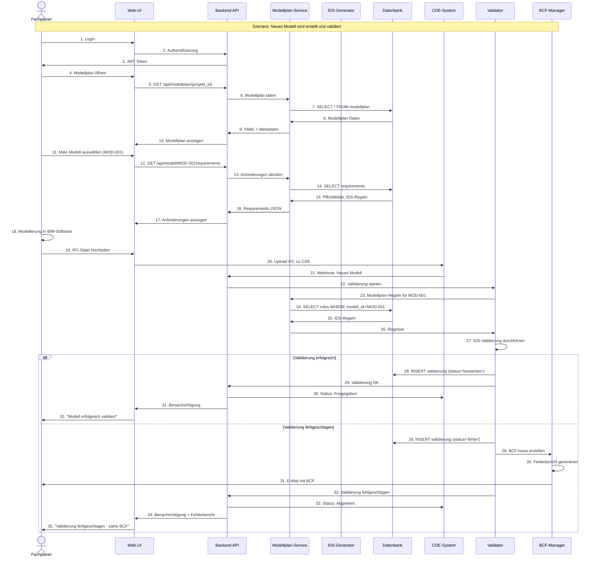
