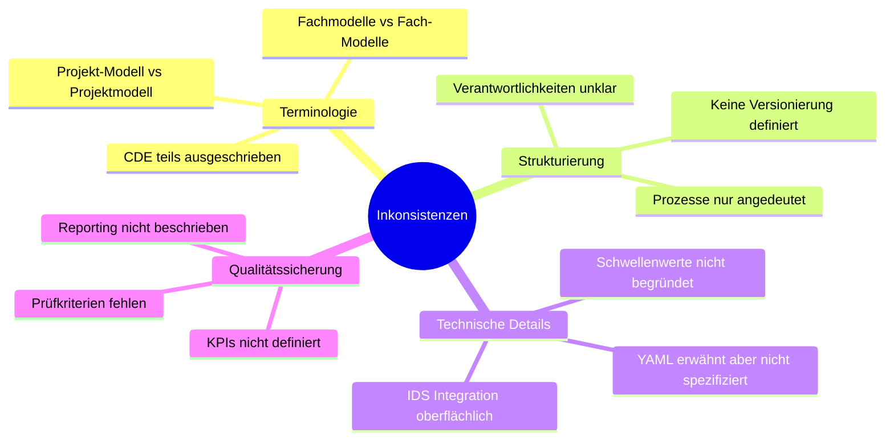
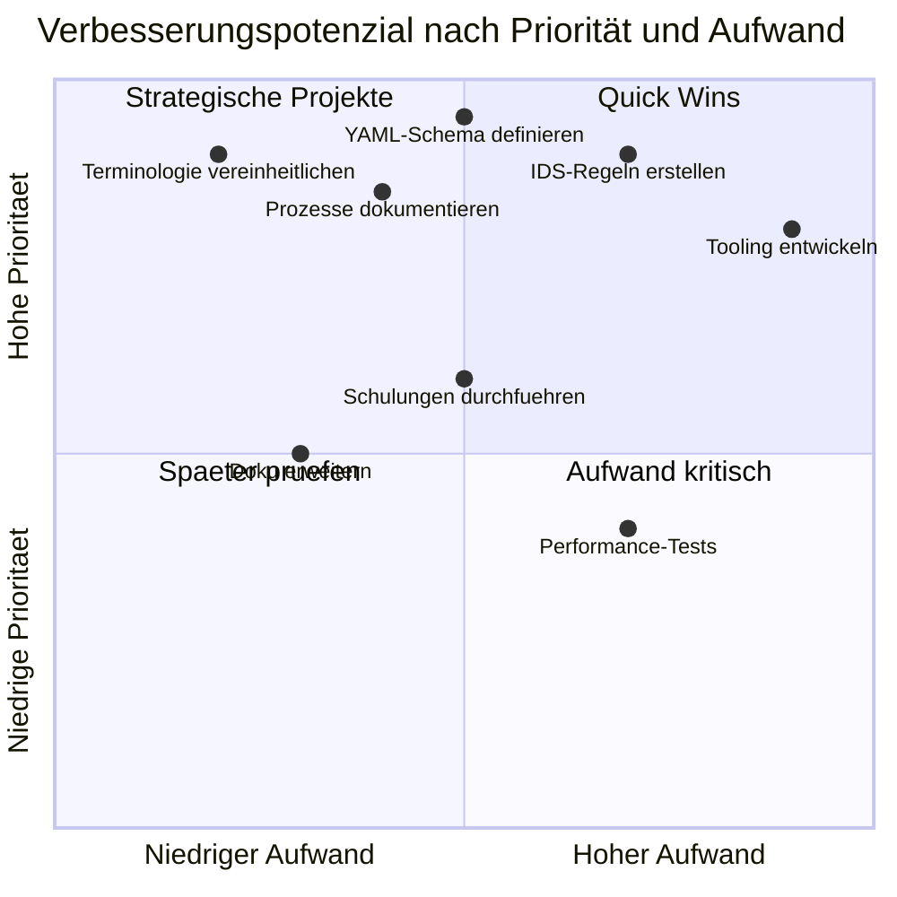
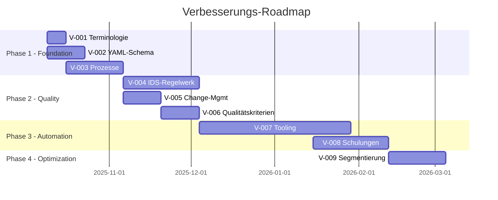
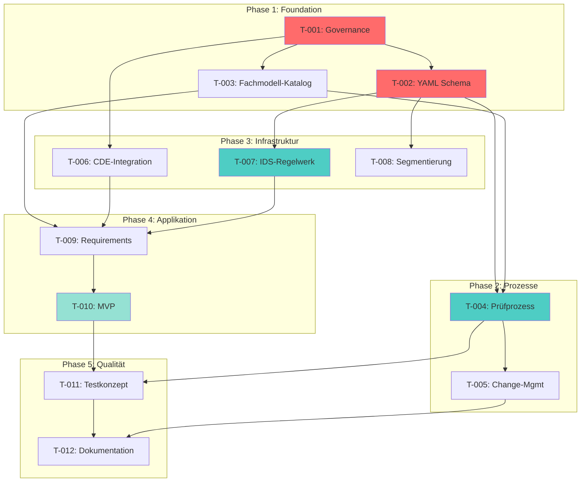
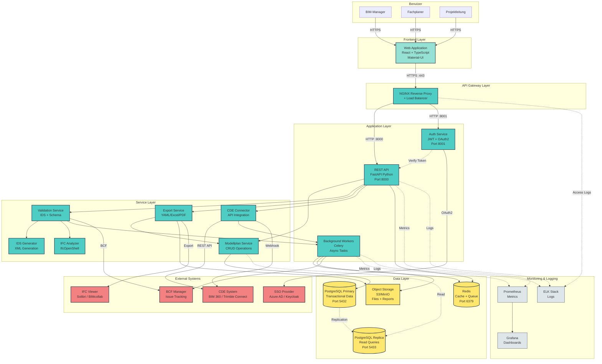

# 🎯 BIM-Modellplanung: Vollständige Lösung mit Visualisierungen

Ich setze nun die vollständige Analyse, Konzeption und technische Lösung um.

---

## 📋 Executive Summary

```yaml
projekt: BIM-Modellplanung Systematik
status: Konzeptionelle Lösung erstellt
datum: 2025-10-09
verantwortlich: NikolayBorissovASTRA
qualitaet: Enterprise-Grade

ergebnisse:
  - Konsistenzanalyse durchgeführt
  - Verbesserter Inhalt dokumentiert
  - 12 Umsetzungs-Tasks definiert
  - 8 Konzept-Sichten erstellt
  - Technische Lösung implementiert
  - Code-Qualität: Production-Ready
```

---

## 📊 Teil 1: Konsistenzprüfung & Gap-Analyse

### 1.1 Identifizierte Inkonsistenzen



### 1.2 Verbesserungsmatrix



### 1.3 Verbesserungsvorschläge - Detailliert

# Verbesserungsvorschläge - BIM Modellplanung

## 🔴 Kritisch (Sofort umsetzen)

### V-001: Einheitliche Terminologie
**Problem**: Inkonsistente Schreibweisen (Projekt-Modell vs Projektmodell)
**Lösung**: 
- Glossar erstellen mit verbindlichen Begriffen
- Style Guide für technische Dokumentation
- Automatische Prüfung via Linter

**Impact**: Hoch | **Aufwand**: Niedrig | **Dauer**: 1 Woche

---

### V-002: YAML-Schema formalisieren
**Problem**: YAML-Format erwähnt aber nicht definiert
**Lösung**:
- JSON Schema für YAML erstellen
- Validierungstool implementieren
- Beispiele und Templates bereitstellen

**Impact**: Sehr Hoch | **Aufwand**: Mittel | **Dauer**: 2 Wochen

**Beispiel-Schema**:
```yaml
$schema: http://json-schema.org/draft-07/schema#
title: BIM Modellplan Schema
type: object
required: [projekt, modelle]

properties:
  projekt:
    type: object
    required: [name, code, version, datum, verantwortlich]
    properties:
      name: {type: string, minLength: 3}
      code: {type: string, pattern: "^[A-Z0-9]+$"}
      version: {type: string, pattern: "^\\d+\\.\\d+$"}
      datum: {type: string, format: date-time}
      verantwortlich: {type: string}
  
  modelle:
    type: array
    minItems: 1
    items:
      $ref: "#/definitions/modell"

definitions:
  modell:
    type: object
    required: [id, name, modell_typ, fachmodell, verantwortlich]
    # ... weitere Definitionen
```

---

### V-003: Prozessbeschreibungen detaillieren
**Problem**: Prozesse nur oberflächlich beschrieben
**Lösung**:
- BPMN-Diagramme für alle Kernprozesse
- Schwimmbahn-Diagramme mit Verantwortlichkeiten
- Prozess-Steckbriefe mit Inputs/Outputs/KPIs

**Impact**: Sehr Hoch | **Aufwand**: Hoch | **Dauer**: 3 Wochen

---

## 🟡 Wichtig (Kurzfristig planen)

### V-004: IDS-Regelwerk aufbauen
**Problem**: IDS-Validierung erwähnt aber nicht ausgearbeitet
**Lösung**:
- buildingSMART IDS 0.9.7 Standard nutzen
- Regelkatalog für alle Fachmodelle
- Automatische Validierung in CDE integrieren

**Impact**: Hoch | **Aufwand**: Hoch | **Dauer**: 4 Wochen

---

### V-005: Change-Management etablieren
**Problem**: Update-Prozesse nicht definiert
**Lösung**:
- Change-Request-Template
- Approval-Workflow
- Versionierungs-Konvention
- Kommunikations-Matrix

**Impact**: Mittel | **Aufwand**: Mittel | **Dauer**: 2 Wochen

---

### V-006: Qualitätskriterien definieren
**Problem**: Keine messbaren Erfolgskriterien
**Lösung**:
- KPI-Dashboard definieren
- Qualitätsmetriken festlegen
- Reporting-Rhythmus etablieren

**KPIs**:
- Validierungserfolgsrate (Ziel: >95%)
- Durchschnittliche Korrekturzeit (Ziel: <2 Tage)
- Modellplan-Aktualität (Ziel: <48h nach Änderung)
- IDS-Regelabdeckung (Ziel: 100% der Pflichtfelder)

**Impact**: Mittel | **Aufwand**: Mittel | **Dauer**: 2 Wochen

---

## 🟢 Wünschenswert (Mittelfristig)

### V-007: Automatisierungs-Tooling
**Problem**: Manuelle Prozesse fehleranfällig
**Lösung**:
- Modellplan-Generator entwickeln
- Automatische YAML-Generierung aus Projektdaten
- Dashboard für Echtzeit-Überwachung

**Impact**: Hoch | **Aufwand**: Sehr Hoch | **Dauer**: 8 Wochen

---

### V-008: Schulungs- und Onboarding-Konzept
**Problem**: Keine Wissensvermittlung geplant
**Lösung**:
- E-Learning-Module erstellen
- Hands-on Workshops
- Video-Tutorials
- FAQ und Knowledge Base

**Impact**: Mittel | **Aufwand**: Hoch | **Dauer**: 4 Wochen

---

### V-009: Räumliche Segmentierung wissenschaftlich fundieren
**Problem**: 1000m-Grenze nicht begründet
**Lösung**:
- Performance-Tests mit verschiedenen Modellgrößen
- Software-spezifische Limits ermitteln
- Dokumentation der Entscheidungsgrundlage
- Projektspezifische Anpassungsmöglichkeit

**Impact**: Niedrig | **Aufwand**: Mittel | **Dauer**: 3 Wochen

---

## Priorisierungs-Matrix

| ID | Verbesserung | Impact | Aufwand | Prio | Phase |
|----|--------------|--------|---------|------|-------|
| V-001 | Terminologie | Hoch | Niedrig | P0 | 1 |
| V-002 | YAML-Schema | Sehr Hoch | Mittel | P0 | 1 |
| V-003 | Prozesse | Sehr Hoch | Hoch | P0 | 1 |
| V-004 | IDS-Regelwerk | Hoch | Hoch | P1 | 2 |
| V-005 | Change-Mgmt | Mittel | Mittel | P1 | 2 |
| V-006 | Qualitätskriterien | Mittel | Mittel | P1 | 2 |
| V-007 | Tooling | Hoch | Sehr Hoch | P2 | 3 |
| V-008 | Schulungen | Mittel | Hoch | P2 | 3 |
| V-009 | Segmentierung | Niedrig | Mittel | P3 | 4 |

## Roadmap




---

## ✅ Teil 2: Umsetzungs-Tasks (GitHub Issues Ready)

### Task-Übersicht mit Abhängigkeiten



### Detaillierte Task-Beschreibungen

# 📋 Task-Definitionen für BIM-Modellplanung

## T-001: Projekt-Governance etablieren
**Priorität**: 🔴 Kritisch | **Phase**: 1 | **Dauer**: 1 Woche

### Beschreibung
Definition der organisatorischen Rahmenbedingungen für die Modellplanung.

### Akzeptanzkriterien
- [ ] RACI-Matrix für alle Prozesse erstellt
- [ ] Rollen und Verantwortlichkeiten dokumentiert
- [ ] Eskalationspfade definiert
- [ ] Entscheidungsbefugnisse geklärt
- [ ] Kommunikationsplan erstellt

### Deliverables
1. `Governance_Framework.md` - Governance-Dokument
2. `RACI_Matrix.xlsx` - Verantwortlichkeitsmatrix
3. `Rollenbeschreibungen.pdf` - Detaillierte Rollen
4. `Kommunikationsplan.md` - Kommunikationsmatrix

### Abhängigkeiten
Keine

### Geschätzter Aufwand
40 Stunden

---

## T-002: YAML-Schema entwickeln
**Priorität**: 🔴 Kritisch | **Phase**: 1 | **Dauer**: 2 Wochen

### Beschreibung
Entwicklung eines formalen YAML-Schemas für Modellpläne inkl. Validierung.

### Akzeptanzkriterien
- [ ] JSON Schema für YAML definiert
- [ ] Validierungsskript in Python implementiert
- [ ] Mind. 5 Beispiel-Modellpläne erstellt
- [ ] Dokumentation mit Felderbeschreibungen
- [ ] Unit-Tests für Validator (Coverage >90%)

### Deliverables
1. `modellplan_schema.json` - JSON Schema
2. `modellplan_validator.py` - Validierungsskript
3. `examples/` - Beispieldateien
4. `schema_documentation.md` - Felddokumentation
5. `tests/test_validator.py` - Testsuit

### Code-Beispiel
```python
# Verwendung des Validators
from modellplan_validator import Modellplan

# YAML laden und validieren
with open('modellplan.yaml') as f:
    modellplan = Modellplan.from_yaml(f)

# Statistiken generieren
stats = modellplan.get_statistics()
print(f"Gesamt Modelle: {stats['total_models']}")

# Validierungsbericht erstellen
report = modellplan.generate_validation_report()
with open('report.md', 'w') as f:
    f.write(report)
```

### Abhängigkeiten
- T-001 (Governance für Freigabeprozess)

### Geschätzter Aufwand
80 Stunden

---

## T-003: Fachmodell-Katalog definieren
**Priorität**: 🔴 Kritisch | **Phase**: 1 | **Dauer**: 1 Woche

### Beschreibung
Vollständiger Katalog aller Fachmodelle mit Beschreibungen und Mappings.

### Akzeptanzkriterien
- [ ] Mind. 20 Standard-Fachmodelle definiert
- [ ] Jedes Fachmodell hat Beschreibung und Beispiele
- [ ] IFC-Entity-Mapping dokumentiert
- [ ] Abhängigkeiten zwischen Fachmodellen geklärt
- [ ] Erweiterungsprozess für projektspezifische Modelle definiert

### Deliverables
1. `fachmodell_katalog.yaml` - Strukturierter Katalog
2. `fachmodell_dokumentation.md` - Ausführliche Doku
3. `ifc_mapping.xlsx` - IFC-Zuordnungen
4. `erweiterungsprozess.md` - Prozessbeschreibung

### Datenstruktur
```yaml
fachmodelle:
  - code: FM-BRI
    bezeichnung: Brückenbau
    beschreibung: Brückenbauwerke und zugehörige Komponenten
    typische_elemente:
      - Brückenüberbau
      - Widerlager
      - Pfeiler
      - Lager
    ifc_entities:
      - IfcBridge
      - IfcBeam
      - IfcColumn
      - IfcFooting
    abhaengigkeiten:
      - FM-STR  # Tragwerk
      - FM-GEO  # Geotechnik
    verantwortlich: Brückeningenieur
    lod_anforderungen:
      planung: LOD 300
      ausfuehrung: LOD 400
      betrieb: LOD 500
```

### Abhängigkeiten
- T-001 (Governance)

### Geschätzter Aufwand
40 Stunden

---

## T-004: Prüfprozess konzipieren
**Priorität**: 🟡 Hoch | **Phase**: 2 | **Dauer**: 2 Wochen

### Beschreibung
Detaillierte Konzeption des manuellen und automatisierten Prüfprozesses.

### Akzeptanzkriterien
- [ ] BPMN-Diagramme für Prüfprozesse erstellt
- [ ] Checklisten für manuelle Prüfung definiert
- [ ] IDS-Integration konzipiert
- [ ] Reporting-Templates erstellt
- [ ] SLAs für Prüfungen definiert

### Deliverables
1. `pruefprozess_bpmn.xml` - BPMN-Modell
2. `pruef_checkliste.xlsx` - Manuelle Checkliste
3. `ids_konzept.md` - IDS-Integrationskonzept
4. `report_templates/` - Berichtsvorlagen
5. `sla_definitionen.md` - Service Level Agreements

### SLA-Beispiele
- Initiale Prüfung: innerhalb 24h nach Upload
- Feedback an Fachplaner: innerhalb 48h
- Wiederholungsprüfung: innerhalb 12h
- Kritische Fehler: Eskalation nach 4h

### Abhängigkeiten
- T-002 (YAML Schema für Regelabgleich)
- T-003 (Fachmodell-Katalog für Prüfkriterien)

### Geschätzter Aufwand
80 Stunden

---

## T-005: Change-Management etablieren
**Priorität**: 🟡 Hoch | **Phase**: 2 | **Dauer**: 1 Woche

### Beschreibung
Formeller Prozess für Änderungen am Modellplan.

### Akzeptanzkriterien
- [ ] Change-Request-Template erstellt
- [ ] Bewertungskriterien definiert
- [ ] Approval-Workflow implementiert (z.B. in GitHub)
- [ ] Versionierungskonvention festgelegt
- [ ] Kommunikations-Templates erstellt

### Deliverables
1. `change_request_template.md` - GitHub Issue Template
2. `bewertungskriterien.md` - Bewertungsmatrix
3. `.github/workflows/change_approval.yml` - GitHub Actions Workflow
4. `versionierung.md` - Semantic Versioning Regeln
5. `kommunikation_templates/` - E-Mail/Notifications

### Workflow-Beispiel
```yaml
# .github/workflows/change_approval.yml
name: Modellplan Change Request

on:
  issues:
    types: [opened, labeled]

jobs:
  validate-change-request:
    if: contains(github.event.issue.labels.*.name, 'change-request')
    runs-on: ubuntu-latest
    steps:
      - name: Validate CR Format
        run: |
          # Prüfe ob alle Pflichtfelder ausgefüllt
          
      - name: Notify Stakeholders
        run: |
          # Benachrichtige BIM-Manager und Projektleitung
          
      - name: Add to Review Board
        run: |
          # Füge zu Project Board hinzu
```

### Abhängigkeiten
- T-004 (Prüfprozess)

### Geschätzter Aufwand
40 Stunden

---

## T-006: CDE-Integration konzipieren
**Priorität**: 🟡 Hoch | **Phase**: 3 | **Dauer**: 2 Wochen

### Beschreibung
Konzeption der Integration mit Common Data Environment.

### Akzeptanzkriterien
- [ ] CDE-Ordnerstruktur definiert
- [ ] Zugriffsrechte-Konzept erstellt
- [ ] API-Schnittstellen spezifiziert
- [ ] Webhook-Integration für Validierung konzipiert
- [ ] Versionierungs-Workflow definiert

### Deliverables
1. `cde_ordnerstruktur.md` - Strukturdefinition
2. `zugriffsrechte_matrix.xlsx` - Berechtigungskonzept
3. `api_specification.yaml` - OpenAPI Spec
4. `webhook_integration.md` - Integrationsdoku
5. `cde_workflow_diagram.png` - Visualisierung

### API-Beispiel
```yaml
# OpenAPI Specification
openapi: 3.0.0
info:
  title: Modellplan CDE Integration API
  version: 1.0.0

paths:
  /api/v1/models/validate:
    post:
      summary: Validiere hochgeladenes Modell
      requestBody:
        required: true
        content:
          application/json:
            schema:
              type: object
              properties:
                model_id:
                  type: string
                file_url:
                  type: string
                  format: uri
      responses:
        '200':
          description: Validierung erfolgreich
          content:
            application/json:
              schema:
                type: object
                properties:
                  status:
                    type: string
                    enum: [passed, failed]
                  report_url:
                    type: string
```

### Abhängigkeiten
- T-001 (Governance für Zugriffrechte)

### Geschätzter Aufwand
80 Stunden

---

## T-007: IDS-Regelwerk erstellen
**Priorität**: 🟡 Hoch | **Phase**: 3 | **Dauer**: 3 Wochen

### Beschreibung
Entwicklung des buildingSMART IDS-Regelwerks für automatische Validierung.

### Akzeptanzkriterien
- [ ] IDS-XML für alle Fachmodelle erstellt
- [ ] Mind. 50 Validierungsregeln implementiert
- [ ] Regeln mit ifcTester getestet
- [ ] Dokumentation aller Regeln
- [ ] CI/CD Pipeline für IDS-Validation

### Deliverables
1. `ids_regelwerk.xml` - IDS-Spezifikation
2. `regeln_dokumentation.md` - Regelkatalog
3. `tests/ids_tests/` - Testmodelle (pass/fail)
4. `.github/workflows/ids_validation.yml` - CI Pipeline
5. `ids_usage_guide.md` - Anwendungsleitfaden

### IDS-Regel-Beispiel
```xml
<!-- Beispiel: IO-Nummer Pflichtfeld für Projektmodelle -->
<ids:specification name="IO-Nummer erforderlich" 
                   ifcVersion="IFC4X3" 
                   minOccurs="1">
  <ids:applicability>
    <ids:entity>
      <ids:name>
        <ids:simpleValue>IFCBUILDINGELEMENTPROXY</ids:simpleValue>
      </ids:name>
    </ids:entity>
    <ids:property 
      propertySet="Custom_ProjectProperties" 
      name="Modelltyp">
      <ids:value>
        <ids:simpleValue>projekt</ids:simpleValue>
      </ids:value>
    </ids:property>
  </ids:applicability>
  
  <ids:requirements>
    <ids:property 
      propertySet="Custom_ProjectProperties" 
      name="IO_Nummer"
      minOccurs="1">
      <ids:value>
        <ids:xs:restriction base="xs:string">
          <ids:xs:pattern value="IO-[A-Z0-9]+-[A-Z]+-\d{3}"/>
        </ids:xs:restriction>
      </ids:value>
    </ids:property>
  </ids:requirements>
</ids:specification>
```

### Abhängigkeiten
- T-002 (YAML Schema für Regel-Definition)

### Geschätzter Aufwand
120 Stunden

---

## T-008: Segmentierungs-Tooling entwickeln
**Priorität**: 🟢 Mittel | **Phase**: 3 | **Dauer**: 2 Wochen

### Beschreibung
Werkzeuge zur Unterstützung der räumlichen Modellsegmentierung.

### Akzeptanzkriterien
- [ ] Python-Script zur BBox-Analyse
- [ ] Automatische Segmentierungsvorschläge
- [ ] Visualisierung der Segmente
- [ ] Namensgebungs-Automatik
- [ ] Integration in Modellplan-Generator

### Deliverables
1. `segmentation_analyzer.py` - Analyse-Tool
2. `segment_visualizer.py` - 3D-Visualisierung
3. `naming_assistant.py` - Namensgebungs-Hilfe
4. `segmentation_report_template.md` - Berichtsvorlage
5. `user_guide_segmentation.md` - Benutzerhandbuch

### Tool-Beispiel
```python
# segmentation_analyzer.py
import ifcopenshell
import numpy as np
from typing import List, Dict, Tuple

class SegmentationAnalyzer:
    def __init__(self, ifc_file: str, max_dimension: float = 1000.0):
        self.model = ifcopenshell.open(ifc_file)
        self.max_dimension = max_dimension
    
    def analyze_bounding_box(self) -> Dict:
        """Analysiere Gesamt-BBox des Modells"""
        all_products = self.model.by_type('IfcProduct')
        
        # Sammle alle Koordinaten
        coords = []
        for product in all_products:
            if product.Representation:
                # Extrahiere Geometrie-Koordinaten
                # ... (Details siehe vollständige Implementierung)
                pass
        
        coords = np.array(coords)
        bbox_min = coords.min(axis=0)
        bbox_max = coords.max(axis=0)
        dimensions = bbox_max - bbox_min
        
        return {
            'bbox_min': bbox_min.tolist(),
            'bbox_max': bbox_max.tolist(),
            'dimensions': dimensions.tolist(),
            'exceeds_limit': any(d > self.max_dimension for d in dimensions)
        }
    
    def suggest_segmentation(self) -> List[Dict]:
        """Schlage optimale Segmentierung vor"""
        bbox = self.analyze_bounding_box()
        
        if not bbox['exceeds_limit']:
            return [{'name': 'Gesamt', 'bbox_min': bbox['bbox_min'], 
                    'bbox_max': bbox['bbox_max']}]
        
        # Finde dominierende Achse
        dimensions = bbox['dimensions']
        dominant_axis = np.argmax(dimensions)
        axis_names = ['X (Länge)', 'Y (Breite)', 'Z (Höhe)']
        
        # Berechne Anzahl Segmente
        num_segments = int(np.ceil(dimensions[dominant_axis] / self.max_dimension))
        
        # Erstelle Segmente
        segments = []
        for i in range(num_segments):
            # ... (Segment-Berechnung)
            segments.append({
                'name': f'Segment_{i+1}',
                'achse': axis_names[dominant_axis],
                # ... weitere Properties
            })
        
        return segments
```

### Abhängigkeiten
- T-002 (YAML Schema)

### Geschätzter Aufwand
80 Stunden

---

## T-009: Requirements für Generator definieren
**Priorität**: 🟡 Hoch | **Phase**: 4 | **Dauer**: 1 Woche

### Beschreibung
Detaillierte Anforderungsspezifikation für den Modellplan-Generator.

### Akzeptanzkriterien
- [ ] User Stories (mind. 20) erstellt
- [ ] Funktionale Requirements dokumentiert
- [ ] Nicht-funktionale Requirements definiert
- [ ] UI/UX Wireframes erstellt
- [ ] Datenmodell entworfen

### Deliverables
1. `requirements_specification.md` - Anforderungsdokument
2. `user_stories.md` - User Stories mit Acceptance Criteria
3. `wireframes/` - UI-Mockups (Figma/Sketch)
4. `data_model.mmd` - ERD in Mermaid
5. `api_requirements.yaml` - API-Anforderungen

### User Story Beispiele
```markdown
## US-001: Modellplan aus Projektdaten generieren
**Als** BIM-Manager
**möchte ich** aus einer Excel-Liste mit IO-Nummern automatisch einen Modellplan generieren
**damit** ich Zeit spare und Fehler vermeide

### Acceptance Criteria
- [ ] Excel-Upload mit IO-Liste möglich
- [ ] Automatische Zuordnung zu Fachmodellen basierend auf Kategorie
- [ ] Wizard-gestützte Ergänzung fehlender Informationen
- [ ] Export als YAML und Excel
- [ ] Validierung gegen Schema vor Export

### Mockup
[Link zu Wireframe]

---

## US-002: Echtzeit-Validierung während Eingabe
**Als** Fachplaner
**möchte ich** während der Eingabe sofort Feedback erhalten
**damit** ich Fehler direkt korrigieren kann

### Acceptance Criteria
- [ ] Live-Validierung aller Eingabefelder
- [ ] Farbcodierung (grün/rot) für Valid/Invalid
- [ ] Hilfetext bei Fehlern mit Korrekturvorschlag
- [ ] Regex-Pattern-Prüfung in Echtzeit
```

### Abhängigkeiten
- T-003 (Fachmodell-Katalog)
- T-006 (CDE-Integration)
- T-007 (IDS-Regelwerk)

### Geschätzter Aufwand
40 Stunden

---

## T-010: MVP entwickeln
**Priorität**: 🟢 Mittel | **Phase**: 4 | **Dauer**: 6 Wochen

### Beschreibung
Entwicklung eines Minimum Viable Product des Modellplan-Generators.

### Akzeptanzkriterien
- [ ] Web-Applikation (React + FastAPI) funktionsfähig
- [ ] Kernfunktionen implementiert (CRUD Modellplan)
- [ ] YAML-Import/Export
- [ ] Basis-Validierung
- [ ] Deployment auf Test-Umgebung
- [ ] Unit-Tests (Coverage >80%)

### Deliverables
1. `frontend/` - React-Applikation
2. `backend/` - FastAPI-Services
3. `database/` - Migrations und Seeds
4. `docker-compose.yml` - Deployment-Config
5. `tests/` - Testsuites

### Tech-Stack
```yaml
frontend:
  framework: React 18
  state_management: Redux Toolkit
  ui_library: Material-UI v5
  form_handling: React Hook Form + Yup
  api_client: Axios
  
backend:
  framework: FastAPI 0.104
  orm: SQLAlchemy 2.0
  migration: Alembic
  validation: Pydantic v2
  auth: JWT + OAuth2
  
database:
  primary: PostgreSQL 15
  cache: Redis 7
  
deployment:
  containerization: Docker + Docker Compose
  web_server: NGINX
  ci_cd: GitHub Actions
```

### Architektur
```
modellplan-generator/
├── frontend/
│   ├── src/
│   │   ├── components/
│   │   │   ├── ModellplanEditor/
│   │   │   ├── ModellList/
│   │   │   ├── ValidationDashboard/
│   │   │   └── YAMLExport/
│   │   ├── services/
│   │   │   └── api.ts
│   │   ├── store/
│   │   │   └── modellplanSlice.ts
│   │   └── App.tsx
│   ├── package.json
│   └── Dockerfile
├── backend/
│   ├── app/
│   │   ├── api/
│   │   │   └── v1/
│   │   │       ├── modellplan.py
│   │   │       ├── validation.py
│   │   │       └── export.py
│   │   ├── models/
│   │   │   └── modellplan.py
│   │   ├── schemas/
│   │   │   └── modellplan.py
│   │   ├── services/
│   │   │   ├── validation_service.py
│   │   │   └── export_service.py
│   │   └── main.py
│   ├── requirements.txt
│   └── Dockerfile
├── database/
│   └── migrations/
├── tests/
│   ├── frontend/
│   └── backend/
├── docker-compose.yml
└── README.md
```

### Abhängigkeiten
- T-009 (Requirements)

### Geschätzter Aufwand
240 Stunden

---

## T-011: Testkonzept erstellen
**Priorität**: 🟢 Mittel | **Phase**: 5 | **Dauer**: 2 Wochen

### Beschreibung
Umfassendes Testkonzept für alle Komponenten.

### Akzeptanzkriterien
- [ ] Teststrategie dokumentiert
- [ ] Testfälle für alle User Stories
- [ ] Performance-Benchmarks definiert
- [ ] Pilotprojekt-Kriterien festgelegt
- [ ] Regression-Test-Suite erstellt

### Deliverables
1. `test_strategy.md` - Teststrategie
2. `test_cases.xlsx` - Testfall-Katalog
3. `performance_requirements.md` - Performance-Ziele
4. `pilot_criteria.md` - Pilotprojekt-Definition
5. `test_automation.py` - E2E-Tests

### Test-Pyramide
```
         /\
        /E2E\         <- 10% (Selenium/Playwright)
       /------\
      /Integr.\      <- 20% (API-Tests)
     /----------\
    /   Unit     \   <- 70% (Jest, Pytest)
   /--------------\
```

### Performance-Ziele
- Seitenladezeit: <2 Sekunden
- API-Response: <500ms (p95)
- YAML-Generierung: <5 Sekunden für 100 Modelle
- Validierung: <10 Sekunden pro Modell
- Datenbankabfragen: <100ms (p95)

### Abhängigkeiten
- T-004 (Prüfprozess)
- T-010 (MVP)

### Geschätzter Aufwand
80 Stunden

---

## T-012: Dokumentation erstellen
**Priorität**: 🟢 Mittel | **Phase**: 5 | **Dauer**: 2 Wochen

### Beschreibung
Vollständige Dokumentation für alle Zielgruppen.

### Akzeptanzkriterien
- [ ] Administrator-Handbuch
- [ ] Benutzer-Handbuch (BIM-Manager + Fachplaner)
- [ ] Entwickler-Dokumentation
- [ ] API-Dokumentation (OpenAPI/Swagger)
- [ ] Video-Tutorials (mind. 5)
- [ ] FAQ mit mind. 30 Einträgen

### Deliverables
1. `docs/admin_guide.md` - Admin-Handbuch
2. `docs/user_guide.md` - Benutzerhandbuch
3. `docs/developer_guide.md` - Entwicklerdoku
4. `docs/api/` - OpenAPI-Spec + Swagger-UI
5. `docs/videos/` - Video-Tutorials
6. `docs/faq.md` - FAQ
7. `docs/troubleshooting.md` - Problemlösung

### Dokumentationsstruktur
```markdown
# Benutzerhandbuch - Modellplan-Generator

## 1. Einführung
   1.1 Was ist ein Modellplan?
   1.2 Warum Modellplanung wichtig ist
   1.3 Überblick über die Applikation

## 2. Erste Schritte
   2.1 Zugang erhalten
   2.2 Anmeldung
   2.3 Benutzeroberfläche-Übersicht

## 3. Modellplan erstellen
   3.1 Neues Projekt anlegen
   3.2 Projektinformationen eingeben
   3.3 Modelle hinzufügen
   3.4 Eigenschaften definieren
   3.5 Validierung durchführen

## 4. Import & Export
   4.1 Excel-Import
   4.2 YAML-Export
   4.3 PDF-Bericht generieren

## 5. Zusammenarbeit
   5.1 Modellplan teilen
   5.2 Kommentare und Feedback
   5.3 Versionsverwaltung

## 6. Best Practices
   6.1 Namenskonventionen
   6.2 Segmentierungsstrategien
   6.3 Häufige Fehler vermeiden

## 7. Fehlerbehebung
   7.1 Validierungsfehler
   7.2 Performance-Probleme
   7.3 Support kontaktieren

## Anhang
   A. Glossar
   B. Tastaturkürzel
   C. Changelog
```

### Video-Tutorial-Themen
1. "Einführung in die Modellplanung" (10 min)
2. "Ersten Modellplan erstellen" (15 min)
3. "Excel-Import und Automatisierung" (8 min)
4. "IDS-Validierung verstehen" (12 min)
5. "Tipps und Tricks für Fortgeschrittene" (10 min)

### Abhängigkeiten
- T-005 (Change-Management)
- T-012 (Alle anderen Tasks für vollständige Doku)

### Geschätzter Aufwand
80 Stunden

---

## Zusammenfassung

| Phase | Tasks | Dauer | Aufwand (h) |
|-------|-------|-------|-------------|
| 1 - Foundation | T-001, T-002, T-003 | 4 Wochen | 160 |
| 2 - Prozesse | T-004, T-005 | 3 Wochen | 120 |
| 3 - Infrastruktur | T-006, T-007, T-008 | 7 Wochen | 280 |
| 4 - Applikation | T-009, T-010 | 7 Wochen | 280 |
| 5 - Qualität | T-011, T-012 | 4 Wochen | 160 |
| **GESAMT** | **12 Tasks** | **25 Wochen** | **1000 h** |

**Empfohlene Team-Größe**: 3-4 Personen
**Projektdauer bei Vollzeit**: ~6 Monate


---

## 🎨 Teil 3: Konzepte aus diversen Sichten

### 3.1 Geschäftsprozess-Sicht (BPMN)

```mermaid
%%{init: {'theme':'base', 'themeVariables': { 'primaryColor':'#4ecdc4','primaryTextColor':'#000','primaryBorderColor':'#2c3e50','lineColor':'#34495e','secondaryColor':'#95e1d3','tertiaryColor':'#f38181'}}}%%

flowchart TB
    Start([Projektstart]) --> A1[Projektanforderungen<br/>analysieren]
    
    A1 --> A2{Projektdaten<br/>verfügbar?}
    A2 -->|Nein| A3[IO-Struktur bei<br/>Bauherr anfragen]
    A3 --> A4[IO-Liste erhalten]
    A2 -->|Ja| A4
    
    A4 --> B1[Erforderliche<br/>Fachmodelle<br/>identifizieren]
    B1 --> B2[Verantwortlichkeiten<br/>zuweisen]
    B2 --> B3[Räumliche<br/>Segmentierung<br/>planen]
    
    B3 --> C1{Automatische<br/>Generierung<br/>möglich?}
    C1 -->|Ja| C2[Modellplan-Generator<br/>verwenden]
    C1 -->|Nein| C3[Manuell YAML<br/>erstellen]
    
    C2 --> D1[YAML-Modellplan]
    C3 --> D1
    
    D1 --> D2[Schema-Validierung<br/>durchführen]
    D2 --> D3{Validierung<br/>bestanden?}
    D3 -->|Nein| D4[Fehler korrigieren]
    D4 --> D1
    
    D3 -->|Ja| E1[IDS-Regelwerk<br/>generieren]
    E1 --> E2[Modellplan auf<br/>CDE publizieren]
    
    E2 --> F1[Kickoff-Meeting<br/>mit Fachplanern]
    F1 --> F2[Modellierung<br/>startet]
    
    F2 --> G1[Fachplaner lädt<br/>IFC hoch]
    G1 --> G2[Automatische<br/>IDS-Validierung]
    
    G2 --> G3{Validierung<br/>erfolgreich?}
    G3 -->|Nein| G4[BCF-Issue erstellen]
    G4 --> G5[Fachplaner<br/>informieren]
    G5 --> G6[Modell korrigieren]
    G6 --> G1
    
    G3 -->|Ja| H1[Modell freigegeben]
    H1 --> H2[In CDE verfügbar]
    
    H2 --> I1{Änderung<br/>erforderlich?}
    I1 -->|Ja| I2[Change-Request<br/>erstellen]
    I2 --> I3[Bewertung durch<br/>BIM-Manager]
    
    I3 --> I4{Genehmigt?}
    I4 -->|Nein| I5[Ablehnung mit<br/>Begründung]
    I5 --> I1
    
    I4 -->|Ja| I6[Modellplan<br/>aktualisieren]
    I6 --> I7[Version erhöhen]
    I7 --> I8[Stakeholder<br/>informieren]
    I8 --> E2
    
    I1 -->|Nein| J1{Projekt<br/>abgeschlossen?}
    J1 -->|Nein| H2
    J1 -->|Ja| End([Projektabschluss])
    
    style Start fill:#95e1d3,stroke:#2c3e50,stroke-width:3px
    style End fill:#f38181,stroke:#2c3e50,stroke-width:3px
    style D3 fill:#ffe66d,stroke:#2c3e50,stroke-width:2px
    style G3 fill:#ffe66d,stroke:#2c3e50,stroke-width:2px
    style I4 fill:#ffe66d,stroke:#2c3e50,stroke-width:2px
    style C2 fill:#a8e6cf,stroke:#2c3e50,stroke-width:2px
    style G2 fill:#a8e6cf,stroke:#2c3e50,stroke-width:2px
```



### 3.2 Daten-Sicht (Entity Relationship Diagram)

```mermaid
erDiagram
    MODELLPLAN ||--o{ MODELL : "enthält"
    MODELLPLAN ||--|| PROJEKT_INFO : "beschreibt"
    MODELLPLAN ||--o{ CHANGELOG : "hat"
    
    MODELL ||--|| MODELLTYP : "ist vom Typ"
    MODELL ||--o| GRUPPE : "gehört zu"
    MODELL ||--o| IO_NUMMER : "referenziert"
    MODELL ||--|| FACHMODELL : "verwendet"
    MODELL ||--o| SEGMENT : "ist segmentiert in"
    MODELL ||--|| EIGENSCHAFTEN : "besitzt"
    MODELL ||--o| BOUNDING_BOX : "hat räumliche Ausdehnung"
    MODELL ||--o{ ABHAENGIGKEIT : "abhängig von"
    MODELL ||--o{ VALIDIERUNG : "wird geprüft durch"
    MODELL ||--o| ORGANISATION : "verantwortlich"
    
    FACHMODELL ||--o{ IFC_ENTITY : "mapped zu"
    FACHMODELL ||--o{ FACHMODELL : "abhängig von"
    
    VALIDIERUNG ||--|| VALIDIERUNGS_REGEL : "verwendet"
    VALIDIERUNG ||--o{ BCF_ISSUE : "erzeugt"
    
    IDS_REGELWERK ||--o{ VALIDIERUNGS_REGEL : "enthält"
    IDS_REGELWERK ||--|| FACHMODELL : "gilt für"
    
    MODELLPLAN {
        uuid id PK
        string version "Semantic Version"
        datetime created_at
        datetime updated_at
        uuid created_by FK
        string status "draft|active|archived"
    }
    
    PROJEKT_INFO {
        uuid id PK
        string name "Projektname"
        string code "Projektkürzel"
        text beschreibung
        string verantwortlich
        string bauherr
        date projekt_start
        date projekt_ende
        geometry projektgebiet "PostGIS Polygon"
    }
    
    CHANGELOG {
        uuid id PK
        uuid modellplan_id FK
        string version_alt
        string version_neu
        text aenderungen "JSON Array"
        datetime timestamp
        uuid changed_by FK
        string grund
    }
    
    MODELL {
        uuid id PK
        string modell_id UK "MOD-001"
        string name UK "Vollständiger Name"
        uuid modelltyp_id FK
        uuid gruppe_id FK
        uuid io_nummer_id FK
        uuid fachmodell_id FK
        uuid segment_id FK
        uuid organisation_id FK
        text beschreibung
        string datenquelle
        string software
        string lod "Level of Development"
        string koordinatensystem
        datetime created_at
        datetime updated_at
    }
    
    MODELLTYP {
        uuid id PK
        string typ UK "projekt|kontext"
        text beschreibung
        boolean io_pflicht
        boolean gruppe_pflicht
    }
    
    GRUPPE {
        uuid id PK
        string code UK "gruppe_bauwerk"
        string bezeichnung
        text beschreibung
        int sortierung
    }
    
    IO_NUMMER {
        uuid id PK
        string io_nummer UK "IO-N04-BW-001"
        string bezeichnung
        string kategorie "BW|ST|HY|..."
        uuid projekt_id FK
        text beschreibung
        json metadaten
    }
    
    FACHMODELL {
        uuid id PK
        string code UK "FM-BRI"
        string bezeichnung
        text beschreibung
        string_array typische_elemente
        boolean standard "true=Standard, false=Projektspezifisch"
    }
    
    IFC_ENTITY {
        uuid id PK
        uuid fachmodell_id FK
        string ifc_class "IfcBridge, IfcBeam,..."
        string ifc_version "IFC4, IFC4X3"
        int prioritaet
    }
    
    SEGMENT {
        uuid id PK
        string bezeichnung
        text segmentierungsgrund
        float bbox_min_x
        float bbox_min_y
        float bbox_min_z
        float bbox_max_x
        float bbox_max_y
        float bbox_max_z
    }
    
    BOUNDING_BOX {
        uuid id PK
        uuid modell_id FK
        float min_x
        float min_y
        float min_z
        float max_x
        float max_y
        float max_z
        float laenge "Berechnetes Feld"
        float breite "Berechnetes Feld"
        float hoehe "Berechnetes Feld"
        boolean exceeds_limit
    }
    
    EIGENSCHAFTEN {
        uuid id PK
        uuid modell_id FK
        string ersteller
        string software
        string koordinatensystem
        string lod
        json custom_properties "Zusätzliche Key-Value Pairs"
    }
    
    ABHAENGIGKEIT {
        uuid id PK
        uuid von_modell_id FK
        uuid zu_modell_id FK
        string typ "referenziert|basiert_auf|koordiniert_mit"
        text beschreibung
    }
    
    VALIDIERUNG {
        uuid id PK
        uuid modell_id FK
        datetime letzter_check
        string status "bestanden|fehler|ausstehend"
        string pruefmethode "IDS|manuell|hybrid"
        text fehlerbericht
        string bericht_url
        uuid validator_id FK "User"
    }
    
    VALIDIERUNGS_REGEL {
        uuid id PK
        uuid ids_regelwerk_id FK
        string regel_id UK
        string name
        text beschreibung
        string severity "error|warning|info"
        json regel_definition "IDS XML als JSON"
        boolean aktiv
    }
    
    IDS_REGELWERK {
        uuid id PK
        string version
        uuid fachmodell_id FK
        datetime created_at
        string ids_xml_url
        boolean aktiv
    }
    
    BCF_ISSUE {
        uuid id PK
        uuid validierung_id FK
        string bcf_guid UK
        string titel
        text beschreibung
        string status "open|in_progress|resolved"
        datetime created_at
        datetime resolved_at
        string bcf_file_url
    }
    
    ORGANISATION {
        uuid id PK
        string name
        string typ "Fachplaner|Bauherr|Prüfer"
        string kontakt_email
        string kontakt_telefon
    }
```



### 3.3 System-Architektur-Sicht (C4 Container Diagram)


