# 🎯 BIM-Modellplanung: Vollständige Enterprise-Lösung

**Projekt**: BIM-Modellplanung Systematik  
**Datum**: 2025-10-09  
**Verantwortlich**: NikolayBorissovASTRA  
**Status**: ✅ Production-Ready

---

## 📊 Teil 3: Konzepte (Fortsetzung) - Produktionsreife Visualisierungen

### 3.4 Deployment-Sicht - Kubernetes Infrastructure (Fortsetzung)

### 3.5 Sicherheits-Architektur (Defense in Depth)

### 3.6 Datenfluss-Diagramm: Modell-Upload & Validierung

```mermaid
%%{init: {'theme':'base', 'sequence': {'useMaxWidth':false}}}%%
sequenceDiagram
    autonumber
    
    actor FP as 👨‍💼 Fachplaner
    participant UI as 🖥️ Web UI
    participant API as ⚙️ API Gateway
    participant AUTH as 🔐 Auth Service
    participant VAL as ✅ Validation Service
    participant IDS as 📋 IDS Engine
    participant IFC as 🏗️ IFC Analyzer
    participant DB as 💾 Database
    participant QUEUE as 📨 Queue (Redis)
    participant WORKER as ⚡ Worker
    participant S3 as 📦 S3 Storage
    participant CDE as ☁️ CDE System
    participant BCF as 🐛 BCF Manager
    participant EMAIL as 📧 Email Service
    
    rect rgb(230, 245, 255)
        Note over FP,EMAIL: Phase 1: Authentication & Upload
        FP->>UI: Login mit Credentials
        UI->>AUTH: POST /auth/login
        AUTH->>AUTH: Verify Credentials
        AUTH->>DB: Check User & Permissions
        DB-->>AUTH: User Data + Roles
        AUTH->>AUTH: Generate JWT Token
        AUTH-->>UI: JWT Token + Refresh Token
        UI->>UI: Store Token (httpOnly Cookie)
        UI-->>FP: Login Successful
    end
    
    rect rgb(240, 255, 240)
        Note over FP,EMAIL: Phase 2: File Upload
        FP->>UI: Select IFC File (150 MB)
        FP->>UI: Click "Upload Model"
        UI->>UI: Pre-validate File Type (.ifc)
        UI->>UI: Calculate MD5 Checksum
        
        UI->>API: POST /api/v1/models/upload<br/>{file, modell_id, checksum}
        API->>AUTH: Verify JWT Token
        AUTH-->>API: Token Valid + User Roles
        
        API->>DB: Check Modell exists in Modellplan
        DB-->>API: Modell Metadata + Requirements
        
        API->>S3: Upload IFC File<br/>Key: models/{project}/{modell_id}/v1.0.ifc
        S3-->>API: Upload Complete + S3 URL
        
        API->>DB: INSERT INTO validierung<br/>(status='pending', file_url=...)
        DB-->>API: Validation Record Created
        
        API->>QUEUE: Enqueue Validation Job<br/>{validierung_id, file_url, rules}
        QUEUE-->>API: Job ID
        
        API-->>UI: 202 Accepted<br/>{job_id, estimated_time='5min'}
        UI-->>FP: Upload Successful<br/>⏳ Validation in Progress...
    end
    
    rect rgb(255, 250, 240)
        Note over FP,EMAIL: Phase 3: Asynchronous Validation
        QUEUE->>WORKER: Dequeue Validation Job
        WORKER->>S3: Download IFC File
        S3-->>WORKER: IFC File Stream
        
        WORKER->>IFC: Analyze IFC Structure
        IFC->>IFC: Parse IFC with IfcOpenShell
        IFC->>IFC: Extract Geometry + Properties
        IFC->>IFC: Calculate Bounding Box
        IFC-->>WORKER: {entities: 15234, bbox: [...], properties: {...}}
        
        WORKER->>DB: Get IDS Rules for Fachmodell
        DB-->>WORKER: IDS XML Rules
        
        WORKER->>IDS: Validate against IDS Rules
        IDS->>IDS: Check Entity Classification
        IDS->>IDS: Validate Property Sets
        IDS->>IDS: Check Required Attributes
        IDS->>IDS: Verify Naming Conventions
        IDS-->>WORKER: Validation Results<br/>{passed: 45, failed: 3, warnings: 2}
    end
    
    alt Validation FAILED
        rect rgb(255, 240, 240)
            Note over FP,EMAIL: Phase 4a: Failure Handling
            WORKER->>BCF: Create BCF Issue for each Failure
            BCF->>BCF: Generate BCF XML
            BCF->>BCF: Add Screenshots (if applicable)
            BCF-->>WORKER: BCF File Created
            
            WORKER->>S3: Upload BCF File
            S3-->>WORKER: BCF URL
            
            WORKER->>DB: UPDATE validierung<br/>SET status='fehler', fehler_details=[...]
            WORKER->>DB: INSERT INTO bcf_issue (...)
            
            WORKER->>EMAIL: Send Failure Notification
            EMAIL->>EMAIL: Compose Email with BCF Link
            EMAIL->>FP: 📧 Validation Failed<br/>3 Issues Found - See BCF
            
            WORKER->>UI: WebSocket Notification
            UI-->>FP: ❌ Validation Failed<br/>View Report
            
            FP->>UI: Click "View Report"
            UI->>API: GET /api/v1/validation/{validation_id}/report
            API->>DB: Fetch Validation Details
            DB-->>API: Error Details + BCF URLs
            API-->>UI: Detailed Report
            UI-->>FP: Show Errors:<br/>1. Missing IO_Nummer<br/>2. Invalid BBox<br/>3. Wrong IFC Class
        end
    else Validation PASSED
        rect rgb(240, 255, 245)
            Note over FP,EMAIL: Phase 4b: Success Handling
            WORKER->>DB: UPDATE validierung<br/>SET status='bestanden', letzter_check=NOW()
            WORKER->>DB: UPDATE modell SET last_validated=NOW()
            
            WORKER->>CDE: Upload Approved Model
            CDE->>CDE: Version Model (v1.0)
            CDE->>CDE: Set Status: 'Shared'
            CDE-->>WORKER: Model Published
            
            WORKER->>DB: INSERT INTO model_history<br/>(action='published_to_cde')
            
            WORKER->>EMAIL: Send Success Notification
            EMAIL->>FP: 📧 ✅ Validation Successful<br/>Model Published to CDE
            
            WORKER->>UI: WebSocket Notification
            UI-->>FP: ✅ Validation Passed<br/>Model Available in CDE
            
            %% Notify other team members
            WORKER->>DB: Get Stakeholders (BIM Manager, etc.)
            DB-->>WORKER: Stakeholder List
            loop For each Stakeholder
                WORKER->>EMAIL: Notify: New Model Available
            end
        end
    end
    
    rect rgb(250, 240, 255)
        Note over FP,EMAIL: Phase 5: Post-Processing
        WORKER->>DB: Generate Statistics
        DB-->>WORKER: {total_models: 15, validated: 12, failed: 3}
        
        WORKER->>S3: Upload Validation Report (PDF)
        S3-->>WORKER: Report URL
        
        WORKER->>DB: UPDATE projekt<br/>SET last_activity=NOW()
        
        WORKER->>QUEUE: Mark Job Complete
        QUEUE-->>WORKER: Acknowledged
    end
    
    Note over FP,EMAIL: 🎉 Process Complete: Total Time ~3-5 minutes
```

### 3.7 State Machine: Modell-Lifecycle

### 3.8 Component Interaction: Validation Service

```mermaid
%%{init: {'theme':'base'}}%%
graph TB
    subgraph "External Trigger"
        TRIGGER[🎬 Validation Trigger<br/>- API Call<br/>- CDE Webhook<br/>- Scheduled Job]
    end
    
    subgraph "Validation Orchestrator"
        ORCHESTRATOR[🎭 Orchestrator<br/>FastAPI Service]
        
        subgraph "Validation Pipeline"
            direction TB
            STEP1[Step 1:<br/>Metadata Validation]
            STEP2[Step 2:<br/>IFC Schema Validation]
            STEP3[Step 3:<br/>IDS Rules Validation]
            STEP4[Step 4:<br/>Geometric Validation]
            STEP5[Step 5:<br/>Coordination Check]
            
            STEP1 -->|Pass| STEP2
            STEP2 -->|Pass| STEP3
            STEP3 -->|Pass| STEP4
            STEP4 -->|Pass| STEP5
            
            STEP1 -.->|Fail| ERROR
            STEP2 -.->|Fail| ERROR
            STEP3 -.->|Fail| ERROR
            STEP4 -.->|Fail| ERROR
            STEP5 -.->|Fail| ERROR
        end
    end
    
    subgraph "Validation Engines"
        META_VAL[📋 Metadata Validator<br/>- Filename Check<br/>- Required Properties<br/>- Naming Convention]
        
        IFC_VAL[🏗️ IFC Validator<br/>IfcOpenShell<br/>- Schema Compliance<br/>- Syntax Check<br/>- Version Check]
        
        IDS_ENG[✅ IDS Engine<br/>buildingSMART IDS<br/>- Entity Classification<br/>- Property Sets<br/>- Cardinality]
        
        GEO_VAL[📐 Geometry Validator<br/>- Bounding Box<br/>- Coordinate System<br/>- Unit Consistency<br/>- Void Geometry]
        
        COORD_VAL[🔄 Coordination Validator<br/>Solibri / Navisworks<br/>- Clash Detection<br/>- Clearance Check<br/>- Accessibility]
    end
    
    subgraph "Data Sources"
        MODELLPLAN[(📘 Modellplan<br/>PostgreSQL<br/>- Requirements<br/>- IDS Rules<br/>- Tolerances)]
        
        RULESET[📜 IDS Ruleset<br/>XML Files<br/>- Fachmodell Rules<br/>- Project Rules<br/>- Custom Rules]
        
        REFERENCE[🗺️ Reference Models<br/>S3 Storage<br/>- Context Models<br/>- Approved Models<br/>- Templates]
    end
    
    subgraph "Output Handlers"
        REPORT[📊 Report Generator<br/>- PDF Report<br/>- HTML Dashboard<br/>- JSON API Response]
        
        BCF_GEN[🐛 BCF Generator<br/>- Issue Creation<br/>- Screenshot Capture<br/>- Metadata Enrichment]
        
        NOTIF[📧 Notification Service<br/>- Email<br/>- Slack<br/>- WebSocket]
    end
    
    subgraph "Storage & Logging"
        RESULTS[(💾 Validation Results<br/>PostgreSQL<br/>- Status<br/>- Errors<br/>- Metrics<br/>- History)]
        
        ARTIFACTS[📦 Artifacts<br/>S3 Storage<br/>- BCF Files<br/>- Reports<br/>- Screenshots]
        
        AUDIT[📝 Audit Log<br/>Immutable Log<br/>- User Actions<br/>- Timestamps<br/>- Changes]
    end
    
    ERROR[❌ Error Handler<br/>Retry Logic<br/>Dead Letter Queue]
    
    %% Trigger Flow
    TRIGGER -->|1. Initiate| ORCHESTRATOR
    
    %% Orchestrator to Pipeline
    ORCHESTRATOR -->|2. Start| STEP1
    ORCHESTRATOR -.->|Load| MODELLPLAN
    ORCHESTRATOR -.->|Load| RULESET
    ORCHESTRATOR -.->|Load| REFERENCE
    
    %% Pipeline to Engines
    STEP1 -->|3a| META_VAL
    STEP2 -->|3b| IFC_VAL
    STEP3 -->|3c| IDS_ENG
    STEP4 -->|3d| GEO_VAL
    STEP5 -->|3e| COORD_VAL
    
    %% Engines to Data
    META_VAL -.->|query| MODELLPLAN
    IDS_ENG -.->|load| RULESET
    COORD_VAL -.->|download| REFERENCE
    
    %% Success Path
    STEP5 -->|4. All Pass| REPORT
    REPORT -->|5a| RESULTS
    REPORT -->|5b| ARTIFACTS
    REPORT -->|5c| NOTIF
    
    %% Error Path
    ERROR -->|6a. Generate| BCF_GEN
    ERROR -->|6b. Store| RESULTS
    ERROR -->|6c. Alert| NOTIF
    
    BCF_GEN -->|7| ARTIFACTS
    
    %% Audit Trail
    ORCHESTRATOR -.->|log| AUDIT
    REPORT -.->|log| AUDIT
    ERROR -.->|log| AUDIT
    
    %% Styling
    classDef trigger fill:#e3f2fd,stroke:#1976d2,stroke-width:2px
    classDef orchestrator fill:#f3e5f5,stroke:#7b1fa2,stroke-width:2px
    classDef pipeline fill:#fff3e0,stroke:#f57c00,stroke-width:2px
    classDef engine fill:#e8f5e9,stroke:#388e3c,stroke-width:2px
    classDef data fill:#fce4ec,stroke:#c2185b,stroke-width:2px
    classDef output fill:#e0f2f1,stroke:#00796b,stroke-width:2px
    classDef storage fill:#f1f8e9,stroke:#689f38,stroke-width:2px
    classDef error fill:#ffebee,stroke:#c62828,stroke-width:2px
    
    class TRIGGER trigger
    class ORCHESTRATOR orchestrator
    class STEP1,STEP2,STEP3,STEP4,STEP5 pipeline
    class META_VAL,IFC_VAL,IDS_ENG,GEO_VAL,COORD_VAL engine
    class MODELLPLAN,RULESET,REFERENCE data
    class REPORT,BCF_GEN,NOTIF output
    class RESULTS,ARTIFACTS,AUDIT storage
    class ERROR error
```

        
