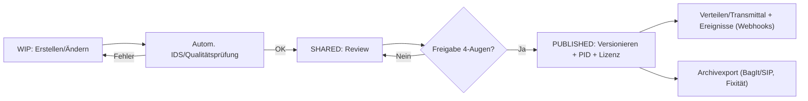
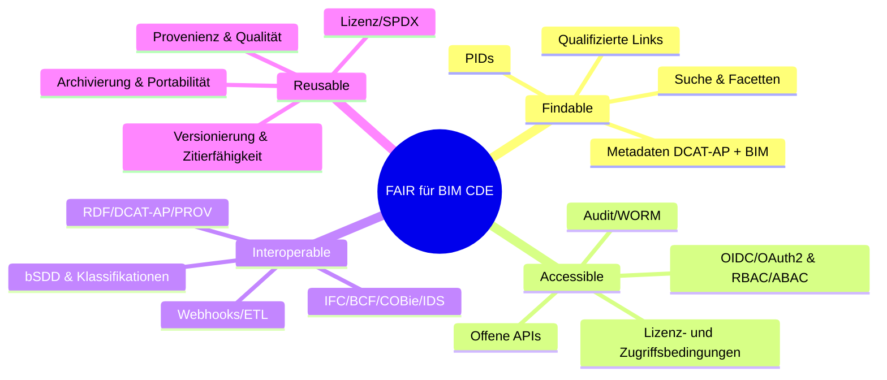

# FAIR-integrierte Anforderungen für eine BIM CDE
Version: 1.0  
Status: Entwurf zur Konsolidierung mit bestehenden Anforderungen  
Bezug: ISO 19650, buildingSMART (IFC, IDS, bSDD, BCF), ISO 16739, ISO 12006, W3C PROV, SPDX, DCAT-AP

## Zielsetzung
Dieser Katalog integriert die FAIR-Prinzipien (Findable, Accessible, Interoperable, Reusable) in die funktionalen und nicht-funktionalen Anforderungen an eine Common Data Environment (CDE) für BIM. Er dient:
- als Ordnungssystem für bereits existierende Anforderungen,
- als Ergänzung um FAIR-spezifische Mindestanforderungen,
- als Grundlage für Ausschreibungen, Abnahmen und Audits.

## Leitplanken und Normbezug
- ISO 19650-1/2: Informationsmanagement, CDE-Prozesse, Status/Container
- buildingSMART: IFC 4.3/IfcJSON, IDS (Info Delivery Specification), bSDD (Semantik), BCF 3.x (Issue-Management), COBie
- Klassifikationen: ISO 12006-2, Uniclass/OmniClass/CCI
- Datenkataloge & Metadaten: DCAT-AP, schema.org; Provenienz: W3C PROV
- Lizenzen: SPDX/Creative Commons; PIDs: DOI/Handle/URN
- Sicherheit/Identität: OIDC/OAuth2, SCIM, Audit, DSGVO/ISO 27001

---

## Taxonomie der Anforderungen
- F: Findable (Auffindbar)
- A: Accessible (Zugänglich)
- I: Interoperable (Interoperabel)
- R: Reusable (Nachnutzbar)
- QX: Querschnitt (Sicherheit, Governance, Betrieb, UX, Performance, Compliance)

Jede Anforderung ist nummeriert (z. B. F1, A2.3). Akzeptanzkriterien sind messbar (K.O./Metrik).

---

## F – Findable (Auffindbar)

F1. Globale, persistente Identifikatoren (PIDs) für Informationscontainer und Datensätze  
- Beschreibung: Jeder Container (Modelle, Pläne, Dokumente, Datensätze) besitzt einen persistenten, auflösbaren Identifikator (z. B. URN/Handle/DOI).  
- Akzeptanzkriterien:  
  - K.O.: PID-URI pro Container vorhanden und per HTTP dereferenzierbar.  
  - Metrik: ≥ 99% Container mit gültigem PID; Resolver Uptime ≥ 99.9%.

F2. Reicher, standardkonformer Metadatensatz  
- Beschreibung: Mindestprofil (DCAT-AP + BIM-Profile) inkl. Titel, Abstract, Keywords, Klassifikation, Version, Status (ISO 19650), Autor, Auftraggeber, Informationsanforderung (EIR/AIR), Revisionshistorie, Bezugsprojekte.  
- Akzeptanzkriterien:  
  - K.O.: Pflichtfelder vollständig; Status/Revision maschinenlesbar.  
  - Metrik: Metadaten-Vollständigkeitsscore ≥ 0.9 (gewichtete Pflicht-/Kür-Felder).

F3. Indizierung und Suche (Volltext, Facetten, Semantik)  
- Beschreibung: Suchindex mit Facetten (Disziplin, Phase, Status, Klassifikation, Datum, Autor, Geografie), Synonyme/Thesauri, semantische Erweiterung (bSDD).  
- Akzeptanzkriterien:  
  - K.O.: Facettierte Suche mit ≥ 8 Kernfacetten.  
  - Metrik: P95 Suchlatenz < 1.0 s; Such-Recall/Precision ≥ 0.85/0.85 in Testset.

F4. Referenzen und Verknüpfungen  
- Beschreibung: Verlinkung von Containern (z. B. Modell ↔ Plan, Modell ↔ Issues/BCF, Modell ↔ IDS-Prüfungen) als qualifizierte Beziehungen.  
- Akzeptanzkriterien:  
  - K.O.: Linktyp und Richtung maschinenlesbar (RDF/PROV-Relationen oder gleichwertig).  
  - Metrik: ≥ 95% referenzierte Artefakte korrekt auflösbar.

---

## A – Accessible (Zugänglich)

A1. Standardisierte Protokolle (HTTP(S), REST/GraphQL/OData)  
- Beschreibung: Der Zugriff erfolgt über offene, dokumentierte APIs; Datei-Downloads via HTTPS mit Range/Resume, Content Negotiation.  
- Akzeptanzkriterien:  
  - K.O.: Öffentliche API-Dokumentation (OpenAPI) und Versionierung.  
  - Metrik: API Uptime ≥ 99.9%; P95 API-Latenz < 300 ms.

A2. Authentifizierung, Autorisierung und Delegation  
- Beschreibung: OIDC/OAuth2, granulare Scopes (Lesen, Schreiben, Freigeben, Löschen), Mandantenfähigkeit, rollenbasierte Freigabestufen gem. ISO 19650 (WIP/SHARED/PUBLISHED/ARCHIVED).  
- Akzeptanzkriterien:  
  - K.O.: RBAC/ABAC umgesetzt; Freigabeworkflows mit 4-Augen-Prinzip.  
  - Metrik: „Least privilege“-Audit ohne kritische Findings; erfolgreiche SCIM-Syncs.

A3. Nutzungsbedingungen, Zugriffsschichten und Ratenbegrenzung  
- Beschreibung: Lizenz-/Zugriffsbedingungen maschinen- und menschenlesbar; faire Rate Limits; Download-Policies je Lizenz/Vertrag.  
- Akzeptanzkriterien:  
  - K.O.: Lizenzanzeige vor Download; Speicherung Nutzerzustimmung.  
  - Metrik: Fehlerrate durch Rate Limits < 0.5%.

A4. Auditierbarkeit und Nachvollziehbarkeit  
- Beschreibung: Lückenlose, fälschungssichere Logs (WORM) für Zugriffe, Freigaben, Transmittals.  
- Akzeptanzkriterien:  
  - K.O.: Unveränderbarkeit verifiziert (z. B. Hash/Notarisierung).  
  - Metrik: 100% der Freigabe-Events signiert und nachvollziehbar.

---

## I – Interoperable (Interoperabel)

I1. Offene Formate und Profile  
- Beschreibung: IFC 4.3/IfcJSON als primäres Austauschformat; BCF 3.x für Issues; COBie für Asset-Daten; IDS für lieferobjektspezifische Regeln; offene 2D/3D-Viewer-Schnittstellen.  
- Akzeptanzkriterien:  
  - K.O.: Import/Export in IFC 4.3 und BCF 3.x; IDS-Validierung integriert.  
  - Metrik: IDS-Compliance ≥ 95% je Meilenstein-Lieferung.

I2. Semantische Referenzen (bSDD, Klassifikationen)  
- Beschreibung: Bindung von PropertySets/Attributen an bSDD-Konzepte; Mapping zu Uniclass/OmniClass; kontrollierte Vokabulare.  
- Akzeptanzkriterien:  
  - K.O.: Mind. 90% der geforderten Attribute mit bSDD-URI hinterlegt.  
  - Metrik: Semantische Konsistenz-Score ≥ 0.9.

I3. Linked Data & qualifizierte Beziehungen  
- Beschreibung: Export von Metadaten/Beziehungen als RDF/DCAT-AP; PROV für Herkunft; eindeutige, dereferenzierbare URIs.  
- Akzeptanzkriterien:  
  - K.O.: DCAT-AP-konformer Katalog-Endpunkt.  
  - Metrik: RDF-Validierung (SHACL) ohne kritische Fehler.

I4. Integrations- und Event-Schnittstellen  
- Beschreibung: Webhooks/Events (Freigabe, neue Version, Kommentar, BCF-Änderung); ETL/ELT-Konnektoren; stabile IDs über Systeme.  
- Akzeptanzkriterien:  
  - K.O.: Mind. 10 wesentliche Events bereitgestellt; Idempotente APIs.  
  - Metrik: Event-Zustellrate ≥ 99.5%, Latenz < 5 s.

---

## R – Reusable (Nachnutzbar)

R1. Klare Lizenzen und Nutzungsrechte  
- Beschreibung: Lizenzkennzeichnung pro Container (SPDX/CC), Auftrags-/Vertragskontext, Einschränkungen maschinenlesbar.  
- Akzeptanzkriterien:  
  - K.O.: Lizenzpflichtfelder; Download blockiert ohne Lizenz.  
  - Metrik: 100% Lizenz-Tagging in PUBLISHED.

R2. Provenienz und Qualitätssicherung  
- Beschreibung: Herkunft, Verantwortliche, Review-/Freigabespuren (PROV), Validierungsreports (IDS, Kollisionsprüfung), Qualitätsmetriken (LOD/LOI/LOG).  
- Akzeptanzkriterien:  
  - K.O.: Abnahmeprotokoll und Validierungsreport versioniert.  
  - Metrik: Defect-Rate in PUBLISHED < definierter Schwellwert.

R3. Versionierung und Zitierfähigkeit  
- Beschreibung: Unverwechselbare, zitierfähige Versionen (SemVer/CalVer), differenzierbare Stände (WIP/SHARED/PUBLISHED/ARCHIVED), reproduzierbare Builds/Exporte.  
- Akzeptanzkriterien:  
  - K.O.: Revisionsbaum nachvollziehbar; Delta-Ansicht verfügbar.  
  - Metrik: Wiederherstellungszeit (RTO) < 15 min.

R4. Langzeitarchivierung und Portabilität  
- Beschreibung: Archivprofile (Format-Standards, Checksums, Migrationsstrategie), Metadaten-Fixierung, Export-Bundles (BagIt/SIP).  
- Akzeptanzkriterien:  
  - K.O.: Archivexport inklusive Metadaten/Provenienz reproduzierbar.  
  - Metrik: Jährlicher Format-Migrations-Check ohne Datenverlust.

---

## QX – Querschnitt

QX1. Sicherheit & Datenschutz  
- ISO 27001 Controls, Verschlüsselung (at rest/in transit), Schlüsselmanagement (KMS), DSGVO/GDPR, Datenresidenz.  
- K.O.: DPIA vorhanden; Verschlüsselung AES-256/TLS1.2+; Secrets Rotation.  

QX2. Governance & Rollen  
- RACI für Freigaben, Mandantenfähigkeit, Trennung von Projekten/Vertragspaketen, Delegationsregeln.  
- K.O.: Freigabeprozess dokumentiert und technisch erzwungen.  

QX3. Performance & Skalierbarkeit  
- Zielwerte: P95 Interaktive Views < 1.5 s, große Modell-Streams mit Tiling/LOD, horizontale Skalierung.  

QX4. User Experience & Barrierefreiheit  
- Einheitliche Informationscontainer-UI, Bulk-Operationen, Inline-IDS-Feedback, WCAG 2.1 AA.  

QX5. Betrieb & Support  
- SLO/SLA, Monitoring/Alerting, Backup/Restore, Change-/Release-Management, Sandbox-/Staging-Umgebungen.  

---

## Abnahme-Checkliste (Ausschnitt)
- [ ] PIDs dereferenzierbar (F1)  
- [ ] DCAT-AP-Export validiert (I3)  
- [ ] IDS-Prüfungen automatisiert pro Lieferung (I1)  
- [ ] Lizenzpflicht vor Download (R1)  
- [ ] WORM-Logs für Freigaben (A4)  
- [ ] OIDC/OAuth2 mit RBAC/ABAC (A2)  
- [ ] IFC4.3/BCF3 Export/Import bestanden (I1)  
- [ ] Archivexport mit Fixitätsprüfungen (R4)

---

## Metriken & KPIs
- Metadaten-Vollständigkeit pro Status (F2)  
- IDS-Compliance-Quote und Fehlertypologie (I1)  
- Time-to-Approve und Rework-Rate (A4/R2)  
- API/Resolver Uptime und Latenzen (A1/F1)  
- Lizenz-Tagging-Abdeckung (R1)  
- Event-Zustellrate (I4)  
- Archiv-Integritätschecks (R4)

---

## Zuordnung bestehender Anforderungen (Mapping-Vorlage)
Spaltenbeschreibung:
- Bestehende_ID: Ihre aktuelle Kennung  
- Bestehende_Beschreibung: Wortlaut  
- FAIR_Kategorie: F/A/I/R/QX  
- FAIR_ID: z. B. F1, A2, I3.2  
- Norm/Standard: ISO 19650, IFC, IDS, bSDD, DCAT-AP, PROV, SPDX, etc.  
- Akzeptanzkriterium: messbar, prüfbar  
- Lücke: ja/nein  
- Aktion: behalten/ändern/ergänzen/zusammenführen  
- Priorität: Hoch/Mittel/Niedrig  
- Verantwortlich, Fällig_bis

```csv
Bestehende_ID,Bestehende_Beschreibung,FAIR_Kategorie,FAIR_ID,Norm/Standard,Akzeptanzkriterium,Lücke,Aktion,Priorität,Verantwortlich,Fällig_bis
REQ-001,"Dokumente müssen schnell auffindbar sein",F,F3,"DCAT-AP,bSDD","P95 Suche <1.0s; Facetten aktiv",nein,behalten,Mittel,Team CDE,2025-01-31
REQ-014,"IFC Austausch",I,I1,"IFC4.3,IDS","IFC4.3 Import/Export; IDS-Checks ≥95%",ja,ergänzen,Hoch,BIM Koordination,2024-12-15
REQ-022,"Freigabeprozess",A,A2,"ISO19650","4-Augen-Prinzip technisch erzwungen",nein,ändern,Hoch,PMO,2024-11-30
```

---

## Beispiel-Mapping (synthetisch)
- „Transmittals müssen protokolliert werden“ → A4 (Auditierbarkeit), QX5 (Betrieb)  
- „Modelle müssen als BCF Issues kommentierbar sein“ → I1 (BCF), F4 (Verknüpfungen)  
- „Eigenschaften nach bSDD“ → I2 (Semantik)  
- „Langzeitarchiv in standardisierten Paketen“ → R4 (Archivierung)

---

## Prozessdiagramm: Lebenszyklus Informationscontainer


---

## Mindmap: FAIR → CDE-Anforderungen


---

## Minimaler Metadatensatz (Beispiel)
```json
{
  "pid": "urn:example:container:12345",
  "title": "Tragwerksmodell OG2",
  "description": "IFC 4.3 Modell, LOD 300, Revit 2024 Export",
  "keywords": ["Tragwerk", "OG2", "IFC4.3"],
  "status": "PUBLISHED",
  "revision": "v1.2.0",
  "discipline": "Structural",
  "phase": "Execution",
  "classification": ["Uniclass-…"],
  "bSDD_refs": ["https://bsdd.buildingsmart.org/…"],
  "ids_reports": ["urn:…:ids:report:abc"],
  "bcf_threads": ["urn:…:bcf:thread:789"],
  "license": "CC-BY-4.0",
  "provenance": {
    "createdBy": "ORG:X",
    "approvedBy": "ORG:Y",
    "createdAt": "2025-05-20T10:15:00Z",
    "approvedAt": "2025-05-22T14:00:00Z"
  }
}
```

---

## Optional: Schnelltest für FAIR-Abdeckung (Python)
Dieser Skript-Check liest ein Mapping-CSV (siehe Vorlage) und prüft, ob alle FAIR-Kategorien abgedeckt sind und ob kritische K.O.-Kriterien markiert sind.

```python
import csv
from collections import defaultdict

REQUIRED_FAIR = set(["F","A","I","R"])
CRITICAL_IDS = set(["F1","F2","A2","A4","I1","I2","R1","R3","R4"])

def load_rows(path):
    with open(path, newline='', encoding='utf-8') as f:
        return list(csv.DictReader(f))

def coverage(rows):
    cats = set()
    critical_hit = set()
    for r in rows:
        cats.add(r.get("FAIR_Kategorie","").strip())
        fair_id = r.get("FAIR_ID","").strip()
        if fair_id in CRITICAL_IDS:
            critical_hit.add(fair_id)
    missing_cats = REQUIRED_FAIR - cats
    missing_crit = CRITICAL_IDS - critical_hit
    return missing_cats, missing_crit

if __name__ == "__main__":
    rows = load_rows("mapping.csv")
    missing_cats, missing_crit = coverage(rows)
    if missing_cats:
        print("Fehlende FAIR-Kategorien:", ", ".join(sorted(missing_cats)))
    else:
        print("Alle FAIR-Kategorien sind abgedeckt.")
    if missing_crit:
        print("Fehlende K.O.-Anforderungen:", ", ".join(sorted(missing_crit)))
    else:
        print("Alle K.O.-Anforderungen sind abgedeckt.")
```

---

## Nächste Schritte zur Integration Ihrer bestehenden Anforderungen
1) Sammlung: Exportieren Sie Ihre bestehende Anforderungsliste als CSV/Excel.  
2) Mapping: Füllen Sie die Spalten der Mapping-Vorlage aus (FAIR_Kategorie/FAIR_ID, Normbezug, Akzeptanzkriterium).  
3) Lückenanalyse: Markieren Sie „Lücke = ja“ und priorisieren Sie (Hoch/Mittel/Niedrig).  
4) Konsolidierung: Zusammenführen redundanter Anforderungen, Ergänzen fehlender K.O.-Kriterien.  
5) Abnahmeplanung: Weisen Sie jeder K.O.-Anforderung einen Testfall und Messpunktsysteme (Monitoring/Validierung) zu.  
6) Review: Führen Sie einen FAIR-/ISO 19650-Review-Workshop mit Stakeholdern durch.

---

Kontakt: Bitte stellen Sie Ihre bestehende Liste bereit – ich übernehme das Mapping, die Lückenanalyse und die Erstellung einer abnahmefähigen Version.
