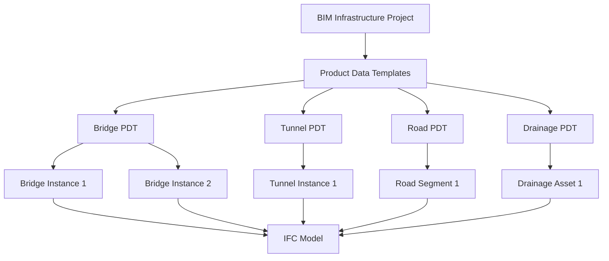
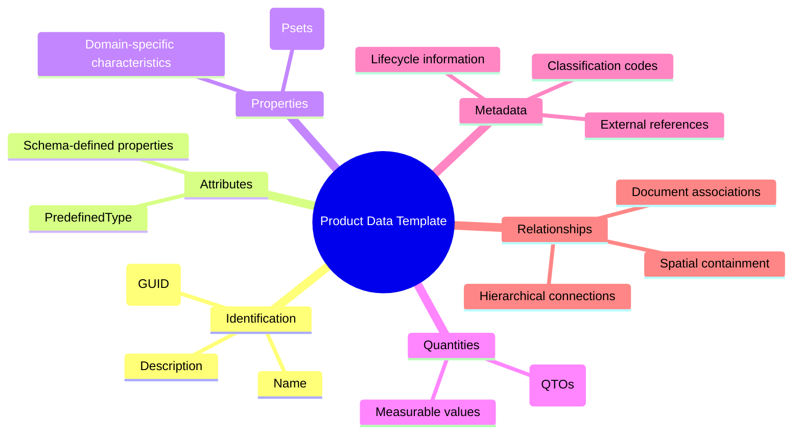
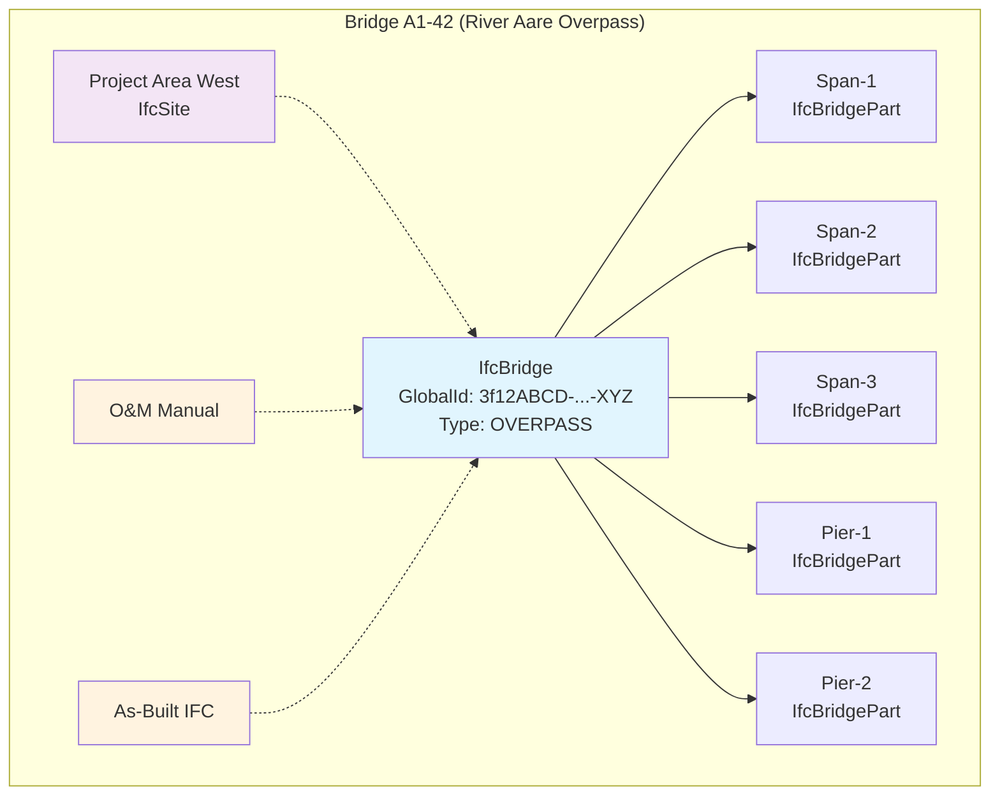
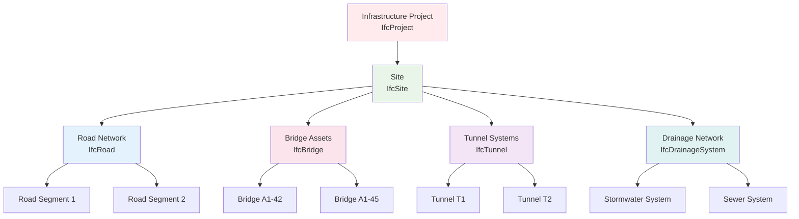
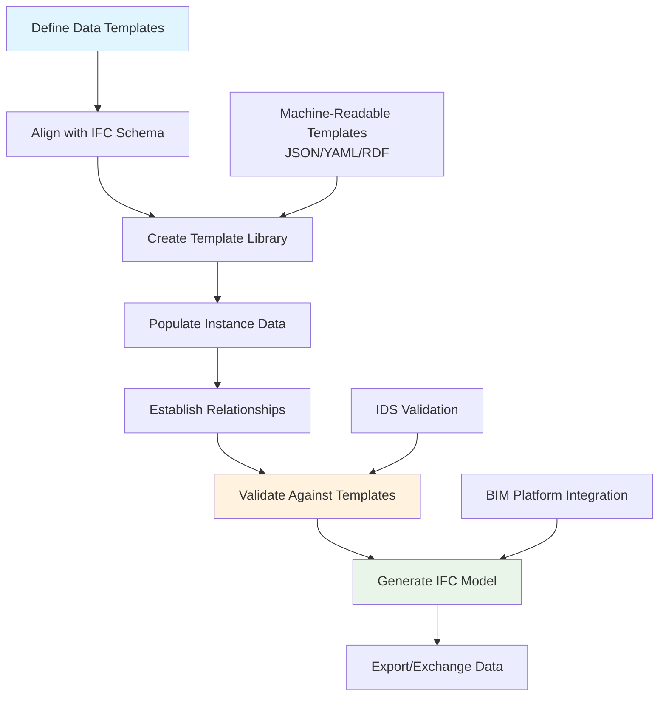

# Product Data Templates (PDTs) and Data Sheets for BIM Infrastructure Assets (IFC 4.3)

## Table of Contents
- [Introduction](#introduction)
- [Structure of a Product Data Template in IFC](#structure-of-a-product-data-template-in-ifc)
- [Bridge Example: Template and Data Sheet](#bridge-example-template-and-data-sheet)
- [Other Infrastructure Asset Types](#other-infrastructure-asset-types)
- [Machine-Readable Formats](#machine-readable-formats)
- [Implementation Guidelines](#implementation-guidelines)

## Introduction

### What are PDTs and PDSs?

In Building Information Modeling (BIM), a **Product Data Template (PDT)** is a structured definition of all relevant data fields (properties, attributes, etc.) for a type of product or asset. It serves as a standardized framework for data collection and organization.

The **Industry Foundation Classes (IFC) schema** (especially IFC 4.3, which is tailored for infrastructure) provides an open standard to represent such assets and their data. IFC 4.3 introduced robust support for infrastructure elements like bridges, tunnels, roads, and drainage systems.

### ASTRA's BIM Strategy

Switzerland's **ASTRA (Federal Roads Office)**, as a key stakeholder in national infrastructure, emphasizes open standards for data. In its BIM strategy, ASTRA highlights using documented data concepts aligned with international standards like IFC.



## Structure of a Product Data Template in IFC

Each infrastructure asset can be described in terms of six key components:

### Core Components Overview



### Detailed Component Breakdown

| Component | Description | IFC Implementation |
|-----------|-------------|-------------------|
| **Identification** | Unique ID, name, and description | `GlobalId`, `Name`, `Description` |
| **Attributes** | Intrinsic schema-defined properties | `PredefinedType`, entity-specific attributes |
| **Properties** | Domain-specific characteristics | Property sets (`IfcPropertySet`) |
| **Quantities** | Measurable quantities | Quantity sets (`IfcQuantityLength`, `IfcQuantityArea`, etc.) |
| **Metadata** | Additional classification and lifecycle data | Custom property sets, external references |
| **Relationships** | Connections to other entities | `IfcRelAggregates`, `IfcRelContainedInSpatialStructure` |

## Bridge Example: Template and Data Sheet

### Bridge Data Template (YAML Format)

```yaml
# Product Data Template for a Bridge (IFC4.3)
BridgeTemplate:
  applicableIFCClass: IfcBridge
  description: "Template defining standard data fields for a bridge asset."
  
  attributes:
    - name: GlobalId
      type: GUID
      description: "Unique global identifier for the bridge (generated)."
    - name: Name
      type: IfcLabel (String)
      description: "Name or title of the bridge."
    - name: Description
      type: IfcText (String)
      description: "Longer description or notes about the bridge."
    - name: PredefinedType
      type: IfcBridgeTypeEnum
      description: "Bridge type classification (e.g. OVERPASS, VIADUCT, FOOTBRIDGE, etc)."
  
  properties:
    - name: StructureIndicator
      type: Enum (PEnum_StructureIndicator)
      description: "Type of bridge structure (composite, homogeneous, etc)"
    - name: MainSpanMaterial
      type: IfcLabel (String)
      description: "Primary material of the main span (e.g. Concrete, Steel)."
    - name: NumberOfSpans
      type: IfcCountMeasure (Integer)
      description: "Total number of spans in the bridge."
    - name: LoadCapacity
      type: IfcForceMeasure (Double)
      description: "Design load capacity (e.g. in kN) the bridge can carry."
    - name: ConstructionYear
      type: IfcYearNumber (Integer)
      description: "Year the bridge was constructed or opened."
  
  quantities:
    - name: TotalLength
      type: IfcQuantityLength (Length)
      description: "Overall length of the bridge (e.g. end to end, in meters)."
    - name: DeckWidth
      type: IfcQuantityLength (Length)
      description: "Width of the bridge deck or carriageway."
    - name: DeckArea
      type: IfcQuantityArea (Area)
      description: "Surface area of the bridge deck."
    - name: DeckVolume
      type: IfcQuantityVolume (Volume)
      description: "Volume of the bridge deck structure (for material quantity)."
  
  metadata:
    - name: ASTRA_BridgeTypeCode
      type: String
      description: "Classification code per ASTRA or national standard for this bridge type."
    - name: OwnerOrganization
      type: String
      description: "Organization responsible for the bridge (owner/operator name)."
    - name: InspectionFrequency
      type: IfcTimeMeasure (Time period)
      description: "Planned inspection interval (e.g. in months)."
  
  relationships:
    - name: HasParts
      type: Aggregation (IfcRelAggregates)
      description: "Relationship linking the bridge to its constituent parts (spans, piers, etc)."
    - name: LocatedIn
      type: SpatialContainment (IfcRelContainedInSpatialStructure)
      description: "Relationship placing the bridge in a site or route context."
    - name: LinkedDocuments
      type: ExternalReference (IfcRelAssociatesDocument)
      description: "Relationship linking the bridge to external documents (manuals, drawings, etc)."
```

### Bridge Data Sheet Instance (JSON Format)

```json
{
  "guid": "3f12ABCD-...-XYZ",
  "name": "Bridge A1-42 (River Aare Overpass)",
  "description": "Highway overpass bridge crossing the Aare river at km 42.",
  "predefinedType": "OVERPASS",
  
  "properties": {
    "StructureIndicator": "composite",
    "MainSpanMaterial": "Concrete",
    "NumberOfSpans": 3,
    "LoadCapacity": 5000.0,
    "ConstructionYear": 1998
  },
  
  "quantities": {
    "TotalLength": 120.5,
    "DeckWidth": 24.0,
    "DeckArea": 2880.0,
    "DeckVolume": 7200.0
  },
  
  "metadata": {
    "ASTRA_BridgeTypeCode": "ASTRA-BR-112233",
    "OwnerOrganization": "FEDRO (ASTRA)",
    "InspectionFrequency": "60 months"
  },
  
  "relationships": {
    "hasParts": [
      { "ifcClass": "IfcBridgePart", "Name": "Span-1", "GlobalId": "1111-..." },
      { "ifcClass": "IfcBridgePart", "Name": "Span-2", "GlobalId": "2222-..." },
      { "ifcClass": "IfcBridgePart", "Name": "Pier-1", "GlobalId": "3333-..." }
    ],
    "locatedIn": { 
      "ifcClass": "IfcSite", 
      "Name": "Project Area West", 
      "GlobalId": "SITE-..." 
    },
    "linkedDocuments": [
      { "Name": "BridgeA1-42_O&M_Manual.pdf", "DocumentType": "MaintenanceManual" },
      { "Name": "BridgeA1-42_AsBuilt.ifc", "DocumentType": "AsBuiltBIM" }
    ]
  }
}
```

### Bridge Structure Visualization



## Other Infrastructure Asset Types

### Asset Type Comparison Matrix

| Asset Type | IFC Class | Key Properties | Typical Quantities | Specific Considerations |
|------------|-----------|----------------|-------------------|------------------------|
| **Tunnel** | `IfcTunnel` | TunnelLength, CrossSectionShape, NumberOfTubes | Length, CrossSectionalArea, Volume | Ventilation systems, emergency exits |
| **Road** | `IfcRoad` | RoadType, SpeedLimit, NumberOfLanes | Length, Width, SurfaceArea | Pavement layers, markings, signage |
| **Drainage** | `IfcPipeSegment`, `IfcDrainageSystem` | PipeType, FlowCapacity, Material | Length, Diameter, Volume | Flow direction, connection points |

### Infrastructure Asset Hierarchy



## Machine-Readable Formats

### Format Comparison

| Format | Advantages | Use Cases | Example Applications |
|--------|------------|-----------|---------------------|
| **JSON** | Lightweight, widely supported | Web APIs, data exchange | BIM platform integration |
| **YAML** | Human-readable, comments supported | Configuration, documentation | Template definitions |
| **RDF/Turtle** | Semantic web compatibility | Linked data, ontologies | Knowledge graphs |

### RDF Example (Turtle Syntax)

```turtle
@prefix ifc: <https://standards.buildingsmart.org/IFC/DEV/IFC4_3/OWL#> .
@prefix ifc4x3_bridge: <https://standards.buildingsmart.org/IFC/DEV/IFC4_3/OWL/Bridge#> .

:BridgeA142 rdf:type ifc:IfcBridge ;
    ifc:GlobalId "3f12ABCD-...-XYZ" ;
    ifc:Name "Bridge A1-42 (River Aare Overpass)" ;
    ifc:PredefinedType ifc4x3_bridge:OVERPASS ;
    ifc:hasPropertySet :BridgeA142_PsetCommon .

:BridgeA142_PsetCommon rdf:type ifc:IfcPropertySet ;
    ifc:Name "Pset_BridgeCommon" ;
    ifc:hasProperty :Prop_StructureIndicator .

:Prop_StructureIndicator rdf:type ifc:IfcPropertyEnumeratedValue ;
    ifc:Name "StructureIndicator" ;
    ifc:nominalValue :Enum_StructureIndicator_Composite .

:Enum_StructureIndicator_Composite rdf:type ifc:PEnum_StructureIndicator ;
    ifc:value "composite" .
```

## Implementation Guidelines

### Implementation Process Flow



### Step-by-Step Implementation

1. **Define Data Templates**
   - List all required attributes, properties, quantities, and metadata
   - Align each field with IFC schema definitions
   - Document in human-readable format (YAML/JSON)

2. **Populate Instance Data**
   - Ensure each asset instance includes all template-required data
   - Set IFC object attributes (GlobalId automatically generated)
   - Populate property sets and quantity sets

3. **Establish Relationships**
   - Use `IfcRelAggregates` for composition relationships
   - Use `IfcRelContainedInSpatialStructure` for spatial placement
   - Link documents via `IfcRelAssociatesDocument`

4. **Validation and Quality Assurance**
   - Use Information Delivery Specification (IDS) for validation
   - Implement automated checking against templates
   - Ensure data completeness and consistency

### Best Practices

- **Standardization**: Use consistent naming conventions and units
- **Documentation**: Maintain clear documentation for all templates
- **Validation**: Implement automated validation workflows
- **Interoperability**: Ensure compatibility with major BIM platforms
- **Lifecycle Management**: Plan for data updates and maintenance

## Conclusion

This systematic approach ensures that each asset in an infrastructure BIM project has a comprehensive, standardized data sheet associated with it, fulfilling the information requirements for effective asset management throughout the project lifecycle.

The methodology aligns with IFC4.3 documentation and buildingSMART guidelines, providing a robust foundation for infrastructure BIM data management in accordance with ASTRA's open standards strategy.

---

**Sources**: This methodology is informed by IFC4.3 documentation and buildingSMART guidelines. IFC4.3 supports infrastructure assets like bridges, roads, tunnels, and drainage systems with new entity definitions and property sets specifically designed for infrastructure applications.
