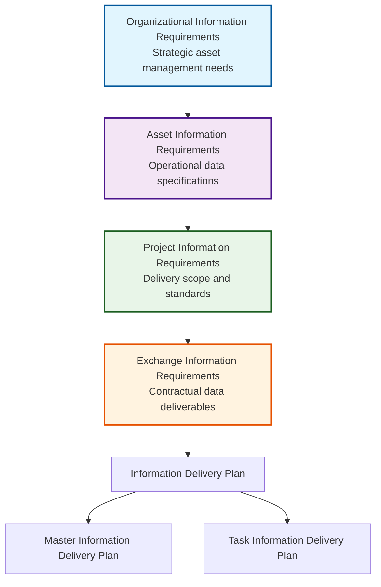
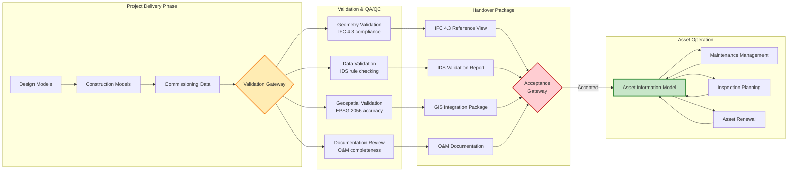
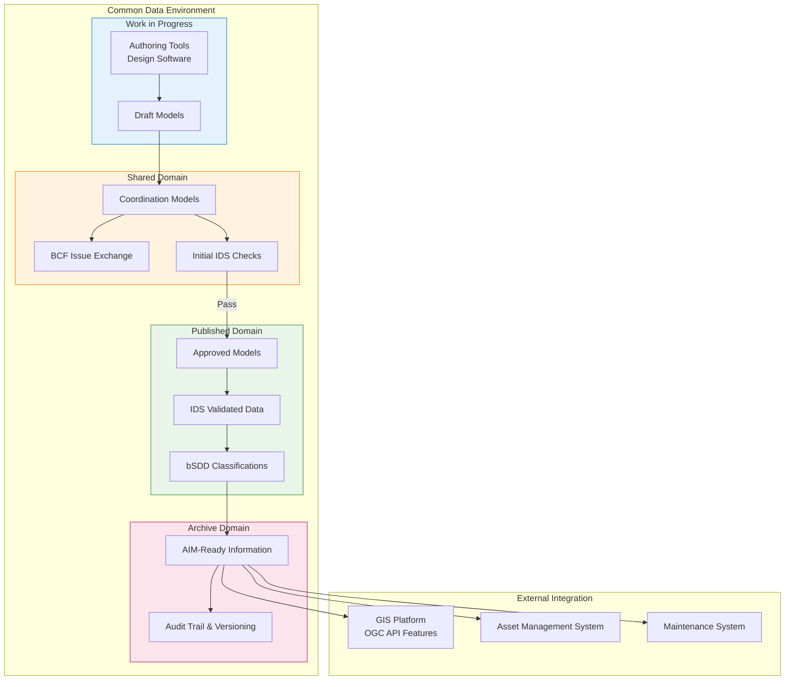
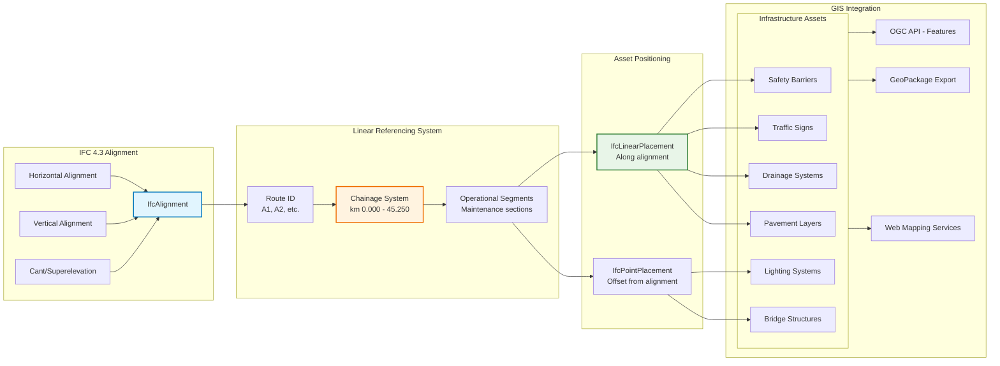
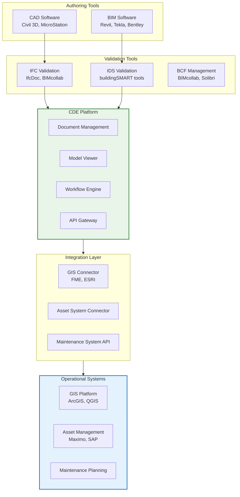

# PIM and AIM for Infrastructure Projects (ISO 19650 Aligned)

## 1. Executive Summary

This document defines the Project Information Model (PIM) to Asset Information Model (AIM) transition process for infrastructure projects, aligned with **SN EN ISO 19650** and contemporary openBIM standards. It addresses the complete information lifecycle from project delivery through operational asset management.

## 2. Standards Framework

### Core Standards
- **SN EN ISO 19650-1/2/3/5**: Information management framework
- **IFC 4.3**: Infrastructure geometry and data exchange
- **IDS 1.0**: Machine-readable validation specifications
- **bSDD**: Harmonized classification and semantics
- **BCF 2.1/3.0**: Collaborative issue management

### Swiss Context
- **SIA 2051**: BIM methodology principles
- **Coordinate System**: EPSG:2056 (CH1903+/LV95) with LHN95 heights
- **Georeferencing**: IfcMapConversion for precise spatial anchoring

## 3. Information Requirements Hierarchy



## 4. PIM to AIM Transition Process



## 5. CDE Implementation with Standards Integration



## 6. Infrastructure-Specific Linear Referencing



## 7. Comprehensive Handover Package Specification

### 7.1 Geometric Models
```yaml
IFC_4.3_Deliverables:
  format: IFC 4.3 Reference View
  content:
    - IfcAlignment with horizontal/vertical/cant
    - IfcLinearPlacement for all assets
    - IfcFacilityPart hierarchy
    - Complete material definitions
    - Georeferencing via IfcMapConversion
  validation:
    - Schema compliance check
    - Geometry validity verification
    - Coordinate system validation (EPSG:2056)
```

### 7.2 Data Validation Package
```xml
<!-- Enhanced IDS Example for Highway Assets -->
<?xml version="1.0" encoding="UTF-8"?>
<ids:ids xmlns:ids="http://standards.buildingsmart.org/IDS" 
         xmlns:xsi="http://www.w3.org/2001/XMLSchema-instance"
         xsi:schemaLocation="http://standards.buildingsmart.org/IDS 
         https://standards.buildingsmart.org/IDS/1.0/ids.xsd">
  
  <ids:info>
    <ids:title>ASTRA Highway Asset Handover Validation</ids:title>
    <ids:version>1.0</ids:version>
    <ids:description>Validation rules for highway infrastructure AIM handover</ids:description>
  </ids:info>
  
  <!-- Safety Barrier Validation -->
  <ids:specification name="Safety Barrier Requirements" minOccurs="1">
    <ids:applicability>
      <ids:entity name="IFCBUILDINGELEMENT"/>
      <ids:classification>
        <ids:value>
          <ids:simpleValue>SafetyBarrier</ids:simpleValue>
        </ids:value>
        <ids:system>
          <ids:simpleValue>bSDD</ids:simpleValue>
        </ids:system>
      </ids:classification>
    </ids:applicability>
    <ids:requirements>
      <ids:property dataType="IfcLabel" minOccurs="1">
        <ids:propertySet>
          <ids:simpleValue>Pset_AssetCommon</ids:simpleValue>
        </ids:propertySet>
        <ids:name>
          <ids:simpleValue>AssetID</ids:simpleValue>
        </ids:name>
      </ids:property>
      <ids:property dataType="IfcLabel" minOccurs="1">
        <ids:propertySet>
          <ids:simpleValue>Pset_SafetyBarrier_ASTRA</ids:simpleValue>
        </ids:propertySet>
        <ids:name>
          <ids:simpleValue>ContainmentLevel</ids:simpleValue>
        </ids:name>
        <ids:value>
          <ids:restriction>
            <ids:enumeration>
              <ids:value>
                <ids:simpleValue>N1</ids:simpleValue>
              </ids:value>
              <ids:value>
                <ids:simpleValue>N2</ids:simpleValue>
              </ids:value>
              <ids:value>
                <ids:simpleValue>H1</ids:simpleValue>
              </ids:value>
              <ids:value>
                <ids:simpleValue>H2</ids:simpleValue>
              </ids:value>
              <ids:value>
                <ids:simpleValue>H3</ids:simpleValue>
              </ids:value>
            </ids:enumeration>
          </ids:restriction>
        </ids:value>
      </ids:property>
      <ids:property dataType="IfcDate" minOccurs="1">
        <ids:propertySet>
          <ids:simpleValue>Pset_ManufacturerOccurrence</ids:simpleValue>
        </ids:propertySet>
        <ids:name>
          <ids:simpleValue>InstallationDate</ids:simpleValue>
        </ids:name>
      </ids:property>
    </ids:requirements>
  </ids:specification>
  
  <!-- Bridge Structure Validation -->
  <ids:specification name="Bridge Asset Requirements" minOccurs="1">
    <ids:applicability>
      <ids:entity name="IFCBRIDGE"/>
    </ids:applicability>
    <ids:requirements>
      <ids:property dataType="IfcLabel" minOccurs="1">
        <ids:propertySet>
          <ids:simpleValue>Pset_BridgeCommon</ids:simpleValue>
        </ids:propertySet>
        <ids:name>
          <ids:simpleValue>LoadClass</ids:simpleValue>
        </ids:name>
      </ids:property>
      <ids:property dataType="IfcPositiveLengthMeasure" minOccurs="1">
        <ids:propertySet>
          <ids:simpleValue>Pset_BridgeCommon</ids:simpleValue>
        </ids:propertySet>
        <ids:name>
          <ids:simpleValue>DesignLife</ids:simpleValue>
        </ids:name>
      </ids:property>
    </ids:requirements>
  </ids:specification>
</ids:ids>
```

### 7.3 Documentation Package
```yaml
Required_Documentation:
  operation_maintenance:
    - Asset-specific O&M manuals
    - Maintenance schedules and procedures
    - Inspection protocols and frequencies
    - Emergency response procedures
  technical_documentation:
    - As-built drawings (PDF + native CAD)
    - Material test certificates
    - Quality assurance records
    - Commissioning test results
  warranty_information:
    - Warranty certificates and periods
    - Supplier contact information
    - Spare parts specifications and sources
    - Service level agreements
```

## 8. Acceptance Criteria and KPIs

### 8.1 Quantitative Acceptance Thresholds
```python
# Python validation script example
class AIMAcceptanceCriteria:
    def __init__(self):
        self.criteria = {
            'geometry_validation': {
                'ifc_schema_compliance': 100,  # % compliance required
                'georeferencing_accuracy': 0.01,  # meters tolerance
                'coordinate_system_validation': 'EPSG:2056'
            },
            'data_validation': {
                'mandatory_properties_coverage': 100,  # % required
                'classification_coverage': 98,  # % minimum
                'ids_rule_compliance': 100,  # % compliance
                'asset_id_uniqueness': 100  # % unique IDs
            },
            'documentation_validation': {
                'om_manual_completeness': 100,  # % complete
                'warranty_coverage': 100,  # % assets with warranties
                'test_certificate_coverage': 100  # % assets with certs
            }
        }
    
    def validate_handover_package(self, package_data):
        results = {}
        for category, thresholds in self.criteria.items():
            results[category] = self._check_category(package_data, thresholds)
        return results
    
    def _check_category(self, data, thresholds):
        # Implementation would check actual data against thresholds
        pass
```

### 8.2 Qualitative Assessment Framework
- **Information Completeness**: All EIR requirements fulfilled
- **Data Quality**: Accuracy, consistency, and currency validated
- **Interoperability**: Successful data exchange with target systems
- **Usability**: Information supports operational decision-making

## 9. Technology Implementation Stack

### 9.1 Software Ecosystem


## 10. Implementation Roadmap

### Phase 1: Foundation (Months 1-3)
- Establish CDE with ISO 19650 workflows
- Define EIR and IDS specifications
- Implement IFC 4.3 authoring capabilities

### Phase 2: Validation (Months 4-6)
- Deploy automated IDS validation
- Integrate bSDD classification
- Establish QA/QC procedures

### Phase 3: Integration (Months 7-9)
- Connect with GIS platforms
- Implement asset management integration
- Deploy operational dashboards

### Phase 4: Optimization (Months 10-12)
- Refine based on pilot projects
- Scale across all project types
- Establish continuous improvement processes

## 11. Risk Management and Mitigation

### 11.1 Technical Risks
| Risk | Impact | Probability | Mitigation |
|------|---------|-------------|------------|
| IFC 4.3 software immaturity | High | Medium | Maintain IFC 2x3 fallback, vendor engagement |
| Data quality issues | High | High | Automated validation, staged acceptance |
| Integration complexity | Medium | High | Phased implementation, API standardization |

### 11.2 Organizational Risks
| Risk | Impact | Probability | Mitigation |
|------|---------|-------------|------------|
| Skills gap | Medium | High | Training programs, external support |
| Change resistance | High | Medium | Change management, pilot successes |
| Process complexity | Medium | Medium | Simplified workflows, automation |

This enhanced document provides a production-ready framework for PIM to AIM transition that reflects current industry best practices and addresses real-world implementation challenges in infrastructure projects.
